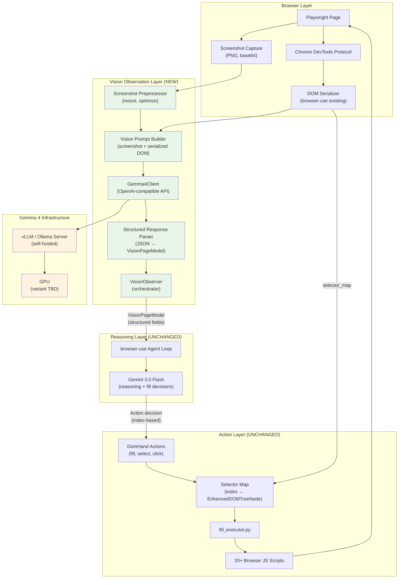
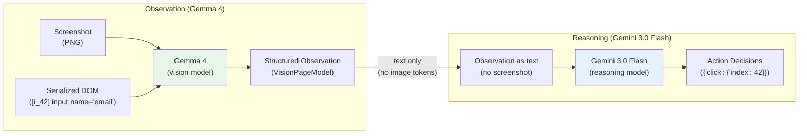
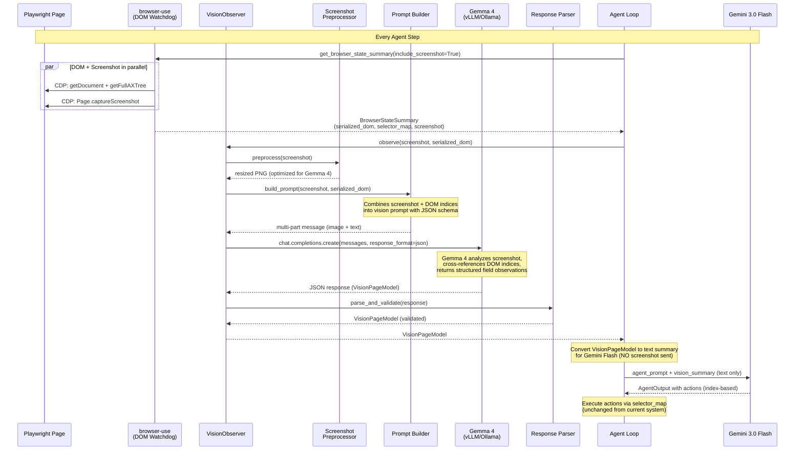
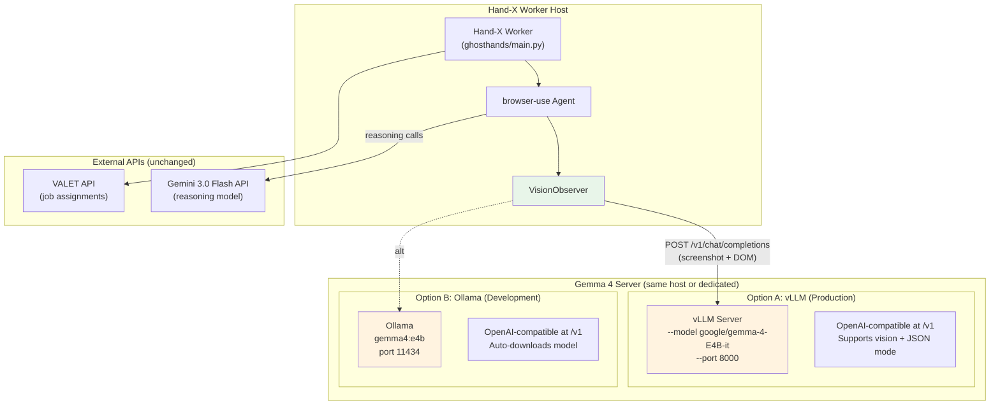
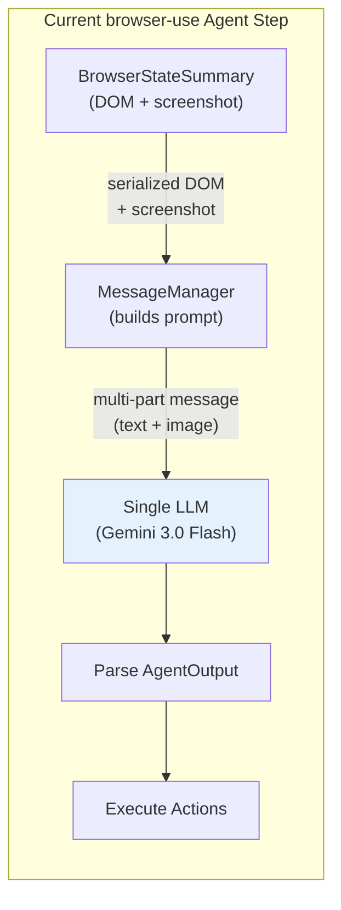
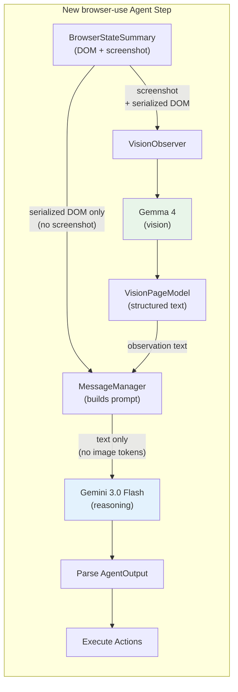

# Hand-X v3.0 — Vision-First Observation Layer OOD

> Object-Oriented Design for a vision-first observation layer using self-hosted
> Gemma 4 as a cheap visual model, with a dual-model architecture that separates
> observation (Gemma 4) from reasoning (Gemini 3.0 Flash).
>
> **Created:** 2026-04-04
> **Status:** Draft — pending Gemma 4 variant selection and latency benchmarks
> **Relationship to V2.0:** Independent implementation. V2.0 (structured DOM + a11y pipeline)
> and V3.0 (vision-first) are developed and tested separately, then compared.

---

## Table of Contents

1. [Motivation: Why Vision-First?](#1-motivation-why-vision-first)
2. [Architecture Overview](#2-architecture-overview)
3. [Dual-Model Architecture](#3-dual-model-architecture)
4. [Data Flow: Observation Cycle](#4-data-flow-observation-cycle)
5. [Component Design](#5-component-design)
6. [Gemma 4 Integration](#6-gemma-4-integration)
7. [Self-Hosting Infrastructure](#7-self-hosting-infrastructure)
8. [Browser-Use Refactor Points](#8-browser-use-refactor-points)
9. [Backward Compatibility](#9-backward-compatibility)
10. [What Changes and What Doesn't](#10-what-changes-and-what-doesnt)
11. [Data Models](#11-data-models)
12. [Open Questions](#12-open-questions)
13. [Comparison: V2.0 vs V3.0](#13-comparison-v20-vs-v30)

---

## 1. Motivation: Why Vision-First?

The V2.0 approach (DOM + a11y tree → structured pipeline) works by programmatically
walking the DOM and a11y tree to extract form field metadata. It's precise but complex —
5+ sub-components, platform-specific heuristics, and a translation layer between
browser internals and semantic understanding.

The V3.0 approach asks a simpler question: **what if we just look at the page?**

A human filling out a job application doesn't inspect the DOM. They look at the screen,
see form fields, read labels, and understand groupings visually. Gemma 4 — Google's
open multimodal model — can do the same thing, and it's cheap enough to self-host.

**Why this might be better:**

| Problem | V2.0 Solution | V3.0 Solution |
|---------|---------------|---------------|
| Field type detection | Multi-signal scoring (DOM + a11y + ARIA) | "I see a dropdown" — visual classification |
| Label resolution | Priority-ordered source chain (10 sources) | "The text above this input says 'Email'" |
| Field grouping | LLM call on every observation | Inherently solved — vision sees spatial grouping |
| Platform differences | Per-platform heuristics | Platform-agnostic — all pages look like pages |
| Shadow DOM / iframes | CDP traversal per frame | Invisible to vision — screenshot captures everything |

**Why this might be worse:**

- Vision models hallucinate — they might "see" fields that don't exist
- No DOM targeting — vision says "there's an email field" but doesn't know its element index
- Latency — image inference is slower than DOM traversal
- State detection — harder to read current values from screenshots than from DOM

**The V3.0 hypothesis:** By combining Gemma 4's visual understanding with browser-use's
existing DOM index system, we get the best of both worlds — vision for understanding,
DOM indices for targeting.

---

## 2. Architecture Overview



---

## 3. Dual-Model Architecture

The key architectural decision: **split observation from reasoning into two separate models.**



**Why dual-model?**

1. **Cost**: Gemma 4 is self-hosted (free per-token) or ~$0.14/1M tokens hosted.
   Gemini 3.0 Flash at $0.50/$3.00 per 1M tokens is expensive for image tokens.
   By having Gemma 4 process the screenshot and emit text, Gemini Flash never sees
   image tokens — it only gets a compact text summary of the page state.

2. **Quality**: Gemma 4 (26B/31B) is not strong enough for complex agent reasoning
   (multi-step planning, error recovery, fill decisions). Gemini 3.0 Flash is.
   Each model does what it's best at.

3. **Latency**: Gemma 4 observation can run in parallel with other agent setup work.
   The observation result is cached and reused across multiple reasoning calls
   within the same fill round.

**Model responsibilities:**

| Responsibility | Model | Why |
|---------------|-------|-----|
| "What fields are on this page?" | Gemma 4 | Visual understanding, cheap |
| "What type is this field?" | Gemma 4 | Can see dropdown arrows, radio buttons, etc. |
| "What's the label for this field?" | Gemma 4 | Reads text visually, no DOM climbing needed |
| "Which fields belong together?" | Gemma 4 | Spatial grouping is inherently visual |
| "What value should go in this field?" | Gemini 3.0 Flash | Requires resume understanding + reasoning |
| "What action should I take next?" | Gemini 3.0 Flash | Agent planning, error recovery |
| "Did the fill work correctly?" | Gemma 4 | Visual verification (before/after screenshots) |

---

## 4. Data Flow: Observation Cycle



---

## 5. Component Design

### 5.1 VisionObserver (Orchestrator)

The top-level class that replaces the observation step in the agent loop.

```python
class VisionObserver:
    """Orchestrates screenshot-based page observation using Gemma 4.

    Session-scoped — created once per job, preserves state across observations.
    Replaces the screenshot interpretation that currently happens implicitly
    when browser-use sends the screenshot to the reasoning LLM.
    """

    def __init__(
        self,
        gemma_client: Gemma4Client,
        screenshot_size: tuple[int, int] = (1400, 850),
    ):
        self._gemma = gemma_client
        self._preprocessor = ScreenshotPreprocessor(target_size=screenshot_size)
        self._prompt_builder = VisionPromptBuilder()
        self._parser = VisionResponseParser()
        self._previous_observation: VisionPageModel | None = None

    async def observe(
        self,
        screenshot_b64: str,
        serialized_dom: str,
        page_url: str = "",
        page_title: str = "",
    ) -> VisionPageModel:
        """Run a full observation cycle.

        1. Preprocess screenshot (resize for optimal token usage)
        2. Build multi-part prompt (screenshot + serialized DOM + JSON schema)
        3. Call Gemma 4 via OpenAI-compatible API
        4. Parse and validate structured response
        5. Store as previous observation for diffing
        """
        processed_screenshot = self._preprocessor.process(screenshot_b64)

        messages = self._prompt_builder.build(
            screenshot=processed_screenshot,
            serialized_dom=serialized_dom,
            page_url=page_url,
            page_title=page_title,
            previous_observation=self._previous_observation,
        )

        raw_response = await self._gemma.complete(messages)
        observation = self._parser.parse(raw_response)

        self._previous_observation = observation
        return observation
```

### 5.2 Gemma4Client (LLM Interface)

```python
class Gemma4Client:
    """OpenAI-compatible client for Gemma 4 vision calls.

    Connects to a self-hosted vLLM or Ollama instance running Gemma 4.
    Uses the standard OpenAI chat completions format with multi-part
    messages (text + image_url with base64 data).
    """

    def __init__(
        self,
        base_url: str = "http://localhost:8000/v1",  # vLLM default
        api_key: str = "EMPTY",
        model: str = "google/gemma-4-E4B-it",        # variant TBD
        timeout: float = 10.0,
        max_tokens: int = 2048,
    ):
        self._client = AsyncOpenAI(base_url=base_url, api_key=api_key)
        self._model = model
        self._timeout = timeout
        self._max_tokens = max_tokens

    async def complete(
        self,
        messages: list[dict],
    ) -> dict:
        """Send a vision request to Gemma 4.

        Messages follow the OpenAI multi-part format:
        [{"role": "user", "content": [
            {"type": "image_url", "image_url": {"url": "data:image/png;base64,..."}},
            {"type": "text", "text": "Analyze this form page..."}
        ]}]
        """
        response = await asyncio.wait_for(
            self._client.chat.completions.create(
                model=self._model,
                messages=messages,
                max_tokens=self._max_tokens,
                response_format={"type": "json_object"},
            ),
            timeout=self._timeout,
        )
        return json.loads(response.choices[0].message.content)
```

### 5.3 VisionPromptBuilder

```python
class VisionPromptBuilder:
    """Builds the multi-part prompt sent to Gemma 4.

    The prompt includes:
    1. The screenshot (PNG, base64) — what the page looks like
    2. The serialized DOM with element indices — so Gemma 4 can reference
       specific elements by their [i_X] index
    3. Instructions + JSON schema — what to return
    4. Previous observation (optional) — for change detection
    """

    SYSTEM_PROMPT = """You are a form field observer for job application pages.
You receive a screenshot of a web page AND a serialized DOM with element indices.

Your job:
1. Identify all form fields visible in the screenshot
2. For each field, determine its type, label, current value, and whether it's required
3. Cross-reference with the DOM indices — use the [i_X] notation to identify elements
4. Identify field groupings (radio groups, button groups, segmented dates)
5. Return structured JSON matching the provided schema

IMPORTANT:
- Always reference elements by their [i_X] index from the serialized DOM
- If you can see a field in the screenshot but can't find its index in the DOM, flag it
- Report current values as you see them in the screenshot
- For dropdowns, report the currently selected value (not all options)
"""

    def build(
        self,
        screenshot: str,
        serialized_dom: str,
        page_url: str = "",
        page_title: str = "",
        previous_observation: VisionPageModel | None = None,
    ) -> list[dict]:
        """Build the message list for the Gemma 4 API call."""

        user_content = []

        # Part 1: Screenshot
        user_content.append({
            "type": "image_url",
            "image_url": {"url": f"data:image/png;base64,{screenshot}"}
        })

        # Part 2: Text (DOM + instructions)
        text = f"Page: {page_title} — {page_url}\n\n"
        text += f"Serialized DOM (interactive elements with indices):\n{serialized_dom}\n\n"

        if previous_observation:
            text += f"Previous observation had {len(previous_observation.fields)} fields. "
            text += "Report any changes you notice.\n\n"

        text += "Respond with JSON matching this schema:\n"
        text += json.dumps(VisionPageModel.model_json_schema(), indent=2)

        user_content.append({"type": "text", "text": text})

        return [
            {"role": "system", "content": self.SYSTEM_PROMPT},
            {"role": "user", "content": user_content},
        ]
```

### 5.4 ScreenshotPreprocessor

```python
class ScreenshotPreprocessor:
    """Resizes and optimizes screenshots for Gemma 4.

    Reuses browser-use's existing resize logic (LANCZOS resampling)
    but targets the optimal size for Gemma 4's vision token budget.

    Gemma 4 supports 70, 140, 280, or 1120 tokens per image.
    For form field detection, 280 tokens (medium detail) is the sweet spot
    between accuracy and speed.
    """

    def __init__(self, target_size: tuple[int, int] = (1400, 850)):
        self._target_size = target_size

    def process(self, screenshot_b64: str) -> str:
        """Resize screenshot to target dimensions.

        Returns base64-encoded PNG.
        """
        img_bytes = base64.b64decode(screenshot_b64)
        img = Image.open(io.BytesIO(img_bytes))

        if img.size != self._target_size:
            img = img.resize(self._target_size, Image.Resampling.LANCZOS)

        buffer = io.BytesIO()
        img.save(buffer, format="PNG")
        return base64.b64encode(buffer.getvalue()).decode()
```

### 5.5 VisionResponseParser

```python
class VisionResponseParser:
    """Parses and validates Gemma 4's JSON response into VisionPageModel.

    Handles:
    - JSON parsing errors (malformed output from cheap model)
    - Schema validation via Pydantic
    - Fallback: if response is unparseable, returns empty observation with warning
    """

    def parse(self, raw_response: dict) -> VisionPageModel:
        """Parse raw JSON dict into validated VisionPageModel."""
        try:
            return VisionPageModel.model_validate(raw_response)
        except ValidationError as e:
            logger.warning("vision.parse_error", error=str(e), response=raw_response)
            return VisionPageModel(
                fields=[],
                warnings=[f"Failed to parse Gemma 4 response: {e}"],
            )
```

---

## 6. Gemma 4 Integration

### 6.1 Model Variants

| Model | Params (active) | VRAM (Q4) | Vision | Speed | Best for |
|-------|----------------|-----------|--------|-------|----------|
| **E2B** | 2.3B | ~5 GB | Yes | Fastest | Edge/mobile, low latency |
| **E4B** | 4.5B | ~6 GB | Yes | Fast | Consumer GPUs, good accuracy/speed ratio |
| **26B-A4B** | 3.8B (MoE) | ~18 GB | Yes | Slow (known issue) | When speed issues are fixed |
| **31B** | 31B (dense) | ~20 GB | Yes | Moderate | Best accuracy, needs serious hardware |

**Decision: TBD.** The variant depends on:
1. Available GPU hardware
2. Latency benchmarks on real ATS pages
3. Accuracy comparison across variants for form field detection

The E4B is the likely sweet spot — fits on any modern GPU, fast inference,
good enough vision quality. The 26B-A4B has a known speed problem (as of
2026-04-04) that Google may fix with optimized kernels.

### 6.2 Vision Token Budget

Gemma 4 supports configurable image token budgets: 70, 140, 280, or 1120 tokens per image.

| Budget | Detail Level | Use case | Est. latency added |
|--------|-------------|----------|-------------------|
| 70 | Very low | Quick page-type detection | +50ms |
| 140 | Low | Basic field detection | +100ms |
| 280 | Medium | Field detection + labels + values | +200ms |
| 1120 | High | OCR-level detail, small text | +500ms |

**Recommended: 280 tokens** for standard observation. 1120 for verification
(before/after fill comparison where value accuracy matters).

### 6.3 Structured Output

Gemma 4 supports JSON mode via vLLM's guided decoding engine:
- `response_format: {"type": "json_object"}` in the API call
- Constrains output to valid JSON matching a provided schema
- Combines with thinking mode for step-by-step reasoning before emitting JSON

If structured output fails (malformed JSON), the `VisionResponseParser` falls back
to an empty observation with warnings — same fallback pattern as V2.0's LLM Grouper.

---

## 7. Self-Hosting Infrastructure



### No nginx required

vLLM and Ollama natively expose OpenAI-compatible endpoints with full
multimodal support. Images are passed as base64 in the standard format:

```json
{
    "type": "image_url",
    "image_url": {"url": "data:image/png;base64,iVBOR..."}
}
```

### Deployment commands

**Development (Ollama):**
```bash
ollama run gemma4:e4b
# API available at http://localhost:11434/v1
```

**Production (vLLM + Docker):**
```bash
docker run -d --gpus all --network host \
    -v ~/.cache/huggingface:/root/.cache/huggingface \
    vllm/vllm-openai:gemma4 \
    --model google/gemma-4-E4B-it \
    --max-model-len 32768 \
    --host 0.0.0.0 --port 8000
# API available at http://localhost:8000/v1
```

### Environment variables

| Variable | Default | Description |
|----------|---------|-------------|
| `GH_GEMMA_BASE_URL` | `http://localhost:8000/v1` | Gemma 4 server endpoint |
| `GH_GEMMA_MODEL` | `google/gemma-4-E4B-it` | Model name (variant selection) |
| `GH_GEMMA_API_KEY` | `EMPTY` | API key (for hosted providers) |
| `GH_GEMMA_TIMEOUT` | `10` | Vision call timeout (seconds) |
| `GH_GEMMA_IMAGE_TOKENS` | `280` | Image token budget (70/140/280/1120) |

---

## 8. Browser-Use Refactor Points

The core refactor: **split the single-LLM agent loop into a dual-model pipeline.**

### 8.1 Current Flow (Single Model)



### 8.2 New Flow (Dual Model)



### 8.3 Specific Files to Modify

| File | Change | Scope |
|------|--------|-------|
| `browser_use/agent/service.py` | Add `vision_llm` parameter to `AgentService.__init__()`. In `_prepare_context()`, call `VisionObserver.observe()` before building the reasoning prompt. | Medium |
| `browser_use/agent/prompts.py` | Modify `AgentMessagePrompt.get_user_message()` to accept a `VisionPageModel` instead of raw screenshot. When `vision_llm` is configured, include the observation text instead of image content. | Medium |
| `browser_use/agent/message_manager/service.py` | When dual-model is active, set `use_vision=False` for the reasoning LLM (since Gemma 4 already processed the screenshot). Inject `VisionPageModel` as text in the browser_state section. | Small |
| `ghosthands/agent/factory.py` | Create `Gemma4Client` and `VisionObserver`. Pass `vision_llm` to the browser-use Agent alongside the existing reasoning LLM. | Small |
| `ghosthands/config/settings.py` | Add `GH_GEMMA_*` environment variables. | Small |

**Nothing changes in the action layer.** The reasoning LLM (Gemini 3 Flash) still
outputs actions referencing element indices (`{"click": {"index": 42}}`). The
selector_map → CDP pipeline is completely untouched.

---

## 9. Backward Compatibility

### The bridge: DOM indices

The critical question: how does Gemma 4's visual observation connect to the DOM?

**Answer:** Gemma 4 receives the serialized DOM alongside the screenshot. The serialized
DOM contains element indices like `[i_42] <input name="email" placeholder="Email" />`.
Gemma 4 cross-references what it sees visually with these indices and reports:

```json
{
    "fields": [
        {
            "element_index": 42,
            "field_type": "text",
            "label": "Email Address",
            "value": "",
            "required": true
        }
    ]
}
```

The downstream system uses `element_index: 42` to look up the element in
`selector_map[42]`, which returns an `EnhancedDOMTreeNode` with `backend_node_id`.
CDP uses the `backend_node_id` to perform actual clicks/types.

**This is the same pipeline browser-use already uses.** We're just adding a
structured observation step before the reasoning LLM, not changing how actions execute.

### ff_id compatibility

For DomHand actions that use `data-ff-id` (fill_executor, browser scripts),
the ff_id tagging still happens via `shadow_helpers.inject_helpers()`.
The VisionObserver's output includes element indices from browser-use's
serialization; the DomHand layer converts between browser-use indices and
ff_ids as it does today.

---

## 10. What Changes and What Doesn't

```
┌─────────────────────────────────────────────────────────────────┐
│                         CHANGES                                  │
│                                                                  │
│  browser_use/agent/service.py  → dual-model support added        │
│  browser_use/agent/prompts.py  → vision model prompt path        │
│  ghosthands/agent/factory.py   → Gemma4Client creation           │
│  ghosthands/config/settings.py → GH_GEMMA_* env vars             │
│                                                                  │
│  NEW FILES:                                                      │
│  ghosthands/dom/observation/vision_observer.py                   │
│  ghosthands/dom/observation/gemma4_client.py                     │
│  ghosthands/dom/observation/vision_prompt.py                     │
│  ghosthands/dom/observation/vision_models.py                     │
│  ghosthands/dom/observation/screenshot_preprocessor.py           │
│                                                                  │
├─────────────────────────────────────────────────────────────────┤
│                     DOES NOT CHANGE                              │
│                                                                  │
│  fill_executor.py           → stays exactly as-is                │
│  domhand_fill.py            → stays exactly as-is                │
│  domhand_select.py          → stays exactly as-is                │
│  verification_engine        → stays exactly as-is                │
│  fill_browser_scripts       → stays exactly as-is                │
│  All 20+ browser JS scripts → stay exactly as-is                 │
│  selector_map / CDP pipeline → stays exactly as-is               │
│  Gemini 3.0 Flash reasoning → stays exactly as-is                │
│  shadow_helpers.py          → stays exactly as-is                │
│                                                                  │
└─────────────────────────────────────────────────────────────────┘
```

---

## 11. Data Models

### 11.1 VisionField (Gemma 4 output per field)

```python
class VisionFieldType(str, Enum):
    """Field types as observed visually."""
    TEXT = "text"
    EMAIL = "email"
    PHONE = "phone"
    SELECT = "select"
    RADIO_GROUP = "radio_group"
    CHECKBOX_GROUP = "checkbox_group"
    DATE = "date"
    FILE = "file"
    TEXTAREA = "textarea"
    BUTTON_GROUP = "button_group"
    TOGGLE = "toggle"
    UNKNOWN = "unknown"


class VisionField(BaseModel):
    """A form field as observed by Gemma 4 from the screenshot.

    The element_index ties the visual observation back to the DOM via
    browser-use's selector_map. This is the bridge between vision and action.
    """

    # ── Identity (ties to DOM) ──
    element_index: int                    # browser-use [i_X] index
    element_indices: list[int] = []       # For groups: all member indices

    # ── Visual observation ──
    field_type: VisionFieldType           # What type of field this looks like
    label: str                            # Text label as read from screenshot
    value: str = ""                       # Current value visible in the field
    placeholder: str = ""                 # Placeholder text if field is empty
    required: bool = False                # Whether field appears required (* or "required" text)

    # ── Options (for select, radio, checkbox, button groups) ──
    visible_options: list[str] = []       # Options visible in the screenshot
    selected_option: str = ""             # Currently selected option

    # ── Grouping ──
    group_label: str = ""                 # For groups: the question/label above the group
    is_group: bool = False                # True if this represents multiple elements

    # ── Visual metadata ──
    section: str = ""                     # Section heading this field is under
    visual_state: str = ""                # "empty", "filled", "error", "disabled"
    confidence: float = 1.0              # How confident Gemma 4 is in this observation
```

### 11.2 VisionPageModel (Full observation)

```python
class VisionPageModel(BaseModel):
    """Complete page observation from Gemma 4.

    This is the primary output — what Gemma 4 "sees" on the page.
    Consumed by the reasoning LLM (Gemini Flash) as text input.
    """

    fields: list[VisionField]             # All observed form fields

    # ── Page-level observations ──
    page_type: str = ""                   # "job_application", "login", "profile", etc.
    page_title: str = ""
    current_section: str = ""             # Which section of the application is visible
    has_submit_button: bool = False
    submit_button_index: int | None = None
    has_next_button: bool = False
    next_button_index: int | None = None

    # ── Progress indicators ──
    progress_text: str = ""               # "Step 2 of 5", "50% complete", etc.
    visible_errors: list[str] = []        # Error messages visible on page

    # ── Changes from previous observation ──
    fields_changed: list[str] = []        # Fields that changed since last observation
    new_fields: list[str] = []            # Fields that appeared since last observation

    # ── Quality metadata ──
    warnings: list[str] = []              # Issues during observation
    observation_ms: float = 0             # How long the Gemma 4 call took
    total_fields_observed: int = 0
```

### 11.3 Converting VisionPageModel to text for Gemini Flash

The VisionPageModel is serialized to concise text for the reasoning LLM:

```
Page: "Software Engineer Application — Workday" (Step 2 of 5)
Section: Work Experience

Fields:
  [i_42] text "Email Address" — empty, required
  [i_55] select "Country" — value: "Select...", required
  [i_67] radio_group "Require sponsorship?" — options: [Yes, No], none selected, required
  [i_80] file "Resume" — empty, accepts PDF/DOCX
  [i_91] textarea "Why do you want to work here?" — empty

Errors: None
Submit: [i_120] "Submit Application"
```

This gives Gemini Flash everything it needs to make fill decisions without
ever seeing the screenshot — saving significant image token costs.

---

## 12. Open Questions

### Gemma 4 variant and infrastructure

| # | Question | Why it matters | How to answer |
|---|----------|---------------|---------------|
| 1 | Which Gemma 4 variant (E4B vs 26B vs 31B)? | Determines GPU requirements, latency, and accuracy | Benchmark all three on real ATS page screenshots |
| 2 | What GPU hardware is available? | Determines which variants are feasible | Inventory existing hardware |
| 3 | E4B accuracy: is it good enough for form field detection? | Cheapest option, but smallest model | Test on Workday/Greenhouse/Lever screenshots |
| 4 | 26B-A4B speed issue: has Google fixed it? | MoE variant was ~5x slower than expected at launch | Retest periodically as Google releases optimized kernels |

### Vision accuracy

| # | Question | Why it matters | How to answer |
|---|----------|---------------|---------------|
| 5 | Can Gemma 4 reliably cross-reference DOM indices with visual elements? | The entire bridge depends on this | Test with real serialized DOM + screenshot pairs |
| 6 | How does Gemma 4 handle long serialized DOM text (1000+ elements)? | Large Workday pages have many elements | Test with real large-page DOMs |
| 7 | Can Gemma 4 detect field values accurately from screenshots? | Values are often small text in input fields | Test OCR accuracy on filled form screenshots |
| 8 | How does Gemma 4 handle dynamic pages (dropdowns open, modals)? | Application pages have lots of dynamic UI | Test with screenshots of various page states |

### Integration

| # | Question | Why it matters | How to answer |
|---|----------|---------------|---------------|
| 9 | Does the dual-model refactor break any browser-use behavior? | We're modifying core agent loop files | Comprehensive regression testing |
| 10 | What's the total observation latency (screenshot + Gemma 4 call)? | Must fit within ~2-3 second observation budget | Benchmark end-to-end on real pages |

---

## 13. Comparison: V2.0 vs V3.0

| Dimension | V2.0 (Structured Pipeline) | V3.0 (Vision-First) |
|-----------|---------------------------|---------------------|
| **Observation source** | DOM + a11y tree (CDP) | Screenshot (PNG) + DOM indices |
| **Field detection** | TypeClassifier (multi-signal scoring) | Gemma 4 vision ("I see a dropdown") |
| **Label resolution** | LabelResolver (10-source priority chain) | Gemma 4 reads text from screenshot |
| **Field grouping** | LLM Grouper (cheap model, every observation) | Inherent — Gemma 4 sees spatial layout |
| **State tracking** | MutationObserver + diffing | Before/after screenshot comparison |
| **Platform specificity** | Heuristics may still be needed | Platform-agnostic (visual) |
| **Accuracy risk** | Low — DOM data is precise | Medium — vision models hallucinate |
| **Speed** | Fast (~200ms DOM extraction) | Slower (1-5s vision call) |
| **Cost** | Low (mostly deterministic Python + cheap LLM for grouping) | Free if self-hosted, ~$0.14/1M tokens if hosted |
| **Complexity** | High (5 sub-components + adapter + strategy pattern) | Lower (one vision call replaces the pipeline) |
| **Browser-use changes** | Minimal (uses existing DomService) | Medium (dual-model refactor of agent loop) |
| **Testability** | Unit-testable (pure Python classifiers) | Harder (requires real screenshots + model) |
| **Action layer changes** | None | None |

**Both approaches produce element-index-based observations that feed into the
same reasoning + action pipeline. They differ only in HOW they observe, not
in what they produce or how actions execute.**

---

*Document created: 2026-04-04*
*For: Hand-X v3.0 Vision-First Observation Layer*
*Status: Draft — pending Gemma 4 variant selection and latency benchmarks*
