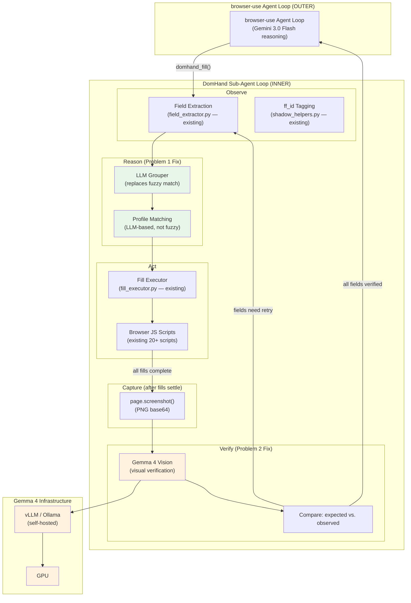
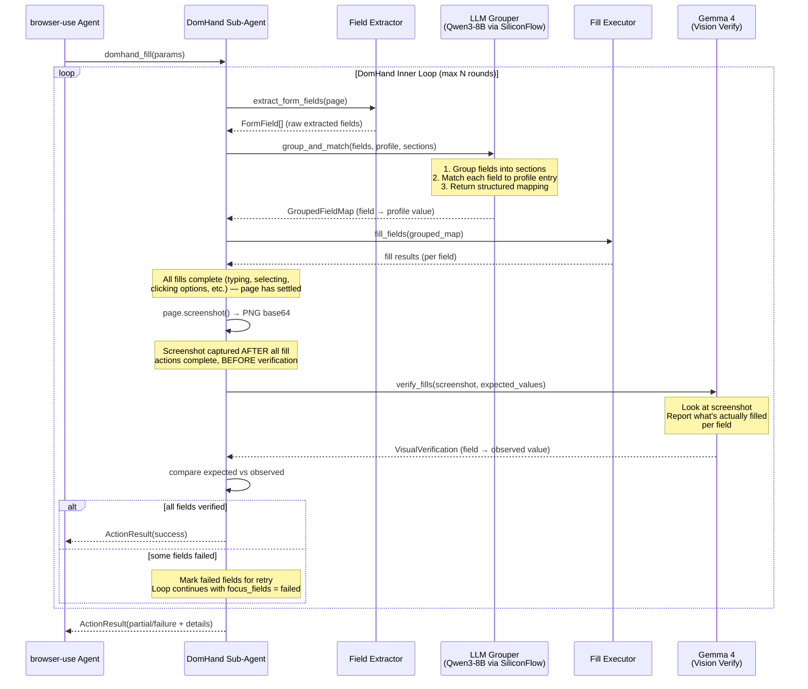
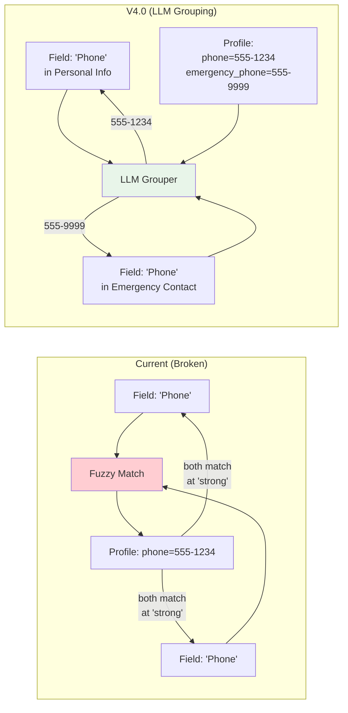
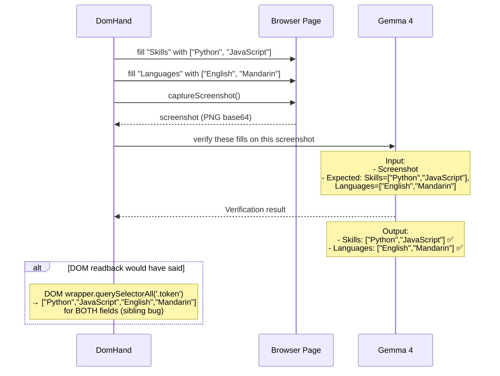
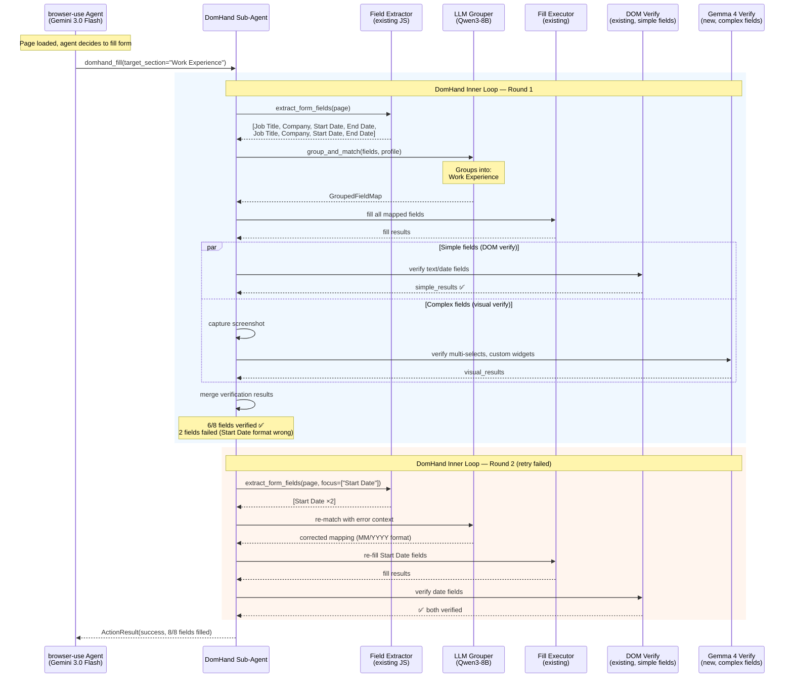
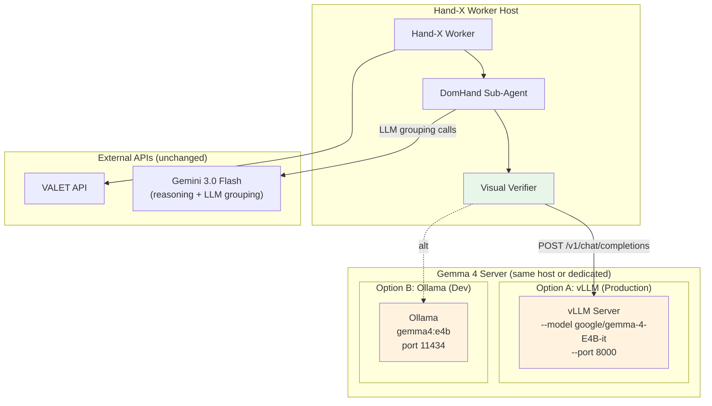
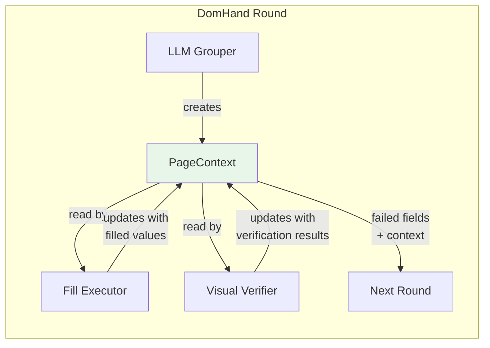

# Hand-X v4.0 — DomHand Enrichment OOD

> Object-Oriented Design for enriching the existing DomHand with two targeted
> fixes: (1) LLM-based grouping to replace broken fuzzy match, and (2) Gemma 4
> visual verification to solve the sibling element observation problem.
>
> **Created:** 2026-04-05
> **Status:** Draft — pending team alignment
> **Relationship to previous versions:** V4.0 enriches the **current** DomHand
> approach directly. V2.0 (structured pipeline) and V3.0 (vision-first) are
> scratched. This is not a replacement — it's targeted enrichment of what exists.

---

## Table of Contents

1. [Problem Statement](#1-problem-statement)
2. [Architecture Overview](#2-architecture-overview)
3. [DomHand Sub-Agent Loop](#3-domhand-sub-agent-loop)
4. [Problem 1: LLM-Based Grouping (Replace Fuzzy Match)](#4-problem-1-llm-based-grouping-replace-fuzzy-match)
5. [Problem 2: Visual Verification (Gemma 4)](#5-problem-2-visual-verification-gemma-4)
6. [Data Flow: End-to-End](#6-data-flow-end-to-end)
7. [Component Design](#7-component-design)
8. [Gemma 4 Integration](#8-gemma-4-integration)
9. [Self-Hosting Infrastructure](#9-self-hosting-infrastructure)
10. [Structured Output Determinism](#10-structured-output-determinism)
11. [Page Context: Tying Grouping to Verification](#11-page-context-tying-grouping-to-verification)
12. [What Changes and What Doesn't](#12-what-changes-and-what-doesnt)
13. [Data Models](#13-data-models)
14. [Testing Strategy](#14-testing-strategy)
15. [Open Questions](#15-open-questions)

---

## 1. Problem Statement

DomHand works. It fills forms. But it has two specific problems that cause
fill failures, and both are about **observation quality** — not the action layer.

### Problem 1: Fuzzy Match is Broken

**Location:** `ghosthands/dom/fill_label_match.py:185-234`

The current field-to-profile matching uses fuzzy string matching with substring
comparison, word overlap ratios, and stemming. This causes wrong fields to match:

| Failure mode | Example | Root cause |
|-------------|---------|------------|
| Stem collision | "Managing" field matches "Manager" profile entry | Both stem to "manag" |
| Substring match | "Address" matches "Current Address Line 1 Notes" | Substring ≥8 chars |
| Generic word overlap | "Name" matches "Full Name", "First Name", "Preferred Name" equally | Word overlap scoring can't disambiguate |
| No section awareness | "Phone" in Emergency Contact matches "Phone" in Personal Info | Fuzzy match ignores field grouping context |
| Repeater confusion | "Work Experience" vs "Work History" confused across entries | No understanding of which entry is which |

**What we need:** An LLM that understands both (a) which profile data maps to
which field label, and (b) which fields belong to which section/group. The LLM
replaces the fragile fuzzy heuristics with semantic understanding.

### Problem 2: Can't Observe Filled-In State

**Location:** `ghosthands/dom/fill_executor.py:4146-4191`

DomHand reads field values via DOM properties (`.value`, `.checked`, etc.).
This works for simple inputs but breaks for complex widgets:

| Widget type | What DOM says | What's actually on screen |
|-------------|--------------|--------------------------|
| Custom multi-select | `.value` is empty string | Chips/tags showing "Python, JavaScript" as siblings |
| Custom radio group | No standard `checked` property | One button visually highlighted via CSS class |
| Workday prompt search | Input shows search text, not selection | Selected item displayed in sibling container |
| Button group (Yes/No) | No form value | One button has `aria-pressed="true"` or active class |
| Answer tabs | Tab content not in input | Selected answer rendered in adjacent panel |

The multi-select wrapper at `fill_executor.py:4146` tries to read tokens by
walking UP to a parent container, then querying ALL token-like elements inside.
If two multi-select fields are siblings in the same container, it reads BOTH
fields' tokens — returning wrong verification data.

**What we need:** A vision model (Gemma 4) that looks at the screenshot and
reports what's actually filled. "I can see 'Python' and 'JavaScript' are
selected in the Skills field" — regardless of DOM structure.

### Why These Are Two Separate Problems

| | Problem 1 (Grouping) | Problem 2 (Verification) |
|---|---|---|
| **When** | Before fill — matching fields to profile | After fill — verifying fill worked |
| **Model** | LLM (Gemini 3.0 Flash or Haiku) | Vision model (Gemma 4) |
| **Needs screenshot?** | No — works on extracted field metadata | Yes — needs to see the page |
| **Replaces** | `fill_label_match.py` fuzzy heuristics | `_read_multi_select_selection()` DOM readback |
| **Risk if wrong** | Wrong value in wrong field | Thinks fill failed when it succeeded (or vice versa) |

Both problems enrich DomHand. Neither replaces the observation or action layer.

---

## 2. Architecture Overview



**Key insight:** The outer browser-use agent loop is unchanged. It calls
`domhand_fill()` as a tool. Inside DomHand, we add an inner loop that
observes → reasons (LLM grouping) → acts (fills) → verifies (Gemma 4 vision).
If verification fails, it loops back to re-observe and retry.

---

## 3. DomHand Sub-Agent Loop

### Current Flow (3 rounds, no reasoning between rounds)

```
domhand_fill() called by browser-use agent
  └─ for round in 1..3:
       ├─ extract_form_fields()           # observe (JS extraction)
       ├─ filter by section/boundary      # scope
       ├─ _known_profile_value_for_field()  # match (FUZZY — broken)
       ├─ LLM call for remaining fields   # fill decisions
       ├─ _fill_single_field() per field  # act
       └─ DOM-based verification          # verify (BROKEN for complex widgets)
```

### V4.0 Flow (sub-agent loop with LLM grouping + visual verification)



### What changes in the loop

| Phase | Current | V4.0 |
|-------|---------|------|
| **Observe** | `field_extractor.py` JS extraction | Same — no changes |
| **Group** | None (fields treated individually) | NEW: LLM groups fields into sections |
| **Match** | `fill_label_match.py` fuzzy matching | NEW: LLM matches fields to profile with section context |
| **Fill** | `fill_executor.py` + browser scripts | Same — no changes |
| **Verify** | DOM `.value` readback (broken for complex widgets) | NEW: Gemma 4 visual verification for complex widgets; DOM readback kept for simple fields |

### When DomHand runs

Per IndoClaw's premises:
1. **On new page** (SPA navigation, URL change, hash change): DomHand runs once
2. **On conditional reveal** (new fields appear after a selection): DomHand re-runs on the revealed section
3. **On verification failure**: Inner loop retries failed fields

DomHand is called by the browser-use agent loop as a tool — the outer loop
handles page navigation, clicking "Next", handling errors. DomHand handles
everything within a single page/section of a form.

---

## 4. Problem 1: LLM-Based Grouping (Replace Fuzzy Match)

### What fuzzy match does today (and why it breaks)

`fill_label_match.py:185` implements `_label_match_confidence()` which:

1. Normalizes labels (lowercase, strip symbols)
2. Computes word overlap ratio between field label and profile entry
3. Falls back to stemming ("managing" → "manag")
4. Falls back to substring match (≥8 chars)

Returns confidence: `exact | strong | medium | weak | None`

**Failure modes:**

```
Field: "First Name"     Profile: "first_name: Spencer"     → exact ✅
Field: "Managing"       Profile: "manager: John"           → medium (stem collision) ❌
Field: "Phone" (emergency) Profile: "phone: 555-1234"      → strong (no section context) ❌
Field: "Address Line 1" Profile: "address: 123 Main St"    → strong (but which address?) ❌
```

### What LLM grouping replaces it with

Instead of fuzzy string matching, we send the extracted fields + user profile
to an LLM in a single call. The LLM returns:

1. **Field groups** — which fields belong together (e.g., "First Name", "Last Name",
   "Email" are all in "Personal Information")
2. **Profile mapping** — which profile value goes in which field, WITH section context
   (e.g., "Phone in Emergency Contact" → emergency contact phone, not personal phone)



### LLM Grouper input/output

**Key design decision:** We use **integer indices** instead of `ff_id` strings
in the LLM prompt/response. SiliconFlow's Qwen3-8B does not support true
JSON schema enum constraints, so asking the LLM to reproduce exact `ff_id`
strings like `"ff-12"` risks hallucination (`"12"`, `"ff_12"`, `"ff-012"`).
Integer indices are deterministic — we map them back to `ff_id` in our code.

See [Section 10: Structured Output Determinism](#10-structured-output-determinism) for full rationale.

**Input** (sent to Qwen3-8B via SiliconFlow):
```
Here are the form fields on this page. Each field has an index number.

Fields:
[0] "First Name" (text) — section: Personal Information — empty
[1] "Last Name" (text) — section: Personal Information — empty
[2] "Phone" (tel) — section: Personal Information — empty
[3] "Phone" (tel) — section: Emergency Contact — empty
[4] "Job Title" (text) — section: Work Experience — empty
[5] "Job Title" (text) — section: Work Experience — empty

User profile:
- first_name: Spencer
- last_name: Wang
- phone: 555-1234
- emergency_contact_phone: 555-9999
- work_experience: [{title: "Software Engineer", company: "Acme"}, {title: "Intern", company: "StartupCo"}]

Group these fields into logical sections, then map each field to the correct profile value.
Use the field index numbers in your response.

Return JSON.
```

**Output** (structured JSON — indices only, no ff_id strings):
```json
{
  "groups": [
    {"section": "Personal Information", "field_indices": [0, 1, 2]},
    {"section": "Emergency Contact", "field_indices": [3]},
    {"section": "Work Experience #1", "field_indices": [4]},
    {"section": "Work Experience #2", "field_indices": [5]}
  ],
  "mappings": [
    {"index": 0, "profile_key": "first_name", "value": "Spencer"},
    {"index": 1, "profile_key": "last_name", "value": "Wang"},
    {"index": 2, "profile_key": "phone", "value": "555-1234"},
    {"index": 3, "profile_key": "emergency_contact_phone", "value": "555-9999"},
    {"index": 4, "profile_key": "work_experience.0.title", "value": "Software Engineer"},
    {"index": 5, "profile_key": "work_experience.1.title", "value": "Intern"}
  ]
}
```

**Our code then maps indices back to ff_ids:**
```python
# Built before LLM call — deterministic, on our side
index_to_ff_id = {i: field.field_id for i, field in enumerate(fields)}
# index_to_ff_id = {0: "ff-0", 1: "ff-1", 2: "ff-5", 3: "ff-12", 4: "ff-20", 5: "ff-21"}

# After LLM response — map back
for mapping in llm_response["mappings"]:
    ff_id = index_to_ff_id[mapping["index"]]  # deterministic lookup
    # ff_id is guaranteed correct — no hallucination possible
```

### What gets removed

| File | What's removed | Why |
|------|---------------|-----|
| `fill_label_match.py` | `_label_match_confidence()`, word overlap, stemming, substring match | Replaced by LLM semantic understanding |
| `fill_profile_resolver.py` | `_match_qa_answer()`, `_find_best_profile_answer()` fuzzy fallback paths | LLM handles matching directly |

### What stays

- `field_extractor.py` — still extracts raw fields from DOM (the observation)
- `fill_executor.py` — still executes fills via Playwright/CDP
- All browser JS scripts — untouched
- `shadow_helpers.py` — still injects ff_id tags
- The profile data structure — unchanged

### LLM Grouper model: Qwen3-8B via SiliconFlow

**Decision: `Qwen/Qwen3-8B` on SiliconFlow (free tier)**

SiliconFlow offers Qwen3-8B at **$0.00/token** (free). The API is OpenAI-compatible
and supports `response_format: {"type": "json_object"}` for structured output.

| Model | Cost | Active Params | Context | JSON mode | Speed |
|-------|------|---------------|---------|-----------|-------|
| **Qwen3-8B (free)** | **$0/month** | 8B dense | 131K | Yes | Fast |
| Qwen3-30B-A3B (paid, upgrade path) | ~$36/month | 3B active (MoE) | 262K | Yes | Very fast |

**Why Qwen3-8B:**
- Free — $0/month regardless of call volume
- Qwen3-8B outperforms Qwen2.5-14B on most benchmarks
- Our task is relatively simple: field labels + profile → JSON mapping
- Use non-thinking mode (skip chain-of-thought) for direct JSON output
- If accuracy is insufficient for complex repeater disambiguation, upgrade to
  Qwen3-30B-A3B-Instruct-2507 at ~$36/month

**SiliconFlow integration:**
```python
from openai import AsyncOpenAI

client = AsyncOpenAI(
    base_url="https://api.siliconflow.cn/v1",
    api_key=settings.GH_SILICONFLOW_API_KEY,
)

response = await client.chat.completions.create(
    model="Qwen/Qwen3-8B",
    messages=messages,
    response_format={"type": "json_object"},
    max_tokens=1024,
)
```

**Environment variables:**

| Variable | Default | Description |
|----------|---------|-------------|
| `GH_SILICONFLOW_API_KEY` | — (required) | SiliconFlow API key |
| `GH_SILICONFLOW_BASE_URL` | `https://api.siliconflow.cn/v1` | SiliconFlow API endpoint |
| `GH_GROUPER_MODEL` | `Qwen/Qwen3-8B` | Model for LLM grouping |
| `GH_GROUPER_TIMEOUT` | `5` | Grouper call timeout (seconds) |

### Cost consideration

One LLM call per DomHand round (not per field). With Qwen3-8B on SiliconFlow's
free tier, the grouper has **zero marginal cost**. The input is compact (field
labels + profile keys, ~500-2000 tokens), output is structured JSON (~200-500 tokens).
This replaces N fuzzy match calls with 1 LLM call — faster AND free.

---

## 5. Problem 2: Visual Verification (Gemma 4)

### What DOM-based verification does today (and why it breaks)

After filling a field, DomHand reads the value back via DOM properties:

```javascript
// Simple fields — works fine
const value = element.value;  // text, email, tel, select

// Complex widgets — BROKEN
// fill_executor.py:4146-4191
const wrapper = ff.closestCrossRoot(el, '[data-automation-id="formField"]');
const tokens = wrapper.querySelectorAll('[data-automation-id*="selected"], .chip, .pill, .token');
// ^^^ picks up tokens from SIBLING multi-select fields in the same wrapper
```

### What Gemma 4 visual verification replaces

Gemma 4 receives a screenshot + a list of fields that were just filled, and
reports what it sees:



### When to use visual verification vs DOM verification

Not every field needs Gemma 4. Simple text inputs read fine from DOM.

| Field type | Verification method | Why |
|-----------|-------------------|-----|
| text, email, tel, url | DOM `.value` readback | Fast, reliable, no LLM cost |
| native `<select>` | DOM `.value` readback | Standard DOM API |
| textarea | DOM `.value` readback | Standard DOM API |
| **Custom multi-select** | **Gemma 4 visual** | Sibling element bug |
| **Custom radio/button group** | **Gemma 4 visual** | CSS-based selection, no standard checked property |
| **Workday prompt search** | **Gemma 4 visual** | Selection in sibling container |
| **Answer tabs** | **Gemma 4 visual** | Selected answer in adjacent panel |
| **Any field with low DOM confidence** | **Gemma 4 visual** | Fallback when DOM readback returns unexpected/empty |

### Gemma 4 verification prompt

**Input:** Screenshot + list of expected fills

```
Look at this screenshot of a job application form.
I just filled these fields. For each one, tell me what you see:

1. "Skills" (multi-select) — expected: ["Python", "JavaScript"]
2. "Languages" (multi-select) — expected: ["English", "Mandarin"]
3. "Willing to relocate?" (radio group) — expected: "Yes"

For each field, report:
- What value is currently visible on screen
- Whether it matches the expected value
- If you can't find the field, say so

Return JSON:
{
  "verifications": [
    {"field": "Skills", "observed": ["Python", "JavaScript"], "matches": true},
    ...
  ]
}
```

### Cost optimization

- Only call Gemma 4 for fields flagged as "complex widget" (multi-select,
  custom radio, prompt search, etc.)
- Batch all complex verifications into a single screenshot + single Gemma 4 call
- Simple fields (text, email, native select) still use fast DOM readback
- Estimated: 1-2 Gemma 4 calls per DomHand round (vs. 0 today), ~200-500ms added

---

## 6. Data Flow: End-to-End



---

## 7. Component Design

### 7.1 LLM Grouper (Problem 1)

Replaces `fill_label_match.py` fuzzy matching. Takes raw extracted fields +
user profile, returns grouped and matched field-to-value mapping.

```python
class LLMGrouper:
    """Groups form fields by section and matches them to profile values.

    Replaces the fuzzy string matching in fill_label_match.py with a single
    LLM call that understands field semantics and section context.

    Session-scoped — created once per DomHand session. Caches groupings
    to avoid re-calling on retry rounds (only re-match failed fields).
    """

    def __init__(
        self,
        llm_client: BaseChatModel,  # Gemini Flash or Haiku
        user_profile: dict,
    ):
        self._llm = llm_client
        self._profile = user_profile
        self._cached_groups: dict[str, FieldGroup] | None = None

    async def group_and_match(
        self,
        fields: list[FormField],
        target_section: str | None = None,
        retry_context: list[FieldRetryContext] | None = None,
    ) -> GroupedFieldMap:
        """Group fields into sections and match each to a profile value.

        Args:
            fields: Raw extracted FormFields from field_extractor.py
            target_section: Optional section scope (from DomHandFillParams)
            retry_context: Failed fields from previous round with error details

        Returns:
            GroupedFieldMap with section groupings and field→value mappings
        """
        prompt = self._build_prompt(fields, target_section, retry_context)
        response = await self._llm.ainvoke(prompt)
        return self._parse_response(response, fields)
```

### 7.2 Visual Verifier (Problem 2)

Calls Gemma 4 to verify complex widget fills via screenshot analysis.

```python
class VisualVerifier:
    """Verifies form fill results by analyzing screenshots with Gemma 4.

    Only used for complex widgets (multi-select, custom radio, prompt search)
    where DOM-based readback is unreliable. Simple fields (text, email,
    native select) still use fast DOM verification.

    Called after each fill round with a batch of fields that need visual
    confirmation.
    """

    def __init__(
        self,
        gemma_client: Gemma4Client,
    ):
        self._gemma = gemma_client

    async def verify_fills(
        self,
        screenshot_b64: str,
        expected_fills: list[ExpectedFill],
    ) -> list[VerificationResult]:
        """Verify filled fields by analyzing screenshot.

        Args:
            screenshot_b64: Current page screenshot after fills
            expected_fills: List of (field_label, expected_value, field_type)

        Returns:
            Per-field verification: observed value + match boolean
        """
        prompt = self._build_verification_prompt(screenshot_b64, expected_fills)
        response = await self._gemma.complete(prompt)
        return self._parse_verification(response, expected_fills)

    def needs_visual_verification(self, field: FormField) -> bool:
        """Determine if a field needs visual verification or can use DOM readback.

        Complex widgets that have known DOM readback issues get visual verification.
        Simple fields use the fast, reliable DOM path.
        """
        complex_types = {
            "multi-select", "custom-select", "radio-group",
            "checkbox-group", "button-group", "prompt-search",
        }
        return (
            field.field_type in complex_types
            or field.widget_kind in ("workday-prompt", "custom-dropdown")
            # Fallback: if DOM readback returned empty but we just filled it
            or (field.filled_value and not field.dom_readback_value)
        )
```

### 7.3 Gemma4Client (Shared)

Same OpenAI-compatible client for Gemma 4 vision calls. Used by VisualVerifier.

```python
class Gemma4Client:
    """OpenAI-compatible client for self-hosted Gemma 4.

    Connects to vLLM or Ollama running Gemma 4 with vision capabilities.
    Used exclusively for visual verification — NOT for reasoning or fill decisions.
    """

    def __init__(
        self,
        base_url: str = "http://localhost:8000/v1",
        api_key: str = "EMPTY",
        model: str = "google/gemma-4-E4B-it",
        timeout: float = 10.0,
        max_tokens: int = 1024,
    ):
        self._client = AsyncOpenAI(base_url=base_url, api_key=api_key)
        self._model = model
        self._timeout = timeout
        self._max_tokens = max_tokens

    async def complete(
        self,
        messages: list[dict],
        response_schema: dict | None = None,
    ) -> dict:
        """Send a vision request to Gemma 4.

        Args:
            messages: Chat messages (including image content for vision)
            response_schema: Optional JSON schema for guided decoding.
                When provided, vLLM constrains output tokens to match the
                schema exactly — including enum values for field IDs.
                See Section 10 (Structured Output Determinism).
        """
        kwargs = {
            "model": self._model,
            "messages": messages,
            "max_tokens": self._max_tokens,
        }

        if response_schema:
            # vLLM guided decoding — token-level schema enforcement
            # Enum values are constrained at generation time, not post-hoc
            kwargs["extra_body"] = {"guided_json": response_schema}
        else:
            kwargs["response_format"] = {"type": "json_object"}

        response = await asyncio.wait_for(
            self._client.chat.completions.create(**kwargs),
            timeout=self._timeout,
        )
        return json.loads(response.choices[0].message.content)
```

### 7.4 DomHand Orchestrator (Updated Loop)

The updated `domhand_fill()` function that wires everything together.

```python
async def domhand_fill(
    params: DomHandFillParams,
    browser_session: BrowserSession,
    llm_grouper: LLMGrouper,           # NEW
    visual_verifier: VisualVerifier,    # NEW
) -> ActionResult:
    """DomHand fill with LLM grouping and visual verification.

    The inner loop:
    1. OBSERVE: Extract fields (existing field_extractor.py)
    2. REASON:  LLM groups fields + matches to profile (replaces fuzzy)
    3. ACT:     Fill fields (existing fill_executor.py)
    4. VERIFY:  DOM readback for simple fields + Gemma 4 for complex widgets
    5. LOOP:    Retry failed fields (up to MAX_ROUNDS)
    """
    page = browser_session.page
    failed_fields: list[FieldRetryContext] = []

    for round_num in range(1, MAX_FILL_ROUNDS + 1):
        # 1. OBSERVE
        extraction = await extract_form_fields(
            page,
            target_section=params.target_section,
            focus_fields=[f.label for f in failed_fields] if failed_fields else params.focus_fields,
        )

        # 2. REASON (LLM replaces fuzzy match)
        grouped_map = await llm_grouper.group_and_match(
            fields=extraction.fields,
            target_section=params.target_section,
            retry_context=failed_fields if round_num > 1 else None,
        )

        # 3. ACT (unchanged fill executor)
        fill_results = await fill_mapped_fields(page, grouped_map)

        # 4. VERIFY (split: DOM for simple, Gemma 4 for complex)
        simple_fields = [f for f in fill_results if not visual_verifier.needs_visual_verification(f.field)]
        complex_fields = [f for f in fill_results if visual_verifier.needs_visual_verification(f.field)]

        # DOM verification for simple fields (fast, existing logic)
        dom_results = await verify_via_dom(page, simple_fields)

        # Visual verification for complex fields (Gemma 4)
        visual_results = []
        if complex_fields:
            screenshot = await page.screenshot(type="png")
            screenshot_b64 = base64.b64encode(screenshot).decode()
            visual_results = await visual_verifier.verify_fills(
                screenshot_b64=screenshot_b64,
                expected_fills=[
                    ExpectedFill(label=f.field.label, value=f.filled_value, field_type=f.field.field_type)
                    for f in complex_fields
                ],
            )

        # 5. Merge results, identify failures
        all_results = dom_results + visual_results
        failed_fields = [r for r in all_results if not r.verified]

        if not failed_fields:
            return ActionResult(success=True, details=f"All {len(all_results)} fields verified in {round_num} rounds")

    return ActionResult(
        success=len(failed_fields) == 0,
        details=f"{len(all_results) - len(failed_fields)}/{len(all_results)} fields verified after {MAX_FILL_ROUNDS} rounds",
        failed_fields=failed_fields,
    )
```

---

## 8. Gemma 4 Integration

### 8.1 Model Variants

| Model | Params (active) | VRAM (Q4) | Vision | Speed | Best for |
|-------|----------------|-----------|--------|-------|----------|
| **E2B** | 2.3B | ~5 GB | Yes | Fastest | Edge/mobile, low latency |
| **E4B** | 4.5B | ~6 GB | Yes | Fast | Consumer GPUs, good accuracy/speed |
| **26B-A4B** | 3.8B (MoE) | ~18 GB | Yes | Slow (known issue) | When speed issues are fixed |
| **31B** | 31B (dense) | ~20 GB | Yes | Moderate | Best accuracy, needs hardware |

**Decision: TBD.** For visual verification (not full page understanding),
E4B is likely sufficient — we're asking "is this field filled with X?" not
"describe everything on this page."

### 8.2 Why Self-Hosted

- Visual verification runs 1-2 times per DomHand round
- At scale (thousands of applications), hosted API costs add up
- Self-hosted = fixed cost (GPU) regardless of call volume
- Latency: local GPU is faster than network round-trip to hosted API
- Privacy: screenshots of user applications stay on our infrastructure

### 8.3 Structured Output

Gemma 4 supports JSON mode via vLLM's guided decoding:
- `response_format: {"type": "json_object"}`
- Output is constrained to valid JSON matching the verification schema
- If JSON parsing fails, fallback to DOM-only verification for that round

---

## 9. Self-Hosting Infrastructure



### Deployment

**Development (Ollama):**
```bash
ollama run gemma4:e4b
# API at http://localhost:11434/v1
```

**Production (vLLM + Docker):**
```bash
docker run -d --gpus all --network host \
    -v ~/.cache/huggingface:/root/.cache/huggingface \
    vllm/vllm-openai:gemma4 \
    --model google/gemma-4-E4B-it \
    --max-model-len 32768 \
    --host 0.0.0.0 --port 8000
# API at http://localhost:8000/v1
```

### Environment Variables

| Variable | Default | Description |
|----------|---------|-------------|
| `GH_GEMMA_BASE_URL` | `http://localhost:8000/v1` | Gemma 4 server endpoint |
| `GH_GEMMA_MODEL` | `google/gemma-4-E4B-it` | Model variant |
| `GH_GEMMA_API_KEY` | `EMPTY` | API key (for hosted providers) |
| `GH_GEMMA_TIMEOUT` | `10` | Vision call timeout (seconds) |

---

## 10. Structured Output Determinism

Both the LLM Grouper and Visual Verifier output structured JSON that references
specific form fields. If the LLM hallucinates a field ID — `"0"` instead of
`"ff-0"`, `"ff_0"` instead of `"ff-0"` — the entire downstream pipeline breaks.

This section documents how we ensure **deterministic, exact** field references
in both models' outputs.

### 10.1 The Problem

| Model | Output field | Hallucination risk | Example |
|-------|-------------|-------------------|---------|
| LLM Grouper (Qwen3-8B) | `ff_id` string | **High** — SiliconFlow lacks token-level schema enforcement | Input: `"ff-12"` → Output: `"12"`, `"ff_12"`, `"ff-012"` |
| Visual Verifier (Gemma 4) | `field_id` / `label` | **Medium** — vLLM supports guided decoding with enums | Input: `"Skills"` → Output: `"skills"`, `"Skill"` |

### 10.2 Solution: LLM Grouper (Integer Indexing)

**SiliconFlow does NOT support `json_schema` mode with enum constraints.**
It supports `json_object` mode (valid JSON guaranteed, but values are unconstrained).

**Our approach: don't ask the LLM to output field ID strings at all.**

Instead, we present fields as a numbered list (`[0]`, `[1]`, `[2]`, ...) and
the LLM outputs integer indices. We map integers back to `ff_id` in our code.

```
LLM sees:                    LLM outputs:           Our code maps:
[0] "First Name" (text)  →   {"index": 0, ...}  →   ff_id = index_to_ff_id[0] = "ff-0"
[1] "Last Name" (text)   →   {"index": 1, ...}  →   ff_id = index_to_ff_id[1] = "ff-1"
[2] "Phone" (tel)         →   {"index": 2, ...}  →   ff_id = index_to_ff_id[2] = "ff-5"
```

**Why this works:** LLMs are significantly more reliable at producing small
integers than reproducing arbitrary string IDs. The index→ff_id mapping is
deterministic and entirely on our side — zero hallucination risk.

**Safety net:** Post-processing normalization catches any remaining edge cases:

```python
import re

def normalize_index(raw: any, max_index: int) -> int | None:
    """Normalize LLM output to a valid integer index."""
    if isinstance(raw, int) and 0 <= raw <= max_index:
        return raw
    if isinstance(raw, str):
        m = re.match(r"^\d+$", raw.strip())
        if m:
            idx = int(m.group())
            if 0 <= idx <= max_index:
                return idx
    return None  # invalid — flag for warning
```

### 10.3 Solution: Visual Verifier (vLLM Guided Decoding)

**vLLM supports true token-level schema enforcement** via its guided decoding
engine (xgrammar / outlines). This works with Gemma 4 vision models.

When we call Gemma 4 for verification, we dynamically generate a Pydantic
schema with enum constraints that list the exact field IDs being verified:

```python
from enum import Enum
from pydantic import BaseModel

def build_verification_schema(expected_fills: list[ExpectedFill]) -> dict:
    """Build a JSON schema with enum-constrained field IDs.

    The enum values are the EXACT field labels/IDs being verified.
    vLLM's guided decoding ensures the model can ONLY output these values.
    """
    # Dynamic enum from the fields we're verifying
    field_labels = [f.label for f in expected_fills]
    FieldLabel = Enum("FieldLabel", {label: label for label in field_labels})

    class SingleVerification(BaseModel):
        field: FieldLabel            # constrained to exact input labels
        observed: str | list[str]    # what Gemma 4 sees on screen
        matches: bool                # does observed match expected?

    class VerificationResponse(BaseModel):
        verifications: list[SingleVerification]

    return VerificationResponse.model_json_schema()

# Usage in Gemma4Client:
schema = build_verification_schema(expected_fills)
response = await gemma_client.complete(
    messages=messages,
    response_schema=schema,  # passed to vLLM's guided_json
)
# Gemma 4 literally CANNOT output a field label not in the enum
```

**How vLLM guided decoding works:**
1. We pass the JSON schema via `extra_body={"guided_json": schema}`
2. vLLM converts the schema to a finite-state machine (FSM)
3. At each token generation step, the FSM masks invalid tokens
4. For enum fields, only tokens that form valid enum values are allowed
5. Result: the model's output is **guaranteed** to match the schema

**Ollama equivalent** (for development):
```python
response = ollama.chat(
    model="gemma4",
    messages=messages,
    format=schema,  # same JSON schema, different API surface
)
```

### 10.4 Platform Support Summary

| Platform | Model | Constraint method | Determinism level |
|----------|-------|------------------|-------------------|
| SiliconFlow | Qwen3-8B | Integer indexing (no string IDs in LLM output) | **Guaranteed** — mapping is in our code |
| vLLM | Gemma 4 | `guided_json` with dynamic enum schema | **Guaranteed** — token-level FSM enforcement |
| Ollama | Gemma 4 | `format` with JSON schema + enum | **Guaranteed** — grammar-based decoding |

### 10.5 Qwen3 Caveat: Thinking Mode + Structured Output

Qwen3 models in thinking mode have a known bug with structured output
(vLLM issue #18819). For the SiliconFlow path this doesn't matter (we use
integer indexing, not schema enforcement). But if we ever self-host Qwen3
on vLLM with `guided_json`, we must either:
- Disable thinking mode, OR
- Append `/no_think` to the user prompt

For the SiliconFlow Qwen3-8B grouper, use **non-thinking mode** to get
direct JSON output without wasted chain-of-thought tokens.

---

## 11. Page Context: Tying Grouping to Verification

### The Gap

The LLM Grouper outputs grouped field mappings. The Fill Executor fills fields.
The Visual Verifier checks screenshots. But **nothing ties them together** —
when Gemma 4 reports "Skills field shows Python, JavaScript", how do we know
which group "Skills" belongs to, which `ff_id` it maps to, and what the
expected value was?

### Solution: PageContext

A `PageContext` object is created during the Group phase and persists through
the entire Fill → Capture → Verify → Retry cycle within a DomHand round.



### What PageContext holds

```python
class FieldContext(BaseModel):
    """Everything known about a single field across the round."""
    ff_id: str                            # "ff-12"
    index: int                            # 3 (integer index used in LLM prompt)
    label: str                            # "Phone"
    field_type: str                       # "tel"
    group_section: str                    # "Emergency Contact"
    profile_key: str | None = None        # "emergency_contact_phone"
    expected_value: str | None = None     # "555-9999"
    filled_value: str | None = None       # what we actually sent to the field
    verified: bool | None = None          # None = not yet verified
    verification_method: str | None = None  # "dom" or "visual"
    observed_value: str | None = None     # what verification saw


class PageContext(BaseModel):
    """Persists across the Group → Fill → Verify cycle within a DomHand round.

    Created by the LLM Grouper, updated by Fill Executor and Verifier.
    Passed to the next round if retry is needed, providing error context.
    """
    fields: dict[str, FieldContext]       # ff_id → FieldContext
    groups: list[FieldGroup]              # section groupings from LLM Grouper
    index_to_ff_id: dict[int, str]        # integer index → ff_id mapping
    round_number: int = 1
    page_url: str = ""
    page_title: str = ""

    def get_failed_fields(self) -> list[FieldContext]:
        """Fields that failed verification — candidates for retry."""
        return [f for f in self.fields.values() if f.verified is False]

    def get_group_for_field(self, ff_id: str) -> str:
        """Look up which section/group a field belongs to."""
        return self.fields[ff_id].group_section

    def to_retry_context(self) -> list[FieldRetryContext]:
        """Convert failed fields to retry context for next round."""
        return [
            FieldRetryContext(
                label=f.label,
                ff_id=f.ff_id,
                expected_value=f.expected_value,
                observed_value=f.observed_value,
                failure_reason="value_mismatch" if f.observed_value else "field_empty",
                attempts=self.round_number,
            )
            for f in self.get_failed_fields()
        ]
```

### How PageContext flows through the loop

```
Round 1:
  1. OBSERVE → extract fields → [FormField, FormField, ...]
  2. GROUP   → LLM Grouper creates PageContext
               - Builds index_to_ff_id mapping
               - Populates group_section, profile_key, expected_value per field
  3. FILL    → Fill Executor reads PageContext for values to fill
               - Updates filled_value per field
  4. CAPTURE → Screenshot taken
  5. VERIFY  → DOM verify (simple) + Gemma 4 verify (complex)
               - Verifier looks up field in PageContext by ff_id or label
               - Updates verified, verification_method, observed_value
  6. CHECK   → PageContext.get_failed_fields()
               - If empty → success, return
               - If not → PageContext.to_retry_context() → Round 2

Round 2:
  1. OBSERVE → re-extract (focused on failed fields)
  2. GROUP   → LLM Grouper receives retry_context from PageContext
               - Knows which fields failed, what was observed vs expected
               - Can adjust mapping (e.g., different date format)
  3-6. Same as above with updated PageContext
```

### Why PageContext solves the mapping gap

Without PageContext:
- Gemma 4 says: `{"field": "Skills", "observed": ["Python"], "matches": false}`
- DomHand says: "which field is 'Skills'? which group? what was the expected value?"
- Answer: **unknown** — the grouping context was lost after the LLM Grouper call

With PageContext:
- Gemma 4 says: `{"field": "Skills", "observed": ["Python"], "matches": false}`
- DomHand looks up `PageContext.fields` by label "Skills" → `ff_id="ff-15"`,
  `group_section="Technical Skills"`, `expected_value=["Python", "JavaScript"]`
- DomHand knows exactly what failed, in which group, and can retry with context

---

## 12. What Changes and What Doesn't

```
┌────────────────────────────────────────────────────────────────────┐
│                           CHANGES                                  │
│                                                                    │
│  ghosthands/dom/fill_label_match.py → fuzzy match logic REMOVED    │
│  ghosthands/dom/fill_profile_resolver.py → fuzzy fallback REMOVED  │
│  ghosthands/actions/domhand_fill.py → inner loop updated           │
│  ghosthands/config/settings.py → GH_GEMMA_* + GH_SILICONFLOW_* vars│
│                                                                    │
│  NEW FILES:                                                        │
│  ghosthands/dom/llm_grouper.py     (Problem 1: LLM grouping)      │
│  ghosthands/dom/visual_verifier.py (Problem 2: Gemma 4 verify)    │
│  ghosthands/dom/gemma4_client.py   (Gemma 4 API client)            │
│                                                                    │
├────────────────────────────────────────────────────────────────────┤
│                       DOES NOT CHANGE                              │
│                                                                    │
│  field_extractor.py        → still extracts fields from DOM        │
│  fill_executor.py          → still fills via Playwright/CDP        │
│  domhand_select.py         → unchanged                             │
│  shadow_helpers.py         → still injects ff_id tags              │
│  verification_engine.py    → DOM verify still used for simple      │
│  All 20+ browser JS scripts → unchanged                           │
│  selector_map / CDP pipeline → unchanged                           │
│  browser-use agent loop    → unchanged (calls domhand_fill as tool)│
│  Gemini 3.0 Flash          → still handles reasoning               │
│  views.py (FormField etc.) → unchanged                             │
│                                                                    │
└────────────────────────────────────────────────────────────────────┘
```

**Key point:** The browser-use agent loop is NOT modified. DomHand is still
called as a tool by the agent. The enrichment is entirely INSIDE DomHand.

---

## 13. Data Models

### 13.1 LLM Grouper Models

```python
class FieldGroup(BaseModel):
    """A group of related fields identified by the LLM."""
    section: str                          # "Personal Information", "Work Experience #1"
    field_indices: list[int]              # [0, 1, 2] — integer indices, NOT ff_id strings


class FieldMapping(BaseModel):
    """A mapping from one form field to a profile value."""
    index: int                            # 0 — integer index from numbered field list
    profile_key: str                      # "first_name" or "work_experience.0.title"
    value: str                            # "Spencer"
    confidence: float = 1.0              # LLM's confidence in this mapping


class GroupedFieldMap(BaseModel):
    """Complete output of the LLM Grouper.

    Uses integer indices throughout. The caller maps indices back to
    ff_ids via the index_to_ff_id dict (see PageContext).
    """
    groups: list[FieldGroup]              # Section groupings (by index)
    mappings: list[FieldMapping]          # Index → profile value mappings
    unmapped_indices: list[int] = []      # Indices that couldn't be matched
    warnings: list[str] = []             # Issues during grouping
```

### 13.2 Visual Verifier Models

```python
class ExpectedFill(BaseModel):
    """What we expect a field to contain after filling."""
    label: str                            # "Skills"
    value: str | list[str]               # "Python" or ["Python", "JavaScript"]
    field_type: str                       # "multi-select"


class VerificationResult(BaseModel):
    """Result of verifying one field (either DOM or visual)."""
    ff_id: str
    label: str
    expected: str | list[str]
    observed: str | list[str]             # What was actually found
    verified: bool                        # Does observed match expected?
    method: str                           # "dom" or "visual"
    confidence: float = 1.0


class FieldRetryContext(BaseModel):
    """Context for retrying a failed field on the next round."""
    label: str
    ff_id: str
    expected_value: str | list[str]
    observed_value: str | list[str]
    failure_reason: str                   # "value_mismatch", "field_empty", "field_not_found"
    attempts: int = 1
```

### 13.3 PageContext Models

See [Section 11](#11-page-context-tying-grouping-to-verification) for full
design rationale. `FieldContext` and `PageContext` are defined there.

---

## 14. Testing Strategy

### Approach: Local Toy Application

Instead of testing against live ATS platforms (slow, flaky, rate-limited, can't
control the DOM), we build a **local toy application** — a simple web app that
recreates the exact DOM structures and widget types we've seen in real applications.

**Why this approach:**
- We control the DOM — can add, remove, and modify widgets at will
- Reproducible — same test runs every time, no network dependencies
- Fast — local Playwright connects instantly, no login flows
- Can test edge cases — create the weirdest widget combinations on demand
- Can watch logs in real-time — DomHand runs against localhost

### What to recreate in the toy app

The toy app should include pages that replicate real ATS widgets we've encountered.
When we hit a weird widget in production, we capture its DOM and recreate it in the
toy app for repeatable testing.

#### Widget types to cover

| Category | Widget | Platform seen on | What makes it hard |
|----------|--------|-----------------|-------------------|
| **Multi-select** | Chip/tag multi-select | Workday, Greenhouse | Sibling element bug — tokens read from wrong field |
| **Multi-select** | Searchable multi-select with dropdown | Workday (Skills) | Prompt search dialog, selection in sibling container |
| **Radio group** | CSS-styled radio buttons (no native `<input type="radio">`) | Lever, SmartRecruiters | No `checked` property — selection via CSS class |
| **Button group** | Yes/No/Maybe segmented buttons | Greenhouse, Lever | `aria-pressed` or active class, no form value |
| **Dropdown** | Custom `<div>`-based select (not native `<select>`) | Workday, Phenom | `.value` empty, visible text in separate span |
| **Date fields** | Split date (Month / Day / Year as separate selects) | Workday | 3 fields that are logically one "Date" group |
| **Date fields** | Date picker with calendar popup | Greenhouse | Input shows formatted date, underlying value differs |
| **Repeaters** | "Add Another" work experience / education | Workday, Greenhouse | Identical field labels across entries — grouping problem |
| **Answer tabs** | Tabbed answer selection | Oracle Taleo | Selected answer in adjacent panel, not input value |
| **Conditional reveals** | Fields that appear after selecting a dropdown value | All platforms | New fields mid-form, need re-extraction |
| **File upload** | Resume/cover letter upload | All platforms | Not a fill — but needs verification that upload succeeded |
| **EEO questions** | Gender/race/veteran status with "prefer not to answer" | All platforms | Sensitive fields, specific option matching |

#### How to build the toy app

1. **Start simple:** HTML + CSS, served locally (e.g., `python -m http.server`)
2. **One page per test scenario:** `/repeater-test`, `/multi-select-test`, etc.
3. **Capture real DOM:** When we encounter a weird widget in production:
   - Copy the relevant DOM subtree (via DevTools → Copy → Copy outerHTML)
   - Paste into the toy app as a new test page
   - Include the CSS classes/attributes that make it behave like the real thing
4. **Add form submission endpoint:** Simple POST handler that logs received values
   so we can verify what DomHand actually submitted

#### Test scenarios

**Problem 1 (LLM Grouping) tests:**

| Scenario | What to test | Pass criteria |
|----------|-------------|---------------|
| Basic personal info | First Name, Last Name, Email, Phone | All fields mapped to correct profile values |
| Duplicate labels | Two "Phone" fields (Personal + Emergency Contact) | Each mapped to correct phone number based on section |
| Repeaters ×3 | Three Work Experience blocks with identical labels | Each entry mapped to correct `work_experience[0]`, `[1]`, `[2]` |
| Mixed sections | Personal Info + Education + Work Experience on one page | Fields grouped into correct sections |
| Ambiguous labels | "Name" (could be first, last, or full name) | LLM infers from context (other fields present) |
| No section headings | Flat form with no visible section headers | LLM groups by field semantics alone |

**Problem 2 (Visual Verification) tests:**

| Scenario | What to test | Pass criteria |
|----------|-------------|---------------|
| Multi-select filled | Fill Skills with ["Python", "JavaScript"], verify via screenshot | Gemma 4 sees both chips, reports correct values |
| Multi-select sibling | Two multi-selects in same container, fill both | Gemma 4 correctly attributes chips to the right field |
| Radio group selected | Select "Yes" in a CSS-styled radio group | Gemma 4 sees the highlighted button, reports "Yes" |
| Button group | Click "No" in a Yes/No segmented control | Gemma 4 sees the active button state |
| Empty field detection | Don't fill a required field, verify it's empty | Gemma 4 reports field as empty |
| Dropdown closed | Select an option, dropdown closes | Gemma 4 reads the displayed value in the closed dropdown |

**End-to-end tests:**

| Scenario | What to test | Pass criteria |
|----------|-------------|---------------|
| Full application page | Toy app with all widget types on one page | DomHand fills all fields, LLM grouper maps correctly, Gemma 4 verifies complex widgets |
| Retry loop | Fill a field incorrectly (wrong format), verify DomHand retries | Round 2 corrects the fill after verification failure |
| Conditional reveal | Select "Yes" → new fields appear → DomHand fills them | Re-extraction picks up new fields, grouper includes them |
| Mixed verification | Page with simple (text) + complex (multi-select) fields | DOM verify for simple, Gemma 4 verify for complex, all pass |

### Test execution

```bash
# Start toy app
cd tests/toy_app && python -m http.server 8080

# Run DomHand against toy app
GH_TEST_MODE=true python -m ghosthands.main --target http://localhost:8080/repeater-test

# Watch logs
# structlog outputs show: grouper input/output, fill actions, verification results
```

### Adding new test cases from production

When we encounter a new weird widget in production:

1. **Capture:** Copy the DOM subtree from DevTools
2. **Recreate:** Add a new page to the toy app with the captured DOM
3. **Reproduce:** Run DomHand against it, confirm the failure
4. **Fix:** Update grouper prompt / verifier logic
5. **Verify:** Re-run, confirm the fix
6. **Persist:** The test page stays in the toy app for regression testing

This creates a growing library of edge cases that we can run against every change.

---

## 15. Open Questions

### LLM Grouper

| # | Question | Impact | How to answer |
|---|----------|--------|---------------|
| 1 | ~~Which model for LLM grouping?~~ **RESOLVED:** Qwen3-8B on SiliconFlow (free tier). Upgrade to Qwen3-30B-A3B if accuracy insufficient. | — | — |
| 2 | Can we cache groupings across DomHand rounds? PageContext persists, but should we re-group on retry? | Avoid re-calling LLM on retry if only failed fields change | Test: do groupings change when new fields are revealed? |
| 3 | How to handle repeater entries (Work Experience #1, #2, #3)? | Repeaters have identical field labels per entry | Test LLM's ability to disambiguate by position/context |
| 4 | Should grouping happen before or after section filtering? | If before, LLM sees all fields (better context). If after, LLM sees fewer fields (cheaper). | Test both — likely before filtering for better accuracy |

### Visual Verification

| # | Question | Impact | How to answer |
|---|----------|--------|---------------|
| 5 | Which Gemma 4 variant (E4B vs 26B vs 31B) for verification? | Verification needs less accuracy than full page understanding | Benchmark on real filled form screenshots |
| 6 | What's the E4B accuracy for reading filled values from screenshots? | If too low, need larger variant | Test on Workday/Greenhouse/Lever filled form screenshots |
| 7 | Can we batch-verify all complex fields in one Gemma 4 call? | 1 call vs N calls affects latency | Test if accuracy degrades with more fields per call |
| 8 | Fallback: what happens if Gemma 4 is down? | Need graceful degradation | Fall back to DOM-only verification (current behavior) |

### Integration

| # | Question | Impact | How to answer |
|---|----------|--------|---------------|
| 9 | How much latency does the inner loop add? | Must stay under ~5s total per DomHand round | Benchmark: LLM grouper call + Gemma 4 verify call |
| 10 | ~~How to test LLM grouper without real LLM?~~ **RESOLVED:** Toy app + mock LLM responses. See Section 14 (Testing Strategy). | — | — |
| 11 | Should visual verification be opt-in per platform? | Some platforms (e.g., Lever) might not need it | Track which platforms have complex widgets |

---

*Document created: 2026-04-05*
*For: Hand-X v4.0 DomHand Enrichment*
*Status: Draft — pending team alignment*
