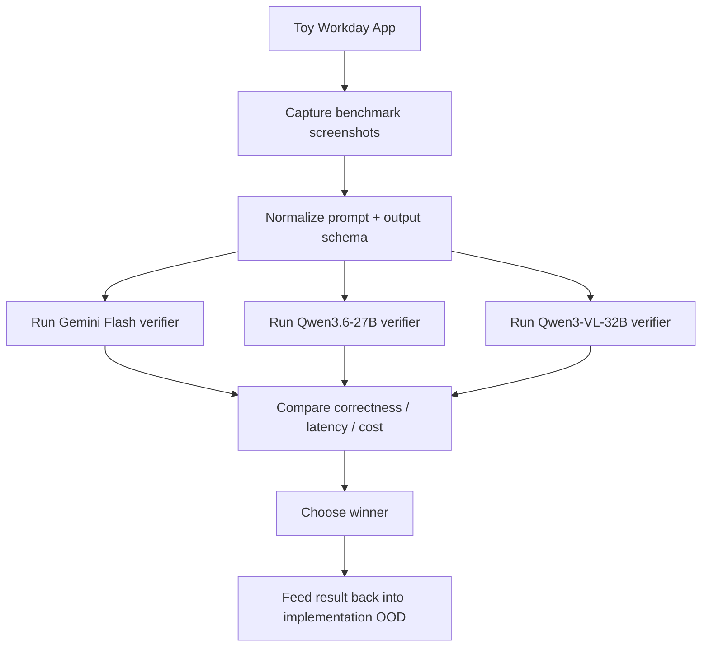

# Hand-X v4.1 — Visual Model Bakeoff Plan

> Source of truth for the next phase of work on `feat/v4.0-domhand-enrichment`.
>
> This document supersedes the **visual-model selection direction** in
> `V4.0-DOMHAND-ENRICHMENT-OOD.md` until the bakeoff is complete. The older OOD
> remains useful as background, but this file is the operational plan we follow
> next.

**Created:** 2026-05-20  
**Status:** Active plan  
**Branch:** `feat/v4.0-domhand-enrichment`

---

## 0. Latest Findings Log

### 2026-05-20 — Initialization findings

- Confirmed the working bakeoff set is:
  - `gemini-2.5-flash`
  - `Qwen/Qwen3.6-27B`
  - `Qwen/Qwen3-VL-32B-Instruct`
- Verified `GOOGLE_API_KEY` is present in `.env` and can successfully reach the
  Gemini API models endpoint.
- Verified `SILLICON_FLOW_KEY` is present in `.env` and can successfully reach
  the SiliconFlow models endpoint.
- Verified both target Qwen models are currently listed as available from the
  live SiliconFlow account model list:
  - `Qwen/Qwen3.6-27B`
  - `Qwen/Qwen3-VL-32B-Instruct`
- Confirmed the repo already has the dependencies needed for the first benchmark
  harness:
  - `playwright`
  - `pillow`
  - `requests`
  - `httpx`
  - `google-genai`
- Confirmed the benchmark harness does **not** need new Browser Use screenshot
  capabilities. The repo already supports:
  - viewport screenshots
  - element screenshots
  - custom crop logic built on top of page screenshots

This section should be updated as the bakeoff progresses so the latest state is
preserved even if conversation context is compacted.

### 2026-05-20 — Live provider smoke findings

- Local benchmark execution required installing Playwright Chromium in the
  workspace. This does not change Hand-X runtime behavior; it only enables the
  local screenshot harness.
- `gemini-2.5-flash` is working cleanly for the benchmark path when called
  through `google-genai` with:
  - `thinking_budget = 0`
  - `response_mime_type = "application/json"`
  - deterministic temperature settings
- `Qwen/Qwen3.6-27B` is working for multimodal screenshot verification on
  SiliconFlow when called with:
  - `/v1/chat/completions`
  - `enable_thinking = false`
  - `response_format = {"type": "json_object"}`
  - base64 image payloads encoded as `data:image/webp;base64,...`
  - `detail = "low"`
- `Qwen/Qwen3-VL-32B-Instruct` currently **fails the visual smoke gate** from
  this workspace/provider path. Text-only requests succeed, but multimodal
  requests return SiliconFlow error `code=50507` (`Request failed: Unknown
  error.`) across multiple image encodings and request variants.
- Python HTTP clients were not reliable enough for SiliconFlow chat completions
  in this workspace during the initial probes:
  - `requests` stalled
  - `httpx` returned provider-side `500/50507`
  - `curl` produced reliable responses
- First empirical bakeoff slice completed on a 3-scenario × 3-crop matrix:
  - `gemini-2.5-flash`
    - smoke gate: pass
    - accuracy: `9 / 9`
    - avg latency: `~2.58s`
    - avg cost: `~$0.000179 / call`
  - `Qwen/Qwen3.6-27B`
    - smoke gate: pass
    - accuracy: `9 / 9`
    - avg latency: `~4.55s`
    - avg cost: `~$0.001199 / call`
  - `Qwen/Qwen3-VL-32B-Instruct`
    - smoke gate: fail

Current interpretation after the first live slice:

- Gemini Flash is the quality/cost/latency leader so far.
- Qwen3.6-27B is viable on quality, but currently slower and materially more
  expensive per verification call.
- Qwen3-VL-32B-Instruct is not currently viable for this bakeoff until its
  SiliconFlow multimodal path becomes reliable.

### 2026-05-20 — Full context-crop corpus findings

The first full decision-grade pass used the **full toy scenario set** with the
most realistic shipping crop mode first:

- crop mode: `context`
- scenarios: `11`
- candidate models allowed past smoke gate:
  - `gemini-2.5-flash`
  - `Qwen/Qwen3.6-27B`
- smoke-gated out:
  - `Qwen/Qwen3-VL-32B-Instruct`

Results:

- `gemini-2.5-flash`
  - accuracy: `11 / 11`
  - avg latency: `~1.31s`
  - avg cost: `~$0.000180 / verification`
  - total benchmark cost: `~$0.001985`
- `Qwen/Qwen3.6-27B`
  - accuracy: `11 / 11`
  - avg latency: `~2.69s`
  - avg cost: `~$0.000463 / verification`
  - total benchmark cost: `~$0.005092`

Observed outcome:

- Both surviving models were perfect on the current toy corpus.
- Gemini Flash remained clearly faster.
- Gemini Flash remained clearly cheaper.
- The quality tie means the decision currently turns on:
  - provider reliability
  - latency
  - cost

Rough cost envelope for one Workday application, based on the measured
**context-crop** average per-call cost:

- `gemini-2.5-flash`
  - low policy (`3` verifications): `~$0.00054`
  - mid policy (`6` verifications): `~$0.00108`
  - high policy (`11` verifications): `~$0.00198`
- `Qwen/Qwen3.6-27B`
  - low policy (`3` verifications): `~$0.00139`
  - mid policy (`6` verifications): `~$0.00278`
  - high policy (`11` verifications): `~$0.00509`

Equivalent cost per `1000` applications under the high-policy estimate:

- `gemini-2.5-flash`: `~$1.98 / 1000 applications`
- `Qwen/Qwen3.6-27B`: `~$5.09 / 1000 applications`

Current provisional winner:

- **`gemini-2.5-flash`**

Reason:

- same observed quality on the current corpus
- faster response time
- lower measured cost
- cleaner SDK/API integration in this workspace

---

## 1. Why We Are Pivoting

We originally moved toward:

- Qwen3-8B on SiliconFlow for replacing fuzzy matching
- Gemma 4 as the visual verification fallback

That was a reasonable first pass, but it skipped a more important question:

> what is the cheapest, strongest, easiest-to-integrate visual model for the
> exact Workday verification problems we care about?

We now want to answer that question empirically before implementing the visual
verifier deeply.

The new priority is:

1. test **Gemini Flash** as the visual verifier
2. test **Qwen3.6-27B** as the first Qwen comparison point
3. test **Qwen3-VL-32B-Instruct** as the second Qwen comparison point
4. measure quality, latency, cost, and integration friction
5. only then lock the implementation target

---

## 2. First-Principles Clarification

There are **two different decisions** here, and they must not be conflated.

### Decision A: Visual verifier model

This is the model that looks at a screenshot or cropped field image and answers:

- what value is visibly selected?
- does it match the expected value?
- which field in the screenshot does the visible answer belong to?

This is the model we are actually choosing in this bakeoff.

### Decision B: Browser Use agent model

This is the model that drives the browser loop itself:

- navigation
- deciding next actions
- clicking
- form progression
- fallback reasoning

This is related, but it is **not the same decision**.

If we test both at the same time, we will not know whether a success or failure
came from:

- the visual verifier
- the browser agent
- or the interaction between them

**Therefore:**

- the primary bakeoff is about the **visual verifier**
- Browser Use + Gemini integration is a **separate smoke-check / secondary experiment**

---

## 3. What We Already Know In This Branch

### 3.1 Toy Workday fixture is ready

We already built a richer post-auth Workday-style toy application:

- `examples/toy-workday/index.html`
- `examples/toy-workday/README.md`

This gives us a controlled local site to benchmark against instead of a real
Workday application.

### 3.2 The toy app already runs through a Workday-looking hostname

We serve it on:

```text
http://company.myworkdayjobs.com.lvh.me:8768/index.html
```

This preserves Workday-specific Hand-X code paths without needing a live
Workday tenant.

### 3.3 Hand-X already has field-focused screenshot paths

We do **not** need Browser Use’s default screenshot behavior to own cropping.

The repo already contains screenshot mechanisms we can build on:

- `ghosthands/dom/fill_llm_escalation.py`
  - `_capture_field_screenshot()` uses `el.screenshot(...)` when possible
- `tests/ci/browser/test_screenshot.py`
  - verifies `browser_session.screenshot_element(...)`

This is important. It means our visual-verifier benchmark can use:

- full viewport screenshots
- element screenshots
- or controlled field-region screenshots

without waiting on any new Browser Use feature.

### 3.4 Browser Use + Gemini is already possible in our stack

The repo already supports Gemini-backed Browser Use execution:

- `ghosthands/llm/client.py`
  - `get_chat_model()` routes Gemini models through `ChatGoogle`
- `examples/apply_to_job.py`
  - agent creation already accepts arbitrary model selection

So the question is **not** “can Gemini integrate with Browser Use?”

The real question is:

> should Gemini be used only as the visual verifier, or also as the browser-use
> agent model?

---

## 4. Candidate Models

### 4.1 Primary Candidate A — Gemini Flash

**Working assumption:** `gemini-2.5-flash`

Why this is a strong candidate:

- multimodal input is supported
- structured output is supported
- Browser Use already supports Gemini directly through `ChatGoogle`
- pricing is low enough that visual verification may be practical at scale
- it is easy to test immediately in our current stack

### Current known pricing / capability snapshot

| Model | Provider | Image input | Structured output | Input price | Output price |
|---|---|---:|---:|---:|---:|
| `gemini-2.5-flash` | Gemini Developer API | Yes | Yes | $0.30 / 1M tokens | $2.50 / 1M tokens |

### Important note

If we use Gemini through open-source Browser Use with `ChatGoogle`, we pay
**Google API pricing**, not Browser Use cloud per-step pricing.

---

### 4.2 Primary Candidate B — Qwen3.6-27B

This is the explicit “Qwen 27B visual model” candidate.

### Current known pricing / capability snapshot

| Model | Provider | Image input | Structured output | Input price | Output price |
|---|---|---:|---:|---:|---:|
| `Qwen/Qwen3.6-27B` | SiliconFlow | Yes | No | $0.30 / 1M tokens | $3.20 / 1M tokens |

### Important note

Qwen 27B is **not automatically cheaper** than Gemini Flash. In fact, based on
current listed pricing, its output tokens are materially more expensive.

That means Qwen 27B has to win on **quality** or **integration benefits** to be
worth choosing.

---

### 4.3 Primary Candidate C — Qwen3-VL-32B-Instruct

This is the second Qwen visual candidate in the bakeoff.

Current listed snapshot:

| Model | Provider | Image input | Structured output | Input price | Output price |
|---|---|---:|---:|---:|---:|
| `Qwen/Qwen3-VL-32B-Instruct` | SiliconFlow | Yes | No | $0.20 / 1M tokens | $0.60 / 1M tokens |

This model is materially more attractive on price than Qwen3.6-27B, so it must
be included in the first benchmark wave rather than treated as a later reserve.

### Locked candidate set

The first bakeoff wave is now explicitly locked to these three models:

1. `gemini-2.5-flash`
2. `Qwen/Qwen3.6-27B`
3. `Qwen/Qwen3-VL-32B-Instruct`

---

## 5. Browser Use Integration Reality

### 5.1 What Browser Use already gives us

Browser Use officially supports:

- `ChatGoogle(model="gemini-2.5-flash")`
- `use_vision`
- `vision_detail_level`
- a screenshot tool in the agent loop

### 5.2 What Browser Use does **not** need to own

For our verification path, Browser Use does **not** need to be responsible for:

- choosing the crop region
- generating field-level screenshots
- being the same model as the visual verifier

Those can be handled in our code.

### 5.3 Decision rule here

For this bakeoff, we should treat Browser Use integration as:

- a **compatibility check**
- not the core benchmark axis

The visual benchmark should be model-vs-model on the **same screenshots**.

---

## 6. Core Hypothesis

### Hypothesis A

Gemini Flash may already be:

- accurate enough for Workday visual verification
- cheap enough to justify usage
- simple enough to integrate immediately

If true, then we should prefer Gemini over Gemma and avoid the local-self-host
complexity for the visual verifier path.

### Hypothesis B

Qwen 27B may outperform Gemini Flash on the specific Workday visual tasks we
care about:

- small-text OCR in real forms
- disambiguating nearby sibling widgets
- reading selected chips in crowded multi-selects
- answering in a stable structured format

If true, then we should accept the extra integration cost if the quality delta
is meaningfully better.

---

## 7. Scope of This Bakeoff

### In scope

- visual verification only
- Workday-style local toy application
- screenshot quality / crop strategy
- cost and latency measurements
- Browser Use + Gemini compatibility smoke-check

### Explicitly out of scope for now

- implementing the Qwen grouper replacement for fuzzy matching
- implementing the final visual verifier in production code
- deleting or rewriting the V4.0 OOD
- choosing the final full agent model for all of Hand-X

The fuzzy-match replacement work is deferred until after the visual model choice
is settled.

---

## 8. Benchmark Design



### 8.1 Principle

The benchmark must compare models on the **same visual inputs** and the **same
expected outputs**.

Do not give one model:

- different crops
- different prompts
- different field context
- or a different post-processing rule

unless we are intentionally measuring those as separate variables.

---

## 9. Benchmark Phases

### 9.1 Phase 0 — Integration Smoke Checks

Before benchmarking quality, prove the plumbing:

### Gemini smoke checks

1. Call Gemini Flash directly on one toy-workday screenshot
2. Verify image + prompt round-trip works
3. Verify JSON / structured output is stable enough for our format
4. Verify Browser Use can run with Gemini via `ChatGoogle`

### Qwen smoke checks

1. Call `Qwen/Qwen3.6-27B` directly on the same screenshot
2. Verify image + prompt round-trip works
3. Verify JSON-mode parsing is stable enough
4. Call `Qwen/Qwen3-VL-32B-Instruct` directly on the same screenshot
5. Verify image + prompt round-trip works
6. Verify JSON-mode parsing is stable enough

**Exit condition:** all three models can answer the same visual question from
the same screenshot.

---

### 9.2 Phase 1 — Offline Screenshot Benchmark

This is the most important phase.

Use saved screenshots from the toy app and ask:

- what value is visibly selected?
- is the field empty or filled?
- does the visible value match the expected one?

### Required scenario categories

1. **Prompt search selected state**
   - closed control after selection
   - selected value lives outside typed text

2. **Custom multi-select chips**
   - one field
   - multiple selected chips
   - visually crowded chips

3. **Sibling multi-select contamination risk**
   - two nearby controls
   - each with different selected chips

4. **Custom radio / button group**
   - selected state visible via styling

5. **Conditional reveal verification**
   - answer changed UI shape
   - verifier must read what is actually shown now

6. **Segmented date widget**
   - month / day / year split

7. **Review-page readback**
   - field is not editable anymore
   - value appears only in summary / review layout

### Output format for benchmark rows

Each row should record:

- `scenario_id`
- `screenshot_path`
- `crop_mode`
- `field_label`
- `expected_value`
- `model_name`
- `raw_response`
- `parsed_observed_value`
- `parsed_match_bool`
- `correct`
- `latency_ms`
- `input_tokens`
- `output_tokens`
- `estimated_cost_usd`
- `notes`

---

### 9.3 Phase 2 — Crop Strategy Comparison

We should not assume the best screenshot format yet.

We need to compare:

1. **Full viewport screenshot**
2. **Field element screenshot**
3. **Field + small surrounding context crop**

### Why this matters

Too-wide screenshots hurt:

- attribution
- OCR on small text
- cost

Too-tight screenshots hurt:

- context
- nearby label association
- section disambiguation

### Planned rule

We will benchmark all three, but the likely winner is:

> field + small surrounding context crop

because it preserves label/context while avoiding full-page visual clutter.

---

### 9.4 Phase 3 — Browser Use + Gemini Compatibility Check

This is a separate smoke-check, not the main quality benchmark.

Goal:

- prove that Browser Use can run against the toy Workday app using Gemini
- confirm that doing so does not introduce an integration blocker

Questions to answer:

1. Can Hand-X/Browser Use run with `ChatGoogle(model="gemini-2.5-flash")`?
2. Does `use_vision="auto"` still behave sanely on the toy app?
3. Do we want Gemini only as the verifier, or also as the browser agent model?

### Important rule

Do **not** use this phase to decide the visual-verifier winner.

This phase only answers:

- “is Gemini compatible with our Browser Use path?”

---

## 10. Prompt and Output Contract

To compare models fairly, use one normalized verifier contract.

### Prompt shape

The prompt should always contain:

- a short description of the field(s) to inspect
- the expected value
- a strict instruction to answer in machine-readable form

### Normalized output target

For the bakeoff, use the smallest contract possible:

```json
{
  "observed": "string or list of strings",
  "matches": true
}
```

If we need field attribution in a shared crop:

```json
{
  "field_id": "stable benchmark id",
  "observed": "string or list of strings",
  "matches": true
}
```

The point is to evaluate model ability, not clever prompt engineering.

---

## 11. Scoring Rubric

### 11.1 Primary score

Weighted score:

- **50% correctness**
- **20% attribution correctness**
- **15% latency**
- **15% cost**

### Correctness means

- exact selected value is read correctly
- empty vs filled is correct
- multi-select token lists are correct
- “match / no match” decision is correct

### Attribution means

- correct nearby field in cluttered or sibling scenarios

---

## 11.2 Tie-breakers

If quality is close, prefer:

1. lower integration complexity
2. structured-output stability
3. lower cost
4. lower latency

---

## 12. Decision Rule

We choose the winner if it:

1. meets the accuracy threshold on the toy-workday benchmark
2. has acceptable latency for fallback usage
3. has acceptable cost per verification call
4. does not create severe integration complexity

### Working acceptance threshold

For targeted visual verification fallback:

- **overall correctness ≥ 95%**
- **sibling attribution correctness ≥ 90%**
- **median latency acceptable for fallback usage**
- **cost low enough that fallback remains practical**

If neither model meets that threshold:

- test the reserve Qwen candidate
- revisit crop strategy
- revisit whether Gemini Flash-Lite is enough for some scenarios
- only then reopen Gemma / local-hosting work

---

## 13. Immediate Implementation Sequence

### Step 1

Build the benchmark harness around the toy Workday app.

### Step 2

Create adapters for:

- Gemini Flash
- Qwen3.6-27B
- Qwen3-VL-32B-Instruct

### Step 3

Generate a fixed screenshot corpus from the toy app:

- before fill
- after fill
- edge-case sibling layouts
- review layouts

### Step 4

Run both models on the exact same corpus and log:

- correctness
- latency
- tokens
- estimated cost

### Step 5

Pick the winner and only then update the implementation OOD.

---

## 14. What This Plan Changes Versus V4.0

### Old direction

- Qwen3-8B for matching
- Gemma 4 for visual verification
- implementation-oriented OOD first

### New direction

- pause visual-model commitment
- run a real visual-model bakeoff first
- treat Browser Use compatibility as a separate concern
- choose the verifier based on data, not assumption

### What stays true

- the toy Workday app is still the right local testbed
- DOM verification should still remain primary in the final design
- fuzzy-match replacement is still valuable, just not the next task

---

## 15. Open Questions

1. Do we keep the Qwen 27B assumption as `Qwen/Qwen3.6-27B`, or do you want the
   bakeoff to use that plus `Qwen/Qwen3-VL-32B-Instruct` together?
2. Do we want to benchmark Gemini via the Gemini Developer API directly,
   Vertex AI, or both?
3. Do we want the first benchmark to use:
   - full viewport
   - element crop
   - or both from day one?
4. Do we want Browser Use + Gemini smoke checks before or after the offline
   screenshot bakeoff?

---

## 16. Current Recommendation

If we start immediately, the shortest correct path is:

1. keep the toy Workday app as the benchmark target
2. run the visual bakeoff on **Gemini 2.5 Flash**
3. compare it against **Qwen/Qwen3.6-27B**
4. compare both of those against **Qwen/Qwen3-VL-32B-Instruct**
5. keep Browser Use + Gemini as a compatibility smoke test, not the main
   benchmark
6. postpone the fuzzy-match replacement until the visual-verifier winner is
   chosen

That keeps the next step narrow, measurable, and logically clean.
