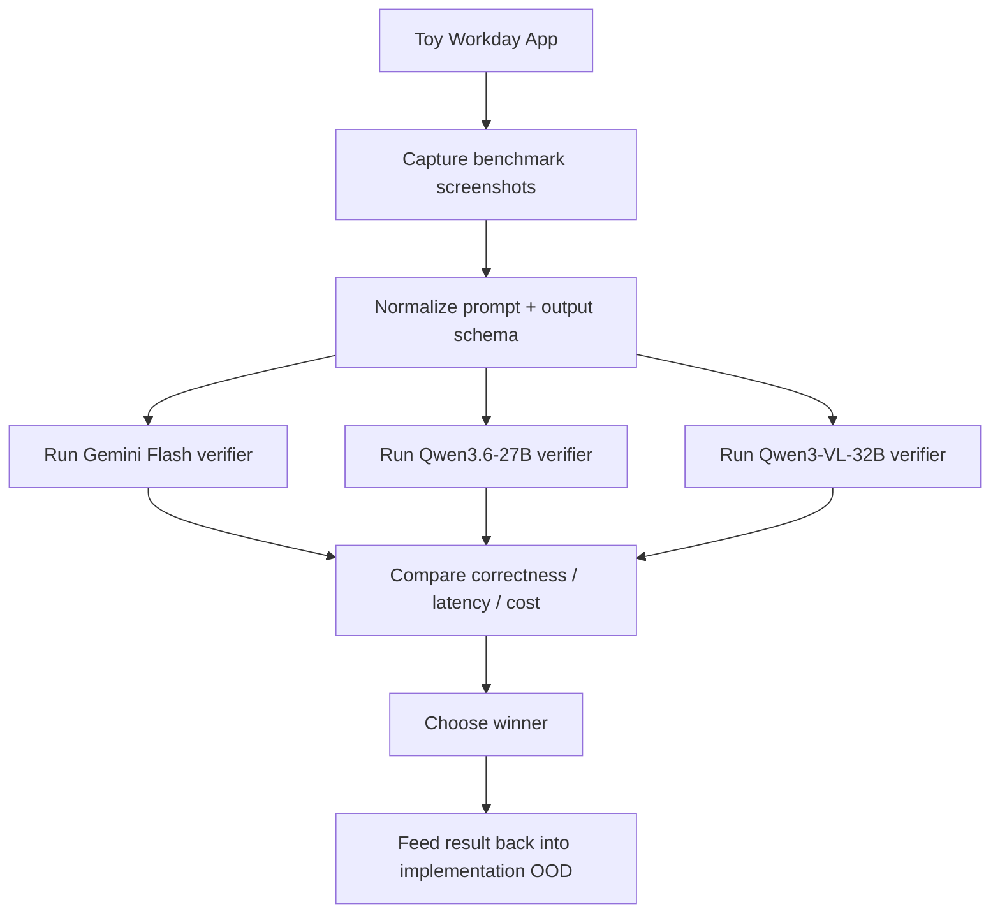

# Hand-X v4.1 — Visual Model Bakeoff Plan

> Source of truth for the next phase of work on `feat/v4.0-domhand-enrichment`.
>
> This document supersedes the **visual-model selection direction** in
> `V4.0-DOMHAND-ENRICHMENT-OOD.md` until the bakeoff is complete. The older OOD
> remains useful as background, but this file is the operational plan we follow
> next.

**Created:** 2026-05-20  
**Status:** Active plan  
**Branch:** `feat/v4.0-domhand-enrichment`

---

## 0. Latest Findings Log

### 2026-05-20 — Initialization findings

- Confirmed the working bakeoff set is:
  - `gemini-2.5-flash`
  - `Qwen/Qwen3.6-27B`
  - `Qwen/Qwen3-VL-32B-Instruct`
- Verified `GOOGLE_API_KEY` is present in `.env` and can successfully reach the
  Gemini API models endpoint.
- Verified `SILLICON_FLOW_KEY` is present in `.env` and can successfully reach
  the SiliconFlow models endpoint.
- Verified both target Qwen models are currently listed as available from the
  live SiliconFlow account model list:
  - `Qwen/Qwen3.6-27B`
  - `Qwen/Qwen3-VL-32B-Instruct`
- Confirmed the repo already has the dependencies needed for the first benchmark
  harness:
  - `playwright`
  - `pillow`
  - `requests`
  - `httpx`
  - `google-genai`
- Confirmed the benchmark harness does **not** need new Browser Use screenshot
  capabilities. The repo already supports:
  - viewport screenshots
  - element screenshots
  - custom crop logic built on top of page screenshots

This section should be updated as the bakeoff progresses so the latest state is
preserved even if conversation context is compacted.

### 2026-05-20 — Live provider smoke findings

- Local benchmark execution required installing Playwright Chromium in the
  workspace. This does not change Hand-X runtime behavior; it only enables the
  local screenshot harness.
- `gemini-2.5-flash` is working cleanly for the benchmark path when called
  through `google-genai` with:
  - `thinking_budget = 0`
  - `response_mime_type = "application/json"`
  - deterministic temperature settings
- `Qwen/Qwen3.6-27B` is working for multimodal screenshot verification on
  SiliconFlow when called with:
  - `/v1/chat/completions`
  - `enable_thinking = false`
  - `response_format = {"type": "json_object"}`
  - base64 image payloads encoded as `data:image/webp;base64,...`
  - `detail = "low"`
- `Qwen/Qwen3-VL-32B-Instruct` currently **fails the visual smoke gate** from
  this workspace/provider path. Text-only requests succeed, but multimodal
  requests return SiliconFlow error `code=50507` (`Request failed: Unknown
  error.`) across multiple image encodings and request variants.
- Python HTTP clients were not reliable enough for SiliconFlow chat completions
  in this workspace during the initial probes:
  - `requests` stalled
  - `httpx` returned provider-side `500/50507`
  - `curl` produced reliable responses
- First empirical bakeoff slice completed on a 3-scenario × 3-crop matrix:
  - `gemini-2.5-flash`
    - smoke gate: pass
    - accuracy: `9 / 9`
    - avg latency: `~2.58s`
    - avg cost: `~$0.000179 / call`
  - `Qwen/Qwen3.6-27B`
    - smoke gate: pass
    - accuracy: `9 / 9`
    - avg latency: `~4.55s`
    - avg cost: `~$0.001199 / call`
  - `Qwen/Qwen3-VL-32B-Instruct`
    - smoke gate: fail

Current interpretation after the first live slice:

- Gemini Flash is the quality/cost/latency leader so far.
- Qwen3.6-27B is viable on quality, but currently slower and materially more
  expensive per verification call.
- Qwen3-VL-32B-Instruct is not currently viable for this bakeoff until its
  SiliconFlow multimodal path becomes reliable.

### 2026-05-20 — Full context-crop corpus findings

The first full decision-grade pass used the **full toy scenario set** with the
most realistic shipping crop mode first:

- crop mode: `context`
- scenarios: `11`
- candidate models allowed past smoke gate:
  - `gemini-2.5-flash`
  - `Qwen/Qwen3.6-27B`
- smoke-gated out:
  - `Qwen/Qwen3-VL-32B-Instruct`

Results:

- `gemini-2.5-flash`
  - accuracy: `11 / 11`
  - avg latency: `~1.31s`
  - avg cost: `~$0.000180 / verification`
  - total benchmark cost: `~$0.001985`
- `Qwen/Qwen3.6-27B`
  - accuracy: `11 / 11`
  - avg latency: `~2.69s`
  - avg cost: `~$0.000463 / verification`
  - total benchmark cost: `~$0.005092`

Observed outcome:

- Both surviving models were perfect on the current toy corpus.
- Gemini Flash remained clearly faster.
- Gemini Flash remained clearly cheaper.
- The quality tie means the decision currently turns on:
  - provider reliability
  - latency
  - cost

Rough cost envelope for one Workday application, based on the measured
**context-crop** average per-call cost:

- `gemini-2.5-flash`
  - low policy (`3` verifications): `~$0.00054`
  - mid policy (`6` verifications): `~$0.00108`
  - high policy (`11` verifications): `~$0.00198`
- `Qwen/Qwen3.6-27B`
  - low policy (`3` verifications): `~$0.00139`
  - mid policy (`6` verifications): `~$0.00278`
  - high policy (`11` verifications): `~$0.00509`

Equivalent cost per `1000` applications under the high-policy estimate:

- `gemini-2.5-flash`: `~$1.98 / 1000 applications`
- `Qwen/Qwen3.6-27B`: `~$5.09 / 1000 applications`

Current provisional winner:

- **`gemini-2.5-flash`**

Reason:

- same observed quality on the current corpus
- faster response time
- lower measured cost
- cleaner SDK/API integration in this workspace

### 2026-05-20 — Gemini 3 follow-up findings

There was a naming clarification to resolve before expanding the Gemini side of
the bakeoff:

- there is **no live `gemini-3.1-flash` text model** exposed from the current
  Gemini models endpoint
- the relevant currently available Gemini 3-series text/vision candidates are:
  - `gemini-3-flash-preview`
  - `gemini-3.1-flash-lite`
  - `gemini-3.1-flash-lite-preview`

To keep the comparison fair, both Gemini 3-series follow-up checks were run on
the exact same **11-scenario context-crop corpus** used for the earlier
decision-grade pass, with:

- deterministic temperature
- JSON output
- `thinking_level = "minimal"`

Results:

- `gemini-3-flash-preview`
  - accuracy: `11 / 11`
  - avg latency: `~1.40s`
  - avg cost: `~$0.000673 / verification`
  - total benchmark cost: `~$0.007405`
- `gemini-3.1-flash-lite`
  - accuracy: `11 / 11`
  - avg latency: `~1.12s`
  - avg cost: `~$0.000335 / verification`
  - total benchmark cost: `~$0.003687`

Interpretation:

- `gemini-3-flash-preview` is the better "quality-upside" Gemini 3 candidate,
  but on the current corpus it did **not** beat `gemini-2.5-flash` on observed
  quality, and it was materially more expensive.
- `gemini-3.1-flash-lite` was fast and cheaper than `gemini-3-flash-preview`,
  but it still cost materially more than `gemini-2.5-flash`, and it should be
  treated as a cost-efficient Gemini 3 workhorse model, **not** as the obvious
  "more reliable than 2.5 Flash" upgrade path.
- `gemini-2.5-flash` remains the provisional winner until a real-Workday
  screenshot pass shows a quality gap large enough to justify a 3-series move.

Rough cost envelope for one Workday application, using the measured
`gemini-3-flash-preview` average from the same **context-crop** corpus:

- low policy (`3` verifications): `~$0.00202`
- mid policy (`6` verifications): `~$0.00404`
- high policy (`11` verifications): `~$0.00740`

### 2026-05-21 — Browser Use integration status clarification

We need to be explicit about what has and has not been proven yet.

What is already proven:

- Hand-X already creates Browser Use agents with `use_vision="auto"` in the
  normal job-application flow.
- the repo already supports Gemini-backed Browser Use models through
  `ChatGoogle`
- the visual benchmark harness already proved that controlled field/context
  crops work with:
  - `gemini-2.5-flash`
  - `gemini-3-flash-preview`
  - `gemini-3.1-flash-lite`

What is **not** yet proven:

- we have **not** yet run a decision-grade benchmark through the exact
  Browser Use screenshot capture / resize / transport path using
  `gemini-3-flash-preview`
- we have **not** yet measured whether Browser Use's screenshot payload shape
  materially changes the token footprint relative to our controlled local crop
  harness

Decision for the next phase:

- treat `gemini-3-flash-preview` as the **selected integration candidate**
  because it is the preferred "reliability-upside" model for the next check
- do **not** treat Browser Use integration cost as already validated
- the immediate next step is a Browser Use vision-integration spike focused on:
  - screenshot payload shape
  - token usage
  - per-verification cost
  - whole-application cost envelope

This means the current state is:

- **model choice for next integration spike:** `gemini-3-flash-preview`
- **best measured cheap baseline so far:** `gemini-2.5-flash`
- **remaining unknown:** exact Browser Use screenshot-path cost with Gemini 3
  Flash Preview

### 2026-05-21 — Browser Use vision-path planning findings

We now have enough local code-level information to plan the next experiment
phase precisely.

Browser Use behavior that matters for the pricing experiment:

- `calculate_cost=True` gives us tracked token usage on the agent history and
  through `token_cost_service`
- `use_vision=True` always includes the current screenshot in the next LLM
  request
- `use_vision="auto"` includes screenshots only when a tool/action explicitly
  requests screenshot inclusion
- Browser Use resizes screenshots for the LLM only if `llm_screenshot_size` is
  explicitly set
- Browser Use currently auto-configures `llm_screenshot_size` only for Claude
  Sonnet models, **not** for Gemini
- current Hand-X agent creation uses `use_vision="auto"` and does **not** set
  `llm_screenshot_size`, so today’s Hand-X Gemini path is effectively:
  - screenshot on demand
  - no Gemini-specific screenshot resizing by default

Important distinction:

- Browser Use’s **default screenshot path** is the current viewport screenshot
  included in the agent state message
- Browser Use does also expose deterministic element capture through
  `browser_session.screenshot_element(...)`
- therefore, Browser Use gives us a cropping capability at the browser/session
  layer, but **not** as the default screenshot payload automatically sent by the
  agent

Reasoning-cost finding that matters for the next benchmark:

- `ChatGoogle(model="gemini-3-flash-preview")` defaults to dynamic
  thought/reasoning behavior unless we explicitly set a Gemini 3
  `thinking_level`
- this means our earlier model-only benchmark with constrained reasoning is a
  useful baseline, but it is **not** yet the same thing as pricing the actual
  Browser Use path

Pricing-risk finding:

- Browser Use’s local custom pricing table for `gemini-3-flash-preview` and
  `gemini-3.1-flash-lite-preview` appears lower than Google’s current official
  pricing
- therefore, the Browser Use experiment should trust Browser Use for:
  - token counts
  - usage aggregation
- but should compute final dollar estimates from the official Gemini pricing
  table, not from Browser Use’s local custom price mapping

### 2026-05-21 — Browser Use visual-pricing experiment results

Implemented artifact:

- `scripts/browser_use_visual_pricing_experiment.py`

Implementation boundary:

- standalone experiment tooling only
- no Hand-X runtime logic changed
- toy Workday app only

Completed run:

- output dir:
  - `tmp/browser_use_visual_pricing/20260521-browser-use-full-v2`
- model:
  - `gemini-3-flash-preview`
- matrix:
  - `11` scenarios
  - `3` screenshot modes
  - `2` reasoning modes
  - `66` total verification calls

Experiment choices that matter:

- Browser Use retry count was held to a single attempt for cost honesty
- the default-reasoning lane needed a larger output ceiling than the
  constrained lane to avoid JSON truncation
- official Gemini pricing was used for dollar estimates; Browser Use internal
  price output was recorded separately but not trusted as the final source of
  truth

Decision-grade results:

- `viewport_no_resize__default`
  - accuracy: `11 / 11`
  - avg latency: `~3.08s`
  - avg official cost: `~$0.002229 / verification`
  - high-policy toy-app estimate (`11` checks): `~$0.02452`
- `viewport_no_resize__minimal`
  - accuracy: `11 / 11`
  - avg latency: `~1.50s`
  - avg official cost: `~$0.001408 / verification`
  - high-policy toy-app estimate (`11` checks): `~$0.01549`
- `viewport_resized__default`
  - accuracy: `11 / 11`
  - avg latency: `~3.00s`
  - avg official cost: `~$0.002261 / verification`
  - high-policy toy-app estimate (`11` checks): `~$0.02488`
- `viewport_resized__minimal`
  - accuracy: `11 / 11`
  - avg latency: `~1.39s`
  - avg official cost: `~$0.001407 / verification`
  - high-policy toy-app estimate (`11` checks): `~$0.01548`
- `element_resized__default`
  - accuracy: `9 / 11`
  - avg latency: `~2.84s`
  - avg official cost: `~$0.001513 / verification`
  - high-policy toy-app estimate (`11` checks): `~$0.01664`
- `element_resized__minimal`
  - accuracy: `9 / 11`
  - avg latency: `~1.32s`
  - avg official cost: `~$0.000789 / verification`
  - high-policy toy-app estimate (`11` checks): `~$0.00868`

What this means:

- Browser Use **viewport-based** screenshot paths were accurate across the full
  toy corpus.
- The tested **element crop + resize** path was cheaper, but it lost too much
  context and dropped to `9 / 11` accuracy.
- The concrete misses on the element-crop path were:
  - phone country-code prompt widget
  - crowded skills multiselect
- Browser Use resizing to `1400x850` did **not** materially reduce cost on the
  viewport path.
- The biggest cost delta came from reasoning depth, not from the resize toggle.
- Default Gemini 3 reasoning materially increased output-token spend versus the
  constrained verifier-style lane.

Important token insight:

- `prompt_image_tokens` stayed almost flat between:
  - viewport resized
  - element resized
- so resizing a cropped screenshot back up to a large fixed canvas did **not**
  buy us image-token savings in this first pass
- the element-crop savings mostly came from sending a smaller non-image browser
  state prompt, not from reducing image-token usage

Current rough price envelope for the toy app:

- if we use a high-policy `11`-verification application:
  - constrained viewport verifier lane: `~$0.0155`
  - default-reasoning upper bound: `~$0.0245` to `~$0.0249`
- if we use a mid-policy `6`-verification application:
  - constrained viewport verifier lane: `~$0.00844`
  - default-reasoning upper bound: `~$0.01337` to `~$0.01357`

Current takeaway:

- the Browser Use viewport screenshot path looks viable on the toy app
- the tested element-crop + resize path is **not** good enough yet to be the
  default verifier path
- the next realism question is no longer "what does the toy app cost?"
- it is "does this viewport-path price/accuracy pattern hold on real Workday
  screenshots / states?"

### 2026-05-21 — Real Workday screenshot batch-verification plan

The next realism pass should use the real screenshot folder the user provided:

- `/Users/spencerwang/Desktop/WorkdayTestScreenshots`

Usable screenshots from that folder:

- `Screenshot 2026-05-21 at 5.59.38 PM.png`
- `Screenshot 2026-05-21 at 6.10.27 PM.png`
- `Screenshot 2026-05-21 at 6.14.08 PM.png`
- `Screenshot 2026-05-21 at 6.25.56 PM.png`

Explicitly excluded:

- the two black screenshots from the same folder should be ignored

Updated experiment choice for the realism pass:

- model:
  - `gemini-3-flash-preview`
- reasoning:
  - default Gemini 3 reasoning
- screenshot mode:
  - full viewport / page screenshot
- resize:
  - off
- verification style:
  - **multiple explicit fields per screenshot in one JSON response**

Why this is the right next move:

- the toy-app Browser Use benchmark already showed viewport screenshots were the
  reliable path
- resizing did not materially improve cost
- tight element crops lost too much context on token-heavy widgets
- the production question is likely closer to "can one page-level call verify
  several visible fields at once?" than "can we cheaply verify one field per
  call forever?"

Planned screenshot-to-field batches for the first real-Workday pass:

1. `Screenshot 2026-05-21 at 5.59.38 PM.png`
   - `Have you previously worked for or are you currently working for Workday as an employee or contractor?`
   - `Country / Territory`
   - `First Name`
   - `Middle Name`
   - `Last Name`
2. `Screenshot 2026-05-21 at 6.10.27 PM.png`
   - `Postal Code`
   - `Email Address`
   - `Phone Device Type`
   - `Country / Territory Phone Code`
   - `Phone Number`
   - `Phone Extension`
3. `Screenshot 2026-05-21 at 6.14.08 PM.png`
   - `Job Title`
   - `Company`
   - `Location`
   - `I currently work here`
   - `From`
4. `Screenshot 2026-05-21 at 6.25.56 PM.png`
   - `Would you consider relocating for this role?`
   - `Are you subject to any non-compete or non-solicitation restrictions at your current or most recent employer?`
   - `In your current job, do you use or work on the Workday system?`
   - `Are you authorized to work in the country where this job is located?`

Planned JSON shape for the real-screenshot batch calls:

```json
{
  "page_id": "workday_real_001",
  "fields": [
    {
      "field_label": "Country / Territory",
      "observed_value": "United States of America",
      "status": "filled_correctly",
      "confidence": 0.98
    }
  ]
}
```

Important scope rule:

- this phase is still **visual verification only**
- we are **not** asking Gemini to infer the page type, navigation state, or
  broader "understanding the page" semantics
- we are asking it to verify an explicit list of visible target fields from a
  single screenshot

Primary measurement goal:

- estimate the rough **cost per one batched Workday page-verification call**

Secondary measurement goals:

- check whether default Gemini reasoning materially improves reliability on real
  Workday screenshots
- check whether batching multiple explicit fields into one call preserves
  accuracy well enough to be the likely production direction

How the rough application guess should be derived after this pass:

- `avg_batched_call_cost_usd * estimated_number_of_visual_page_checks`

Suggested first reporting shape:

- lower-bound whole-flow guess:
  - `avg_batched_call_cost_usd * 4`
- mid-band whole-flow guess:
  - `avg_batched_call_cost_usd * 6`
- upper-bound whole-flow guess:
  - `avg_batched_call_cost_usd * 8`

Rationale:

- the current real screenshot set represents four distinct page/section checks
- a full Workday flow is likely to require more than four visual checks in
  production, but probably not one call per field if page-batched verification
  works well

### 2026-05-21 — Real Workday screenshot batch-verification results

Implemented artifact:

- `scripts/real_workday_batch_verification_experiment.py`

Completed run:

- output dir:
  - `tmp/real_workday_batch_verification/20260521-real-workday-batch-v1`
- screenshot source dir:
  - `/Users/spencerwang/Desktop/WorkdayTestScreenshots`
- model:
  - `gemini-3-flash-preview`
- reasoning:
  - default
- resize:
  - off
- call shape:
  - one screenshot
  - several explicit visible target fields in one JSON response

Measured results:

- calls:
  - `4`
- total fields across all calls:
  - `20`
- total correct fields:
  - `19`
- field accuracy:
  - `95%`
- all-fields-correct calls:
  - `3 / 4`
- avg official cost per call:
  - `~$0.0028135`
- median official cost per call:
  - `~$0.002918`
- effective cost per field:
  - `~$0.0005627`
- avg latency per call:
  - `~4.33s`

Per-screenshot results:

- `workday_real_001_my_information_top`
  - `5 / 5` fields correct
  - cost: `~$0.0022995`
- `workday_real_002_my_information_contact`
  - `5 / 6` fields correct
  - cost: `~$0.0030385`
- `workday_real_003_experience_repeater`
  - `5 / 5` fields correct
  - cost: `~$0.0027975`
- `workday_real_004_application_questions_1`
  - `4 / 4` fields correct
  - cost: `~$0.0031185`

Observed miss:

- the only incorrect field in the four-call realism pass was:
  - `Email Address`
- expected:
  - `spencerycwang@ucla.edu`
- observed by Gemini:
  - `spencerycwang@g.ucla.edu`

Interpretation of the miss:

- this looks like an OCR-style character/grouping error on a dense email string
- it does **not** look like a broader failure to identify the correct field or
  to understand the page cluster
- the rest of the contact-page fields were read correctly, including:
  - blank postal code
  - phone device type
  - phone country-code chip
  - phone number
  - blank phone extension

Current rough whole-flow guess derived from the measured real-screenshot
batched-call average:

- lower / `4` visual page checks:
  - `~$0.011254`
- mid / `6` visual page checks:
  - `~$0.016881`
- upper / `8` visual page checks:
  - `~$0.022508`

Current takeaway after the real screenshot pass:

- page-batched verification on real Workday screenshots looks viable
- the cost per batched page-verification call is still in the low
  fractions-of-a-cent range
- the likely production direction is:
  - `gemini-3-flash-preview`
  - default reasoning
  - no resize
  - page/viewport screenshot
  - several explicit target fields per call
- the main remaining quality risk is transcription-style precision on dense
  strings such as email addresses, not general page comprehension

### 2026-05-22 — Integration planning conclusions

We now have enough evidence to begin implementation planning for the production
visual layer.

Core architectural conclusion:

- keep **DOM verification primary**
- keep the existing single-field screenshot helper in `fill_verify` as the
  cheap narrow fallback it already is
- add the new Gemini visual layer as a **page-batched verification assist
  inside `domhand_assess_state`**

Why this insertion point is correct:

- `domhand_fill` already records stable expected values after successful fills
- `domhand_record_expected_value` already records expected values after manual
  recovery
- `domhand_assess_state` already walks visible fields, looks up expected values,
  and classifies:
  - `mismatched_fields`
  - `opaque_fields`
  - `unverified_fields`
- therefore the shortest correct production design is to let `domhand_assess_state`
  call Gemini only when the DOM pass leaves ambiguity on the current visible
  page/section

Important production constraints locked from the experiments:

- model:
  - `gemini-3-flash-preview`
- reasoning:
  - default
- screenshot path:
  - viewport/page screenshot
- resize:
  - off
- verification shape:
  - several explicit visible target fields in one structured JSON response

Important candidate-selection conclusion:

- phase 1 production verification should **not** cover every field type
- it should focus on the widget families that actually motivated the project:
  - custom selects / prompt-search widgets
  - multiselect chip/token widgets
  - radio / button-group / checkbox-group controls when DOM state is ambiguous
- generic text/email/tel/textarea fields should remain DOM-primary in phase 1
  because the real screenshot pass showed the main residual model risk is dense
  string transcription, not page comprehension

Important expected-value constraint:

- the current runtime expected-value store does **not** persist blank expected
  values
- that is acceptable for phase 1 because the production visual verifier should
  focus on non-empty risky widgets, not optional blank text fields

Important implementation gap discovered during planning:

- `ghosthands/config/models.py` still contains stale Gemini 3 pricing values
  compared with the official prices used in the experiments
- before implementation is considered complete, production cost accounting
  should be updated to match the official pricing basis used in this plan

Recommended failure policy to preserve correctness:

- if the current page enters the visual-verification path and the Gemini call
  cannot be completed, the page should remain **not advanceable**
- do not silently downgrade to DOM-only optimism on a page that explicitly
  required Gemini verification

Recommended caching rule:

- cache one visual batch result per current page context / candidate signature
  in the browser session
- repeated `domhand_assess_state` calls on the same unchanged page should reuse
  that result instead of paying for Gemini again

### 2026-05-22 — Universal visual-read planning update

The production design direction has now shifted in one important way:

- the visual layer should be able to **inspect all visible fields with expected
  values**, not only the historically problematic widget families
- however, the system should still use **typed trust rules** when deciding how
  strongly to enforce a Gemini result

This distinction matters:

- **coverage** should be broad
- **blocking semantics** should remain field-type-aware

Current planning interpretation:

- one page-batched Gemini call should verify as many visible expected-value
  fields as is practical on the current viewport
- custom widgets can use stronger Gemini authority
- dense or freeform text fields should use more cautious mismatch semantics,
  because the real screenshot pass showed transcription-style risk

Cross-platform planning update:

- after toy-fixture validation, the first live-site realism target should be
  **Greenhouse**, not Workday
- reason:
  - Greenhouse is usually public and single-page
  - it avoids login blockers
  - it is a cleaner first cross-platform test of whether the visual layer helps
    beyond Workday-specific widgets
- this means the rollout plan should be:
  - toy Workday fixture first
  - real Greenhouse links second
  - real Workday follow-up after that

### 2026-05-22 — Implementation slice 1 completed

The first foundation slice for the production visual layer is now implemented.

Implemented in code:

- added a dedicated `GH_DOMHAND_VISUAL_MODEL` / `domhand_visual_model` setting
- corrected stale Gemini 3 pricing in `ghosthands/config/models.py`
- added a standalone page-batched visual verifier helper:
  - `ghosthands/dom/page_visual_verifier.py`
- implemented typed trust classification in that helper:
  - Tier A / Tier B / Tier C
- implemented page-batched Browser Use prompt construction using:
  - viewport screenshot
  - no resize
  - structured Gemini response
- implemented per-page cache reuse for unchanged visual-verification calls

Important boundary:

- this slice does **not** yet change Hand-X runtime behavior
- `domhand_assess_state` is not wired to the new helper yet

Verification completed for slice 1:

- `tests/unit/dom/test_page_visual_verifier.py`
  - `3 passed`
- targeted pricing regression checks in `tests/unit/test_domhand_fixes.py`
  - `4 passed`

Interpretation:

- the integration primitives are now in place
- the next slice should wire the helper into `domhand_assess_state`
- that next slice is where `advance_allowed` semantics will begin to change

### 2026-05-22 — Implementation slice 2 completed

The second production slice is now implemented and verified.

Implemented in code:

- wired page-batched visual verification into
  `ghosthands/actions/domhand_assess_state.py`
- added `visual_verification` state reporting to
  `ghosthands/actions/views.py`
- implemented typed trust-rule enforcement in assess-state:
  - Tier A mismatches can hard-block required custom widgets
  - Tier B mismatches remain advisory unless there was already DOM-side doubt
  - verified visual results clear required-missing / opaque / unverified noise
- blocked advancement when visual verification is required for visible
  candidates and the real Browser Use screenshot path errors
- preserved non-runtime unit tests by skipping the visual path when the
  supplied test double does not expose a real `BrowserStateSummary`

Verification completed for slice 2:

- `tests/unit/dom/test_page_visual_verifier.py`
  - `4 passed`
- `tests/unit/dom/test_assess_state_visual_layer.py`
  - `4 passed`
- targeted assess-state regressions in `tests/unit/test_domhand_fixes.py`
  - `10 passed`
- combined focused regression run
  - `16 passed`
- targeted pyright on the modified visual-layer files
  - `0 errors`
- targeted `pre-commit` on all touched visual-layer files
  - passed

Interpretation:

- the assess-state integration is now wired and locally stable
- the next step is end-to-end validation on the toy Workday application
- after toy validation, the next realism target remains public Greenhouse links

### 2026-05-22 — Implementation slice 3 completed (toy validation + trust tightening)

The third slice is now completed and validated against the live toy Workday
application.

What happened during toy validation:

- a full Hand-X / Browser Use run against the toy app was attempted first
- that broader run got stuck on the existing `State*` custom-dropdown recovery
  path before it was useful as a signal for the new visual layer
- to avoid guessing, validation pivoted to a deterministic real-browser check:
  - run `domhand_fill(target_section="My Information")`
  - then run `domhand_assess_state(target_section="My Information")`
  - against the served toy Workday page

Initial live finding from that deterministic toy pass:

- visual verification was definitely firing in the real browser
- but two noisy behaviors showed up:
  - a Tier B text field (`First Name*`) was visually read as unfilled even
    though the DOM had the correct exact value
  - a checkbox companion / preferred-name control inherited an incompatible
    text expected value and surfaced as a mismatch

Implemented tightening from those findings:

- lower-trust visual-only disagreements are now ignored when DOM verification
  already has a clean exact match:
  - Tier B no longer adds advisory noise for visual-only mismatch/unfilled
    results without existing DOM-side doubt
  - Tier C remains even more conservative
- expected-value compatibility filtering was tightened so checkbox/toggle
  fields reject incompatible free-text expected values unless the value is:
  - binary-like (`Yes` / `No` / checked-style), or
  - one of the field’s explicit options
- that compatibility rule now applies in two places:
  - visual candidate filtering
  - deterministic expected-binding compatibility during assess-state

Verification completed for slice 3:

- updated focused visual-layer tests:
  - `tests/unit/dom/test_assess_state_visual_layer.py`
  - `10 passed`
- updated targeted assess-state regressions:
  - `tests/unit/test_domhand_fixes.py` targeted subset
  - `11 passed`
- deterministic real-browser toy validation on `My Information`
  - `advance_allowed = true`
  - `unresolved_required_fields = []`
  - `unverified_fields = []`
  - `mismatched_fields = []`
  - `visual_verification.attempted = true`
  - `candidate_count = 7`
  - `calls = 2`
  - `verified_count = 5`
  - `mismatch_count = 2`
  - `estimated_cost_usd ≈ 0.011065`

Interpretation:

- the visual layer is now functioning on the toy application without creating
  state noise for lower-trust text OCR misses
- Tier A-style custom widget verification remains authoritative
- the production shape remains:
  - universal visual read
  - typed enforcement
  - DOM-first semantics
- the next step after this checkpoint is broader toy-flow coverage and then the
  first public Greenhouse live validation pass

### 2026-05-22 — Implementation slice 4 completed (broad assess-state shell suppression)

After slice 3, a broader deterministic toy walkthrough exposed one more
production-shaped issue:

- `domhand_assess_state()` without a `target_section` hint still blocked on the
  Workday-style `State*` parent select
- the actual visible selected value lived on the blank-label text companion in
  the same section
- this meant page 1 only looked healthy in the narrower target-section path,
  not in the broader whole-page assessment path

Implemented correction:

- extended the existing custom-select readback suppression logic so a required
  custom-select parent is suppressed when:
  - the parent itself is visually/DOM-empty
  - it has a same-section blank-label text companion
  - and that companion already holds a non-empty visible value

This keeps the fix narrow:

- it does **not** change how the field is filled
- it only prevents assess-state from treating the empty control shell as the
  source of truth when the real visible value is already present on its paired
  text readback field

Verification completed for slice 4:

- updated targeted regression:
  - `test_assess_state_suppresses_custom_select_parent_when_blank_text_companion_has_value`
- focused regression bundle:
  - `tests/unit/dom/test_assess_state_visual_layer.py`
    - `10 passed`
  - `tests/unit/test_domhand_fixes.py` targeted subset
    - `12 passed`
- broader deterministic toy walkthrough:
  - step 1 (`My Information`) now reaches `advance_allowed = true` without a
    target-section hint
  - the next broad blocker becomes the expected repeater workflow on the
    experience page (`Work Experience`, `Education`, `Technical Skills`)
  - that step-2 blocker is **not** a visual-layer regression; it appears
    because the validation script intentionally called `domhand_fill()` only
    and did not invoke the repeater-specific flow

Interpretation:

- the visual layer is now healthy in both:
  - the scoped assess-state path
  - the broader whole-page assess-state path
- the next validation step should focus on later toy pages by either:
  - invoking repeater-aware flow, or
  - jumping directly to later toy steps for visual-layer checks

---

## 1. Why We Are Pivoting

We originally moved toward:

- Qwen3-8B on SiliconFlow for replacing fuzzy matching
- Gemma 4 as the visual verification fallback

That was a reasonable first pass, but it skipped a more important question:

> what is the cheapest, strongest, easiest-to-integrate visual model for the
> exact Workday verification problems we care about?

We now want to answer that question empirically before implementing the visual
verifier deeply.

The new priority is:

1. test **Gemini 2.5 Flash** as the practical baseline
2. test **Gemini 3 Flash Preview** as the stronger 3-series comparison point
3. test **Gemini 3.1 Flash-Lite** as the cost-focused 3-series workhorse
4. test **Qwen3.6-27B** as the first Qwen comparison point
5. test **Qwen3-VL-32B-Instruct** as the second Qwen comparison point
6. measure quality, latency, cost, and integration friction
7. only then lock the implementation target

---

## 2. First-Principles Clarification

There are **two different decisions** here, and they must not be conflated.

### Decision A: Visual verifier model

This is the model that looks at a screenshot or cropped field image and answers:

- what value is visibly selected?
- does it match the expected value?
- which field in the screenshot does the visible answer belong to?

This is the model we are actually choosing in this bakeoff.

### Decision B: Browser Use agent model

This is the model that drives the browser loop itself:

- navigation
- deciding next actions
- clicking
- form progression
- fallback reasoning

This is related, but it is **not the same decision**.

If we test both at the same time, we will not know whether a success or failure
came from:

- the visual verifier
- the browser agent
- or the interaction between them

**Therefore:**

- the primary bakeoff is about the **visual verifier**
- Browser Use + Gemini integration is a **separate smoke-check / secondary experiment**

---

## 3. What We Already Know In This Branch

### 3.1 Toy Workday fixture is ready

We already built a richer post-auth Workday-style toy application:

- `examples/toy-workday/index.html`
- `examples/toy-workday/README.md`

This gives us a controlled local site to benchmark against instead of a real
Workday application.

### 3.2 The toy app already runs through a Workday-looking hostname

We serve it on:

```text
http://company.myworkdayjobs.com.lvh.me:8768/index.html
```

This preserves Workday-specific Hand-X code paths without needing a live
Workday tenant.

### 3.3 Hand-X already has field-focused screenshot paths

We do **not** need Browser Use’s default screenshot behavior to own cropping.

The repo already contains screenshot mechanisms we can build on:

- `ghosthands/dom/fill_llm_escalation.py`
  - `_capture_field_screenshot()` uses `el.screenshot(...)` when possible
- `tests/ci/browser/test_screenshot.py`
  - verifies `browser_session.screenshot_element(...)`

This is important. It means our visual-verifier benchmark can use:

- full viewport screenshots
- element screenshots
- or controlled field-region screenshots

without waiting on any new Browser Use feature.

### 3.4 Browser Use + Gemini is already possible in our stack

The repo already supports Gemini-backed Browser Use execution:

- `ghosthands/llm/client.py`
  - `get_chat_model()` routes Gemini models through `ChatGoogle`
- `examples/apply_to_job.py`
  - agent creation already accepts arbitrary model selection

So the question is **not** “can Gemini integrate with Browser Use?”

The real question is:

> should Gemini be used only as the visual verifier, or also as the browser-use
> agent model?

---

## 4. Candidate Models

### 4.1 Primary Candidate A — Gemini Flash

**Working assumption:** `gemini-2.5-flash`

Why this is a strong candidate:

- multimodal input is supported
- structured output is supported
- Browser Use already supports Gemini directly through `ChatGoogle`
- pricing is low enough that visual verification may be practical at scale
- it is easy to test immediately in our current stack

### Current known pricing / capability snapshot

| Model | Provider | Image input | Structured output | Input price | Output price |
|---|---|---:|---:|---:|---:|
| `gemini-2.5-flash` | Gemini Developer API | Yes | Yes | $0.30 / 1M tokens | $2.50 / 1M tokens |

### Important note

If we use Gemini through open-source Browser Use with `ChatGoogle`, we pay
**Google API pricing**, not Browser Use cloud per-step pricing.

---

### 4.1B Primary Candidate A2 — Gemini 3 Flash Preview

This is the stronger Gemini 3-series comparison point when the question is:

> if we want a more capable or more reliable Gemini visual verifier than 2.5
> Flash, is the quality gain worth the extra cost?

### Current known pricing / capability snapshot

| Model | Provider | Image input | Structured output | Input price | Output price |
|---|---|---:|---:|---:|---:|
| `gemini-3-flash-preview` | Gemini Developer API | Yes | Yes | $0.50 / 1M tokens | $3.00 / 1M tokens |

### Important note

This is the best current Gemini 3-series candidate for a **reliability-upside**
check. It is not the cheapest Gemini option.

---

### 4.1C Primary Candidate A3 — Gemini 3.1 Flash-Lite

This is the cost-focused Gemini 3-series workhorse model.

### Current known pricing / capability snapshot

| Model | Provider | Image input | Structured output | Input price | Output price |
|---|---|---:|---:|---:|---:|
| `gemini-3.1-flash-lite` | Gemini Developer API | Yes | Yes | $0.25 / 1M tokens | $1.50 / 1M tokens |

### Important note

This is **not** the same thing as a hypothetical `gemini-3.1-flash` model.
For the current Gemini API surface, `gemini-3.1-flash-lite` is the available
3.1-series text/vision workhorse we can benchmark directly.

---

### 4.2 Primary Candidate B — Qwen3.6-27B

This is the explicit “Qwen 27B visual model” candidate.

### Current known pricing / capability snapshot

| Model | Provider | Image input | Structured output | Input price | Output price |
|---|---|---:|---:|---:|---:|
| `Qwen/Qwen3.6-27B` | SiliconFlow | Yes | No | $0.30 / 1M tokens | $3.20 / 1M tokens |

### Important note

Qwen 27B is **not automatically cheaper** than Gemini Flash. In fact, based on
current listed pricing, its output tokens are materially more expensive.

That means Qwen 27B has to win on **quality** or **integration benefits** to be
worth choosing.

---

### 4.3 Primary Candidate C — Qwen3-VL-32B-Instruct

This is the second Qwen visual candidate in the bakeoff.

Current listed snapshot:

| Model | Provider | Image input | Structured output | Input price | Output price |
|---|---|---:|---:|---:|---:|
| `Qwen/Qwen3-VL-32B-Instruct` | SiliconFlow | Yes | No | $0.20 / 1M tokens | $0.60 / 1M tokens |

This model is materially more attractive on price than Qwen3.6-27B, so it must
be included in the first benchmark wave rather than treated as a later reserve.

### Locked candidate set

The expanded bakeoff wave is now explicitly locked to these five models:

1. `gemini-2.5-flash`
2. `gemini-3-flash-preview`
3. `gemini-3.1-flash-lite`
4. `Qwen/Qwen3.6-27B`
5. `Qwen/Qwen3-VL-32B-Instruct`

---

## 5. Browser Use Integration Reality

### 5.1 What Browser Use already gives us

Browser Use officially supports:

- `ChatGoogle(model="gemini-2.5-flash")`
- `use_vision`
- `vision_detail_level`
- a screenshot tool in the agent loop

### 5.2 What Browser Use does **not** need to own

For our verification path, Browser Use does **not** need to be responsible for:

- choosing the crop region
- generating field-level screenshots
- being the same model as the visual verifier

Those can be handled in our code.

### 5.3 Decision rule here

For this bakeoff, we should treat Browser Use integration as:

- a **compatibility check**
- not the core benchmark axis

The visual benchmark should be model-vs-model on the **same screenshots**.

### 5.4 Next integration question

The next concrete question is no longer "which visual model should we try
first?"

It is now:

> when Browser Use captures and resizes the screenshot payload it sends to
> `gemini-3-flash-preview`, what is the real token/cost footprint per visual
> verification call, and what does that imply for one full Workday
> application?

That is the next measurement phase we should run before implementation.

### 5.5 Resize vs crop clarification

For the next phase we need to keep these paths separate:

1. **Default Browser Use vision path**
   - current viewport screenshot
   - optional `llm_screenshot_size` resize
   - included in the agent state message
2. **Deterministic Browser Use crop path**
   - `browser_session.screenshot_element(...)`
   - optional resize after capture
   - not the default agent screenshot path

This matters because the default Browser Use path is the cleaner estimate for
"what happens if we just turn on Browser Use vision and use Gemini 3 Flash
Preview?", while the deterministic crop path is the cleaner estimate for "what
happens if we build a targeted visual verifier on top of Browser Use/browser
session screenshot primitives?"

---

## 6. Core Hypothesis

### Hypothesis A

Gemini Flash may already be:

- accurate enough for Workday visual verification
- cheap enough to justify usage
- simple enough to integrate immediately

If true, then we should prefer Gemini over Gemma and avoid the local-self-host
complexity for the visual verifier path.

### Hypothesis B

Qwen 27B may outperform Gemini Flash on the specific Workday visual tasks we
care about:

- small-text OCR in real forms
- disambiguating nearby sibling widgets
- reading selected chips in crowded multi-selects
- answering in a stable structured format

If true, then we should accept the extra integration cost if the quality delta
is meaningfully better.

---

## 7. Scope of This Bakeoff

### In scope

- visual verification only
- Workday-style local toy application
- screenshot quality / crop strategy
- cost and latency measurements
- Browser Use + Gemini compatibility smoke-check

### Explicitly out of scope for now

- implementing the Qwen grouper replacement for fuzzy matching
- implementing the final visual verifier in production code
- deleting or rewriting the V4.0 OOD
- choosing the final full agent model for all of Hand-X

The fuzzy-match replacement work is deferred until after the visual model choice
is settled.

---

## 8. Benchmark Design



### 8.1 Principle

The benchmark must compare models on the **same visual inputs** and the **same
expected outputs**.

Do not give one model:

- different crops
- different prompts
- different field context
- or a different post-processing rule

unless we are intentionally measuring those as separate variables.

---

## 9. Benchmark Phases

### 9.1 Phase 0 — Integration Smoke Checks

Before benchmarking quality, prove the plumbing:

### Gemini smoke checks

1. Call Gemini Flash directly on one toy-workday screenshot
2. Verify image + prompt round-trip works
3. Verify JSON / structured output is stable enough for our format
4. Verify Browser Use can run with Gemini via `ChatGoogle`

### Qwen smoke checks

1. Call `Qwen/Qwen3.6-27B` directly on the same screenshot
2. Verify image + prompt round-trip works
3. Verify JSON-mode parsing is stable enough
4. Call `Qwen/Qwen3-VL-32B-Instruct` directly on the same screenshot
5. Verify image + prompt round-trip works
6. Verify JSON-mode parsing is stable enough

**Exit condition:** all three models can answer the same visual question from
the same screenshot.

---

### 9.2 Phase 1 — Offline Screenshot Benchmark

This is the most important phase.

Use saved screenshots from the toy app and ask:

- what value is visibly selected?
- is the field empty or filled?
- does the visible value match the expected one?

### Required scenario categories

1. **Prompt search selected state**
   - closed control after selection
   - selected value lives outside typed text

2. **Custom multi-select chips**
   - one field
   - multiple selected chips
   - visually crowded chips

3. **Sibling multi-select contamination risk**
   - two nearby controls
   - each with different selected chips

4. **Custom radio / button group**
   - selected state visible via styling

5. **Conditional reveal verification**
   - answer changed UI shape
   - verifier must read what is actually shown now

6. **Segmented date widget**
   - month / day / year split

7. **Review-page readback**
   - field is not editable anymore
   - value appears only in summary / review layout

### Output format for benchmark rows

Each row should record:

- `scenario_id`
- `screenshot_path`
- `crop_mode`
- `field_label`
- `expected_value`
- `model_name`
- `raw_response`
- `parsed_observed_value`
- `parsed_match_bool`
- `correct`
- `latency_ms`
- `input_tokens`
- `output_tokens`
- `estimated_cost_usd`
- `notes`

---

### 9.3 Phase 2 — Crop Strategy Comparison

We should not assume the best screenshot format yet.

We need to compare:

1. **Full viewport screenshot**
2. **Field element screenshot**
3. **Field + small surrounding context crop**

### Why this matters

Too-wide screenshots hurt:

- attribution
- OCR on small text
- cost

Too-tight screenshots hurt:

- context
- nearby label association
- section disambiguation

### Planned rule

We will benchmark all three, but the likely winner is:

> field + small surrounding context crop

because it preserves label/context while avoiding full-page visual clutter.

---

### 9.4 Phase 3 — Browser Use + Gemini Compatibility Check

This is a separate smoke-check, not the main quality benchmark.

Goal:

- prove that Browser Use can run against the toy Workday app using Gemini
- confirm that doing so does not introduce an integration blocker

Questions to answer:

1. Can Hand-X/Browser Use run with `ChatGoogle(model="gemini-2.5-flash")`?
2. Does `use_vision="auto"` still behave sanely on the toy app?
3. Do we want Gemini only as the verifier, or also as the browser agent model?

### Important rule

Do **not** use this phase to decide the visual-verifier winner.

This phase only answers:

- “is Gemini compatible with our Browser Use path?”

---

### 9.5 Phase 4 — Browser Use Vision-Path Pricing Experiment

This is now the highest-priority next experiment.

Goal:

- measure the **real token footprint and cost** when Browser Use itself is
  responsible for screenshot inclusion, resize behavior, and Gemini 3 Flash
  Preview reasoning

This phase should answer your teammate’s actual question:

> if we use the Browser Use screenshot/resizing path plus Gemini reasoning for a
> visual verification layer, what does one verification call cost and what does
> one Workday application roughly cost?

### Primary measurement modes

We should benchmark at least these Browser Use payload modes:

1. **Viewport / no resize**
   - Browser Use screenshot included
   - `llm_screenshot_size = None`
2. **Viewport / resized**
   - Browser Use screenshot included
   - `llm_screenshot_size` explicitly set
3. **Element crop / resized**
   - deterministic element screenshot via Browser Use browser session
   - optional resize

### Reasoning modes

We should benchmark both:

1. **Default Gemini 3 Flash Preview reasoning**
   - no special thinking override
   - gives the more realistic upper-bound if we do nothing clever
2. **Verifier-lean Gemini 3 Flash Preview reasoning**
   - explicit constrained Gemini 3 thinking level
   - gives the lower-bound for a targeted visual-verifier design

### Suggested first matrix

To keep this tractable, start with:

- `11` toy scenarios
- `2` reasoning modes
- `3` screenshot modes

That gives a first full matrix of `66` verification calls.

### What each row must record

- `scenario_id`
- `field_label`
- `expected_value`
- `browser_use_mode`
- `resize_mode`
- `reasoning_mode`
- `vision_detail_level`
- `model_name`
- `correct`
- `latency_ms`
- `prompt_tokens`
- `prompt_image_tokens`
- `completion_tokens`
- `total_tokens`
- `browser_use_reported_cost`
- `official_price_cost_usd`
- `notes`

### Important pricing rule

For Gemini 3, we should treat:

- Browser Use `history.usage` / token usage as the source of truth for token
  counts
- official Gemini pricing as the source of truth for dollar cost

### Exit condition

At the end of this phase, we should know:

- how much Browser Use screenshot resizing changes token usage
- whether deterministic crop meaningfully improves cost and/or quality
- whether Gemini 3 default reasoning is too expensive for this path
- the realistic per-verification price envelope

Status:

- **completed on the toy app**
- the remaining unknown is now realism on real Workday screenshots / states,
  not the toy-app Browser Use price envelope

---

### 9.6 Phase 5 — Toy-Application Cost Projection

After the Browser Use vision-path benchmark, compute the toy-application
estimate at three policy levels.

### Policy A — Low-cost page-batched verification

- approximately `3` verification calls
- one call per risky page / page cluster

### Policy B — Mid-cost clustered-widget verification

- approximately `6` verification calls
- one call per risky widget cluster

### Policy C — High-cost per-widget verification

- approximately `11` verification calls
- one call for every toy benchmark scenario

### Required outputs

For each policy, report:

- total prompt tokens
- total image tokens
- total completion/thought tokens
- total official cost in USD
- median latency per verification
- total latency envelope
- observed accuracy on the toy app

### Important reporting rule

We should report **two flavors** of application cost:

1. **Incremental visual-layer cost**
   - the number the product decision actually cares about
2. **Agent-shaped upper bound**
   - what it costs if Browser Use reasoning is allowed to be more verbose /
     general than a tightly scoped verifier

This avoids collapsing two different cost questions into one misleading number.

---

### 9.7 Phase 6 — Team Demo Artifact

This is lower priority than the pricing research, but we should plan for it now
so the experiment naturally produces a shareable artifact.

Recommended demo shape:

- one command that runs a small subset of toy-app verification cases
- prints:
  - scenario name
  - screenshot mode
  - token counts
  - per-call cost
  - total cost
- optionally saves a tiny HTML/Markdown summary with screenshots

The demo should not try to prove the whole system. It only needs to show:

- the toy app
- Gemini 3 Flash Preview receiving Browser Use screenshot input
- usage / cost being measured
- a believable per-application estimate being derived from those runs

---

## 10. Prompt and Output Contract

To compare models fairly, use one normalized verifier contract.

### Prompt shape

The prompt should always contain:

- a short description of the field(s) to inspect
- the expected value
- a strict instruction to answer in machine-readable form

### Normalized output target

For the bakeoff, use the smallest contract possible:

```json
{
  "observed": "string or list of strings",
  "matches": true
}
```

If we need field attribution in a shared crop:

```json
{
  "field_id": "stable benchmark id",
  "observed": "string or list of strings",
  "matches": true
}
```

The point is to evaluate model ability, not clever prompt engineering.

---

## 11. Scoring Rubric

### 11.1 Primary score

Weighted score:

- **50% correctness**
- **20% attribution correctness**
- **15% latency**
- **15% cost**

### Correctness means

- exact selected value is read correctly
- empty vs filled is correct
- multi-select token lists are correct
- “match / no match” decision is correct

### Attribution means

- correct nearby field in cluttered or sibling scenarios

---

## 11.2 Tie-breakers

If quality is close, prefer:

1. lower integration complexity
2. structured-output stability
3. lower cost
4. lower latency

---

## 12. Decision Rule

We choose the winner if it:

1. meets the accuracy threshold on the toy-workday benchmark
2. has acceptable latency for fallback usage
3. has acceptable cost per verification call
4. does not create severe integration complexity

### Working acceptance threshold

For targeted visual verification fallback:

- **overall correctness ≥ 95%**
- **sibling attribution correctness ≥ 90%**
- **median latency acceptable for fallback usage**
- **cost low enough that fallback remains practical**

If neither model meets that threshold:

- test the reserve Qwen candidate
- revisit crop strategy
- revisit whether Gemini Flash-Lite is enough for some scenarios
- only then reopen Gemma / local-hosting work

---

## 13. Immediate Research Sequence

### Step 1

Keep `gemini-3-flash-preview` as the selected Browser Use integration
candidate.

### Step 2

Run a **Browser Use vision-path microbenchmark** on the toy app, not Hand-X:

- Browser Use screenshot included
- Gemini 3 Flash Preview
- token usage captured
- no Hand-X production changes

### Step 3

Measure the effect of:

- screenshot mode
- resize mode
- reasoning mode

on:

- correctness
- latency
- token usage
- official Gemini cost

### Step 4

Project low / mid / high total cost for one toy-application run.

### Step 5

Only after the Browser Use pricing experiment is complete:

- decide whether the visual layer is practical enough
- decide whether Browser Use default screenshot path is good enough
- decide whether we need deterministic crop capture for the final verifier

### Step 6

If the pricing and capability look good, then move to implementation planning
for the actual Hand-X visual verification layer.

---

## 14. What This Plan Changes Versus V4.0

### Old direction

- Qwen3-8B for matching
- Gemma 4 for visual verification
- implementation-oriented OOD first

### New direction

- pause visual-model commitment
- run a real visual-model bakeoff first
- treat Browser Use compatibility as a separate concern
- choose the verifier based on data, not assumption

### What stays true

- the toy Workday app is still the right local testbed
- DOM verification should still remain primary in the final design
- fuzzy-match replacement is still valuable, just not the next task

---

## 15. Current Open Questions

1. For pricing discussion with the team, do we want the headline number to be:
   - incremental visual-layer cost only
   - or incremental visual-layer cost plus an agent-shaped upper bound?
2. Do we want the Browser Use pricing experiment to treat:
   - default viewport screenshot path
   - deterministic crop path
   - or both
   as required for the first pass?
3. Do we want the team demo to be:
   - a terminal-only run summary
   - or a small rendered artifact with screenshots and totals?

Current recommendation on all three:

- report both lower-bound and upper-bound application cost
- benchmark both default viewport and deterministic crop paths
- keep the first demo terminal-first unless the team specifically asks for a
  richer artifact

---

## 16. Current Recommendation

If we continue immediately, the shortest correct path is:

1. keep `gemini-3-flash-preview` as the selected integration candidate
2. use **default reasoning** for the current production-shape estimate, because
   the real Workday pass was run that way and still stayed in a reasonable cost
   band
3. use the **viewport/page screenshot path** as the current leading verifier
   path
4. keep **resize off by default** because it did not materially improve cost in
   the toy Browser Use benchmark
5. keep the tested **element crop + resize** path out of the default design for
   now because it lost too much context
6. prefer **page-batched verification** over one-field-per-call verification:
   - one screenshot
   - several explicit visible target fields
   - one structured JSON response
7. use the real Workday batched-call result as the rough pricing envelope for
   team discussion:
   - `~$0.00281` per batched visual page-verification call
   - `~$0.0113` for a lower-bound `4`-call flow
   - `~$0.0169` for a mid-band `6`-call flow
   - `~$0.0225` for an upper-bound `8`-call flow
8. if we proceed further, the next question is no longer raw cost feasibility;
   it is whether the email/text-precision risk is acceptable enough for
   integration or whether we need a small amount of targeted post-processing /
   confirmation logic before wiring this into Hand-X

That keeps the next step narrow, measurable, and logically clean.

---

## 17. Hand-X Integration Plan

This section captures the current best implementation plan for wiring the
visual verification layer into Hand-X without changing the broader agent
architecture.

### 17.1 Core production shape

The recommended production shape is now:

- keep **DOM verification primary**
- keep the existing single-field screenshot helper in:
  - `ghosthands/dom/fill_llm_escalation.py`
- add the new Gemini visual layer as a **page-batched verification assist**
  inside:
  - `ghosthands/actions/domhand_assess_state.py`

This is the shortest correct path because `domhand_assess_state` already has
the exact information the new layer needs:

- the current visible field set
- the current page URL / page context
- expected values from runtime memory
- the current issue buckets that decide `advance_allowed`

### 17.2 Why `domhand_assess_state` is the right insertion point

The existing runtime flow is already:

1. `domhand_fill`
2. `domhand_assess_state`
3. Browser Use decides whether to recover, continue, or advance

The planned visual layer should therefore be an **assessment-time assist**, not
a new first-pass fill engine.

Why this is correct:

- `domhand_fill` already records intended values into runtime memory
- manual recovery already has `domhand_record_expected_value`
- `domhand_assess_state` already classifies:
  - `unresolved_required_fields`
  - `mismatched_fields`
  - `opaque_fields`
  - `unverified_fields`
- `domhand_assess_state` already owns the final `advance_allowed` judgment

So the visual verifier should answer only this question:

> for the risky fields still ambiguous after the DOM pass, does the screenshot
> show the expected value or not?

### 17.3 Files and responsibilities

Planned production ownership:

- `ghosthands/actions/domhand_assess_state.py`
  - orchestrate candidate selection
  - request one page-batched Gemini verification when needed
  - apply Gemini results back into issue buckets
  - decide whether the page remains advanceable
- `ghosthands/runtime_learning.py`
  - remain the source of truth for expected values
  - no page inference required
- `ghosthands/actions/domhand_record_expected_value.py`
  - continue to support manual-recovery intent recording
- `ghosthands/dom/fill_verify.py`
  - keep the current narrow per-field fallback behavior
- `ghosthands/dom/fill_llm_escalation.py`
  - keep the existing field-crop helper for the current rescue path
- `ghosthands/config/settings.py`
  - likely add a dedicated visual-model setting rather than implicitly sharing
    the cheaper text-answering model slot
- `ghosthands/config/models.py`
  - update Gemini 3 pricing to the official rates used by this plan before
    production cost accounting is considered trustworthy

Implementation-structure recommendation:

- keep the orchestration in `domhand_assess_state`
- factor the Gemini page-batch prompt / response parsing into a small dedicated
  helper module so the action file does not become prompt-heavy

### 17.4 Candidate selection and typed trust rules

Phase 1 should visually inspect **all visible fields with expected values** that
are present in the current viewport, not only risky custom widgets.

A field becomes part of the page-batched Gemini request when all of the
following are true:

1. the field is currently visible on the page / in the current viewport
2. the field has a recorded expected value in runtime memory
3. the field is meaningful to verify visually on the current page

Default exclusions for the first implementation:

- file-upload contents that cannot be read from the screenshot
- hidden/offscreen fields
- fields without any expected-value record

Important shift in design:

- the Gemini **read** should be broad
- the Gemini **authority** should be typed by field category

Planned trust tiers:

#### Tier A — high-trust visual fields

Gemini should be allowed to clear or block these strongly.

- custom selects / prompt-search widgets
- non-native multiselect chip/token widgets
- radios / button groups / checkbox groups
- toggles
- date pickers and grouped dates when the visible rendered value is compact and
  explicit
- standard dropdowns when the selected text is visually clear

Why:

- these are the fields where the UI is often more truthful than DOM readback
- these are also the fields where the bakeoff showed the strongest visual value

#### Tier B — medium-trust bounded text fields

Gemini should inspect these, but mismatch handling should be more cautious.

- short text inputs such as:
  - first name
  - last name
  - city
  - postal code
  - job title
- short phone-like or email-like fields where the UI is visible but OCR risk is
  non-trivial

Recommended behavior:

- allow Gemini matches to help clear uncertainty
- do not let a single weak mismatch be immediately authoritative if DOM and
  expected-value evidence already align

#### Tier C — low-trust freeform text fields

Gemini should inspect these mainly for visible filledness, not strict exactness.

- long textareas
- essay / free-response questions
- cover-letter style inputs

Recommended behavior:

- verify that the field is visibly populated
- avoid strict character-perfect mismatch enforcement

Important rationale:

- the real Workday realism pass showed the primary remaining model weakness is
  dense-string transcription
- therefore universal verification is good
- but universal strict blocking is not the right first implementation

### 17.5 Screenshot and prompt contract

The production prompt should follow the highest-context path that worked in the
experiments:

- one **viewport/page screenshot**
- no forced resize
- Gemini default reasoning
- several explicit target fields in one call
- structured JSON response

The verifier should **not** be asked to infer the entire page or page type.

It should receive:

- page URL
- page title if cheaply available
- screenshot
- explicit list of target fields
- expected value for each target field

Planned response shape:

```json
{
  "page_context_key": "workday:application_questions_1",
  "fields": [
    {
      "field_key": "application_questions.relocate",
      "field_label": "Would you consider relocating for this role?",
      "observed_value": "Yes",
      "matches_expected": true,
      "confidence": 0.97,
      "status": "verified"
    }
  ]
}
```

Important design rule:

- use stable `field_key` / verifier IDs, not label-only matching, because
  duplicate labels and repeated sections are real

### 17.6 How Gemini results should affect page state

The visual layer should be a **resolution layer** over DOM ambiguity, not a
parallel second state machine.

Planned result application:

- if Gemini says `matches_expected = true`
  - suppress that field from:
    - `mismatched_fields`
    - `opaque_fields`
    - `unverified_fields`
- if Gemini says `matches_expected = false`
  - apply typed trust rules before deciding whether the field should block
  - Tier A mismatches can be strongly authoritative
  - Tier B mismatches should usually require stronger corroboration or high
    confidence before becoming hard blockers
  - Tier C mismatches should usually remain advisory unless the field is
    visually empty when it should obviously be filled
- if Gemini cannot determine the field confidently
  - keep the field in the existing ambiguous bucket
  - do not falsely clear it

Planned `advance_allowed` rule:

- Tier A required-field failures should prevent page advancement
- Tier B required-field failures should usually remain unresolved rather than
  immediately hard-failing on a weak OCR-style disagreement
- Tier C freeform fields should mostly gate on visible filledness rather than
  exact string equality
- visually verified fields should no longer block progression via DOM ambiguity
  noise

This is the key production value of the new layer:

- fewer false blockers when the UI is actually correct
- fewer false passes when the DOM lies about a custom widget

### 17.7 Failure policy

Recommended production policy:

- if the current page requires the visual-verification path and the Gemini call
  cannot be completed, the page should remain **not advanceable**

Do **not** silently fall back to optimistic DOM-only advancement on a page that
explicitly required visual confirmation.

This matches the earlier direction already discussed on this branch:

- visual verification is being added exactly because the DOM is not reliable
  enough for these widgets

### 17.8 Caching and cost control

The page-batched visual layer should avoid repeated spend on unchanged pages.

Recommended caching rule:

- cache one visual verification result per:
  - host
  - page context key
  - visible candidate field signature
  - expected-value signature

If `domhand_assess_state` is called again on the same unchanged page, reuse the
cached batch result instead of calling Gemini again.

Batching rule:

- prefer one page-batched call for roughly `4` to `6` risky visible fields
- do not explode into one field per call unless the page is unusually crowded

### 17.9 Cost accounting

The production implementation should record visual-verification cost
separately from:

- page-answer generation cost
- generic Browser Use step cost

Planned accounting requirements:

- preserve token counts
- preserve prompt/image/output token breakdown if available
- compute dollars from the official Gemini pricing basis used in this plan

Known accounting gap from planning:

- `ghosthands/config/models.py` currently underprices Gemini 3 relative to the
  official rates used by the experiments
- this should be corrected before we treat runtime visual-cost telemetry as a
  trustworthy production metric

### 17.10 Testing plan

Planned verification ladder:

1. unit tests
   - candidate selection
   - prompt payload construction
   - response parsing
   - issue-bucket transformations
2. toy Workday integration tests
   - risky widgets visually clear when they should
   - risky widgets block when they should
   - short text fields follow the Tier B trust semantics correctly
   - freeform fields use filledness-style verification rather than strict exact
     mismatch semantics
   - repeated assessment reuses cached results
3. realism regression pass
   - keep the saved real Workday screenshot corpus as an offline confidence
     check
4. live-site validation pass
   - first on public Greenhouse application links
   - later on real Workday flows

Important test principle:

- the new visual layer should be proven without weakening the existing
  deterministic DOM path for ordinary fields

### 17.11 Planned implementation sequence

If we greenlight code later, the shortest correct implementation order is:

1. add the page-batched verifier helper and response schema
2. implement typed trust classification for visual verification outcomes
3. wire universal visible-field candidate selection into `domhand_assess_state`
4. apply Gemini outcomes back into issue buckets and `advance_allowed`
5. add caching so repeated unchanged assessments are cheap
6. add telemetry / pricing recording
7. add toy-fixture and unit coverage
8. run first real Greenhouse validation pass
9. run follow-up real Workday validation pass

### 17.12 Remaining decisions to lock before coding

These are the only meaningful design decisions still worth discussing before
implementation:

1. whether we want a dedicated setting such as `domhand_visual_model` instead
   of reusing `domhand_model`
2. the exact Tier A / Tier B / Tier C field-category mapping
3. the maximum number of target fields per visual batch call
4. whether Tier B text mismatches should require both high Gemini confidence
   and DOM disagreement before becoming hard blockers
5. whether we want a separate lightweight Greenhouse fixture eventually, or
   whether public Greenhouse links are sufficient for the first realism pass

Current recommendation:

- use a dedicated visual-model setting
- use universal visible-field verification with typed trust rules
- batch roughly `4` to `6` fields per call
- treat low-confidence results as unresolved rather than silently clearing them
- validate on public Greenhouse pages before assuming the Workday-shaped toy
  coverage is enough for all ATS platforms

## 2026-05-23 — Implementation slice 5 completed (pre-advance checkpoint hardening)

Goal of this slice:

- make the new Gemini visual layer participate in the real pre-advance path
  instead of being bypassed on clean/happy-path pages

What was implemented:

- added [assessment checkpoint tracking](../../ghosthands/dom/assessment_checkpoint.py)
  so DomHand page mutations can mark the current page as needing a fresh
  `domhand_assess_state`
- `domhand_fill` now marks the page as pending-assessment after a page-level fill
- `domhand_select`, `domhand_interact_control`, and
  `domhand_record_expected_value` now mark the page as pending-assessment after
  successful state-changing recoveries
- `domhand_fill_repeaters` now marks the page as pending-assessment when it
  actually commits repeater entries
- `domhand_assess_state` now:
  - bypasses the old same-page clean-state short-circuit when a pending
    assessment marker exists
  - clears the pending marker after a fresh assessment finishes
- Browser Use’s default action watchdog now blocks `Next / Continue / Save`
  clicks when the current page still has a pending `domhand_assess_state`
  checkpoint
- the task prompt no longer tells the agent to skip `domhand_assess_state`
  after a clean `domhand_fill`; it now explicitly treats assess-state as the
  final same-page checkpoint before advancing

What was verified:

- focused regression tests passed:
  - `uv run pytest tests/unit/dom/test_assess_state_visual_layer.py -q`
  - `uv run pytest tests/unit/test_domhand_fixes.py -q -k "build_task_prompt_requires_assess_state_before_advancing or default_action_watchdog_"`
- fixture safety checks passed:
  - `uv run pytest tests/ci/test_toy_workday_fixture.py -q`
  - `uv run pytest tests/ci/test_toy_repeater_prefill.py -q`
- live toy-app run against
  `http://company.myworkdayjobs.com.lvh.me:8768/index.html` showed the desired
  behavioral shift:
  - after `domhand_fill`, the agent no longer planned to click `Next`
    immediately
  - instead it planned to finish the remaining blocker and **then assess the
    page state**

Important live-run note:

- the toy run still got dragged into the older `State*` custom-select behavior
  on `My Information`
- that is a fill/control issue, not a new visual-layer regression
- per current project direction, this slice intentionally did **not** change
  the underlying fill logic just to make that control easier

Current status after slice 5:

- the visual layer is now wired into Hand-X in a materially more end-to-end way
- the biggest remaining implementation gap before public Greenhouse validation
  is no longer “will the agent skip assess-state entirely?”
- the remaining work is now mainly broader runtime validation:
  - clean toy-flow checkpoints on later pages
  - first public Greenhouse live validation pass

## 2026-05-23 — Implementation slice 6 completed (successful done() checkpoint guard)

Goal of this slice:

- close the remaining easy bypass where the agent could call
  `done(success=True)` on an editable application page without first using the
  latest `domhand_assess_state` result

What was implemented:

- the Browser Use `done` action now rejects `done(success=True)` when Hand-X
  state says the current page still needs a fresh assess-state checkpoint
- the same guard also rejects `done(success=True)` when the latest
  same-page `domhand_assess_state` snapshot says the page is still
  `editing` or `advanceable`
- the guard allows `done(success=True)` when the latest same-page Hand-X state
  is a terminal application state (`review`, `confirmation`, or
  `presubmit_single_page`)
- `domhand_assess_state` now records `terminal_state` into the cached
  `_gh_last_application_state` snapshot so the done-action guard can make that
  decision
- the task prompt wording was tightened again to say the assess-state checkpoint
  applies before calling `done()` on editable pages, not just before
  `Next/Continue/Save`

What was verified:

- focused prompt + done-guard unit tests passed:
  - `uv run pytest tests/unit/test_domhand_fixes.py -q -k "build_task_prompt_requires_assess_state_before_advancing or done_action_requires_fresh_domhand_assessment_before_success or structured_done_action_requires_terminal_handx_state or default_action_watchdog_"`
- visual-layer regression tests still passed:
  - `uv run pytest tests/unit/dom/test_assess_state_visual_layer.py -q`
- toy fixture safety checks still passed:
  - `uv run pytest tests/ci/test_toy_workday_fixture.py -q`
  - `uv run pytest tests/ci/test_toy_repeater_prefill.py -q`

Important scope note:

- this slice intentionally did **not** change any page-filling behavior
- if the toy flow still gets stuck on older custom-select or field-action
  behavior, that remains outside the scope of the visual-layer hardening work

Current status after slice 6:

- `domhand_assess_state` is now protected on both major completion paths:
  - before clicking `Next / Continue / Save`
  - before calling `done(success=True)` on a same-page editable form
- the visual verification layer is materially closer to true end-to-end use in
  Hand-X without broad changes to the legacy fill path
- the next major milestone is still runtime validation rather than another big
  architecture change:
  - clean public Greenhouse live validation
  - then, only if needed, follow-up fill/action fixes that are independent of
    the Gemini verification layer
