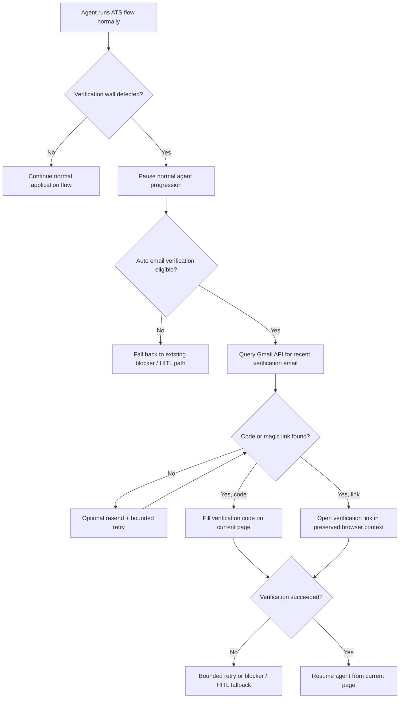

# Hand-X v4.2 — Email Verification Reintegration Plan

> Source of truth for the next phase of work on `feat/gmail-email-verification`.
>
> This document covers the reintegration of inbox-based email verification
> handling into Hand-X. The goal is to move email-code / magic-link pages from
> a hard blocker into a bounded, deterministic recovery flow.

**Created:** 2026-05-31  
**Status:** Active plan  
**Branch:** `feat/gmail-email-verification`
**Base branch:** `feat/v4.0-domhand-enrichment` for Hand-X; `main` for Desktop and VALET

---

## 0. Latest Findings Log

### 2026-05-31 — Current-state audit

- Hand-X currently treats email verification pages as blockers rather than
  resolving them automatically.
- The current blocker path is spread across:
  - `ghosthands/agent/prompts.py`
  - `ghosthands/security/blocker_detector.py`
  - `ghosthands/cli.py`
  - `ghosthands/worker/hitl.py`
- The repo already contains a real Gmail API integration under:
  - `browser_use/integrations/gmail/service.py`
  - `browser_use/integrations/gmail/actions.py`
- That Gmail integration is not currently wired into Hand-X’s runtime apply
  flow. It exists as reusable infrastructure plus examples, not as active
  Hand-X behavior.
- The repo also contains an AgentMail disposable-inbox example under:
  - `examples/integrations/agentmail/`
- The AgentMail path is example/demo code and is not part of current Hand-X
  runtime behavior.
- Existing Hand-X account-creation logic already distinguishes:
  - account created and active
  - account created but pending verification
  - verification-required auth states
- Existing Hand-X runtime can already detect verification-code pages via:
  - DOM text probes
  - auth-state probes
  - blocker text emitted by the agent
- The existing Gmail integration uses Gmail OAuth with the
  `gmail.readonly` scope and stores:
  - `gmail_credentials.json`
  - `gmail_token.json`
- Important dependency gap: the Gmail integration imports Google API client
  packages, but those package names were not found in the current top-level
  `pyproject.toml` / `uv.lock` search. This must be treated as a real
  implementation item rather than assumed away.
- Important product constraint: Gmail-based verification only works when the
  application is using an inbox we actually control. The current sample profile
  email is `rc5663@nyu.edu`, which Gmail OAuth cannot read directly.
- The repo contains a toy job app with a Google-login + verification-code UI
  gate in `examples/toy-job-app/index.html`, but it currently has no matching
  backend for `/api/auth/google/*`, so it is not yet a complete end-to-end
  local verification harness.

### 2026-05-31 — Recommended architecture decision

- The shortest correct integration is **not** “let the general agent browse
  Gmail.”
- The recommended design is a **deterministic runtime subflow** that branches
  off the existing verification-blocker path.
- We should reuse the Gmail API service layer, but we should **not** reuse the
  raw `get_recent_emails` agent tool as the main production behavior.
- The general agent should continue doing the job application.
- When a verification wall is detected, runtime should:
  1. pause normal agent progress,
  2. retrieve the code or link through Gmail API directly,
  3. apply it to the current application page,
  4. verify the page advanced,
  5. then resume the agent from the current page.
- Gmail UI tab-hopping should **not** be the primary approach. Gmail API
  retrieval is cheaper, cleaner, safer, and more deterministic.
- Numeric verification codes and magic-link emails should both be first-class
  supported flows.

### 2026-06-01 — Product UX direction correction

- Requiring each user to manually create and download their own
  `gmail_credentials.json` is not a good default product experience.
- The better end-user design is:
  - Hand-X ships a product-owned Gmail OAuth client,
  - the user clicks **Connect Gmail**,
  - Google handles sign-in + consent in-browser,
  - Hand-X stores the resulting refresh/access token,
  - Hand-X then reads verification emails through the Gmail API.
- Asking users for a raw Gmail username/password is **not** the recommended
  primary path.
- If we ever support a password-like fallback for Gmail, it should be framed as
  an advanced compatibility mode only, not the main integration path.

### 2026-06-01 — Product architecture direction

- The best ownership split is:
  - **Desktop / VALET product layer** owns the Gmail connect UX and token
    lifecycle
  - **Hand-X runtime** consumes a narrow inbox-access capability during runs
- Hand-X should not be the place where ordinary users manually provision Gmail
  OAuth clients.
- Hand-X also should not become the long-term system of record for Gmail
  connection management if VALET/Desktop is already the user-facing integration
  surface.
- The repo already has a pattern for encrypted user-scoped credential storage:
  - `gh_user_credentials`
  - `platform_credentials`
  - AES-256-GCM decryption in `ghosthands/integrations/credentials.py`
- Recommendation: Gmail connection state should follow the same **encrypted,
  user-scoped, runtime-delivered** philosophy, but it should use a dedicated
  integration storage model rather than overloading ATS login credentials.

### 2026-06-06 — Locked implementation decisions

- Final ownership model is confirmed:
  - **VALET/Desktop owns Gmail Connect, token storage, reconnect, revoke, and
    user-facing connection state.**
  - **Hand-X owns email-verification recovery during job execution.**
- Long-term runtime access should use a brokered integration reference or
  short-lived runtime Gmail access from VALET, not a long-lived refresh token
  passed casually through CLI arguments.
- V1 should require the application email to exactly match the connected Gmail
  address. Alias/forwarding support is deferred.
- V1 should support both verification-code emails and magic-link emails if
  practical. If one path proves materially harder, code-entry can ship first,
  but the architecture should not preclude magic links.
- Retry policy is locked:
  - one bounded mailbox poll,
  - one `Resend Code` click if available,
  - one additional bounded poll,
  - then existing blocker/HITL fallback.
- Implementation strategy:
  - build Hand-X recovery logic behind an inbox interface,
  - test with fake/mock inbox first,
  - then connect local/dev Gmail,
  - then connect product VALET runtime delivery.

### 2026-06-06 — Phase 0 repo-contract audit

- Feature branches exist and are pushed in all three repos:
  - Hand-X: `feat/gmail-email-verification`
  - Desktop app: `feat/gmail-email-verification`
  - VALET: `feat/gmail-email-verification`
- Hand-X currently has two relevant runtime surfaces:
  - CLI/Desktop JSONL path in `ghosthands/cli.py`
  - DB/worker path in `ghosthands/worker/executor.py`
- Desktop launches Hand-X with profile/auth/runtime context via environment
  variables, not plaintext CLI args:
  - `GH_USER_PROFILE_TEXT`
  - `GH_EMAIL`
  - `GH_PASSWORD`
  - `GH_LLM_PROXY_URL`
  - `GH_LLM_RUNTIME_GRANT`
  - `GH_USER_ID`
  - `GH_JOB_ID`
  - `GH_LEASE_ID`
  - optional `GH_CDP_URL`
- VALET already has a managed runtime grant system for local-worker calls.
  Hand-X uses the grant today for profile loading and LLM proxy access. This is
  the right authorization spine for Gmail runtime access too.
- VALET already has mailbox-related storage/API substrate:
  - `mailbox_credentials` table
  - `/api/v1/credentials/mailboxes`
  - `mailboxCredentialId` on task input schema
- However, current VALET/web onboarding is still oriented around Gmail
  app-password / IMAP-style credentials in several places, and some onboarding
  code stores Gmail under `platform_credentials` as `platform: "gmail"`.
  This is stale relative to the now-locked Gmail OAuth / Connect Gmail product
  direction.
- Desktop currently exposes platform credential management and passes platform
  auth into Hand-X. It does not yet pass any mailbox capability or mailbox
  connection metadata to Hand-X.
- Hand-X currently has Gmail API infrastructure in
  `browser_use/integrations/gmail/service.py`; it supports:
  - file-based OAuth credentials/token files,
  - direct access-token construction,
  - Gmail readonly scope.
- Hand-X does not currently have the Gmail API client dependencies declared in
  `pyproject.toml`; only `google-auth` appears in `uv.lock`. The later
  real-Gmail adapter phase must add the exact Gmail API dependencies when that
  adapter is implemented.
- Phase 0 conclusion: build toward a VALET-brokered runtime mailbox capability
  and keep a fake/local adapter for Hand-X testing. Do not build against raw
  Gmail password, app-password, or broad Gmail UI browsing as the primary path.

### 2026-06-06 — Phase 1 Hand-X fake-inbox foundation

- Added a new isolated Hand-X package:
  - `ghosthands/email_verification/`
- Added Phase 1 Pydantic models for:
  - `EmailVerificationPageState`
  - `MailboxVerificationQuery`
  - `MailboxMessage`
  - `VerificationArtifact`
  - `VerificationEmailCandidate`
  - `EmailVerificationAttemptResult`
  - mailbox eligibility/status enums
- Added a narrow `InboxClient` protocol so later phases can swap between:
  - fake inbox fixtures,
  - local Gmail OAuth,
  - VALET-brokered Gmail runtime access.
- Added `FakeInboxClient` for deterministic local/unit testing. It supports:
  - in-memory message lists,
  - JSON fixture loading from either a list or `{ "messages": [...] }`.
- Added deterministic extraction/ranking logic for:
  - numeric verification codes,
  - alphanumeric verification codes,
  - magic links in text or HTML `href`s,
  - stale message filtering using `detected_at` + bounded lookback,
  - v1 exact-match connected-email eligibility,
  - tried message/artifact dedupe,
  - scoring by artifact confidence, recency, recipient match, site/company
    hints, and verification-like sender/subject text.
- Added focused unit coverage in:
  - `tests/unit/test_email_verification.py`
- Phase 1 intentionally does **not** change runtime behavior yet:
  - no CLI integration,
  - no worker integration,
  - no browser code-entry helper,
  - no real Gmail OAuth dependencies,
  - no VALET/Desktop changes.
- Verification completed:
  - `uv run pytest tests/unit/test_email_verification.py -q`
  - `uv run ruff check ghosthands/email_verification tests/unit/test_email_verification.py`
  - `uv run pyright ghosthands/email_verification tests/unit/test_email_verification.py`
  - `uv run python -m compileall ghosthands/email_verification`

### 2026-06-07 — Phase 2 verification-page browser helpers

- Extended the isolated Hand-X email-verification package with browser-facing
  helpers, still without changing the live Hand-X run loop.
- Added page-state extraction in:
  - `ghosthands/email_verification/page_state.py`
- The extractor captures deterministic visible-page facts:
  - current URL and hostname,
  - visible body and heading text,
  - detected email addresses,
  - visible code inputs and stable selectors,
  - visible action labels,
  - resend/verify/continue control hints,
  - email, magic-link, SMS, authenticator, and CAPTCHA signals.
- Added a pure classifier for:
  - `email_code`
  - `email_magic_link`
  - `sms_code`
  - `authenticator_code`
  - `captcha`
  - `ambiguous`
  - `not_verification`
- Tightened email-signal heuristics so generic “we sent” wording does not
  accidentally classify SMS pages as email verification. Email evidence now
  requires an email/inbox/mail signal or a visible email address.
- Added deterministic browser helpers in:
  - `ghosthands/email_verification/browser_helpers.py`
- Code-entry helper supports:
  - single visible verification-code input,
  - segmented OTP/code inputs,
  - React-style input/change event dispatch,
  - safe verify/confirm/continue/next-style button click,
  - explicit rejection of final application-submit labels.
- Magic-link helper uses existing BrowserSession behavior:
  - `navigate_to(link, new_tab=True)` to open the link,
  - existing tab-switch event mechanics to restore focus to the original
    application tab when possible.
- Added focused Phase 2 unit tests in:
  - `tests/unit/test_email_verification_browser_helpers.py`
- Phase 2 intentionally still does **not**:
  - connect to real Gmail,
  - call VALET/Desktop,
  - invoke the fake inbox automatically from runtime,
  - alter DomHand/browser-use filling behavior,
  - change final-submit safety behavior.
- Verification completed:
  - `uv run pytest tests/unit/test_email_verification.py tests/unit/test_email_verification_browser_helpers.py -q`
  - `uv run ruff check ghosthands/email_verification tests/unit/test_email_verification.py tests/unit/test_email_verification_browser_helpers.py`
  - `uv run pyright ghosthands/email_verification tests/unit/test_email_verification.py tests/unit/test_email_verification_browser_helpers.py`
  - `uv run python -m compileall ghosthands/email_verification`

### 2026-06-07 — Phase 3 local toy-app verification harness

- Added a local end-to-end code-verification harness test:
  - `tests/ci/test_email_verification_toy_harness.py`
- The harness serves the existing toy job app HTML and mocks only local auth
  endpoints:
  - `POST /api/auth/google/start`
  - `POST /api/auth/google/verify`
  - `POST /api/auth/google/resend`
- The harness exercises the full local recovery chain without real Gmail,
  VALET/Desktop, live ATS targets, or production runtime integration:
  1. navigate to the toy app,
  2. submit the Google-login gate with synthetic credentials,
  3. wait for the visible email-code verification wall,
  4. extract and classify the page with Phase 2 page-state logic,
  5. query `FakeInboxClient` from Phase 1 for the code,
  6. enter the code with the Phase 2 browser helper,
  7. assert the toy application unlocks and carries the email into the app form.
- Added a toy-app README note with the harness command.
- Phase 3 intentionally still does **not**:
  - wire the recovery flow into the live Hand-X run loop,
  - connect to real Gmail,
  - call VALET/Desktop,
  - test live Oracle/Workday/Greenhouse targets,
  - implement a toy magic-link UI.
- Verification completed:
  - `uv run pytest tests/ci/test_email_verification_toy_harness.py -q -s`
  - `uv run pytest tests/unit/test_email_verification.py tests/unit/test_email_verification_browser_helpers.py tests/ci/test_email_verification_toy_harness.py -q`
  - `uv run ruff check ghosthands/email_verification tests/unit/test_email_verification.py tests/unit/test_email_verification_browser_helpers.py tests/ci/test_email_verification_toy_harness.py`
  - `uv run pyright ghosthands/email_verification tests/unit/test_email_verification.py tests/unit/test_email_verification_browser_helpers.py tests/ci/test_email_verification_toy_harness.py`
  - `uv run python -m compileall ghosthands/email_verification tests/ci/test_email_verification_toy_harness.py`

---

## 1. Problem Statement

The current Hand-X system can fill large portions of ATS applications, but it
still gets hard-blocked when a site asks the applicant to verify their email by
either:

- entering a code sent to the inbox, or
- clicking a link sent to the inbox.

Today, those pages are intentionally treated as blockers. That was the right
short-term choice, but it has become one of the main remaining automation
breakpoints.

The reintegration goal is to teach Hand-X to:

1. detect that it is on an email-verification page,
2. retrieve the verification artifact from a Gmail inbox through OAuth-backed
   API access,
3. apply the code or follow the link,
4. verify that the application flow advanced,
5. and then continue the job application normally.

This needs to work generically across ATS platforms, not as a one-off Workday
or Oracle hack.

---

## 2. First-Principles Requirements

This work should satisfy the following root requirements:

1. **Generic ATS support**
   - The system should solve the email-verification problem in a way that can
     work across Oracle, Workday, Greenhouse, and similar application systems.
   - The design should be page-state driven, not platform-hardcoded.

2. **Deterministic inbox access**
   - Hand-X should not rely on the outer agent improvising its way through
     Gmail UI.
   - Inbox retrieval should be deterministic and bounded.

3. **Preserve application state**
   - The system should avoid losing partially completed application state while
     handling verification.
   - This is especially important for long single-page forms and SPA-style
     applications.

4. **Safe failure behavior**
   - If email verification cannot be completed automatically, Hand-X should
     still fail clearly and safely instead of looping or fabricating progress.

5. **Privacy-aware handling**
   - We should avoid sending raw inbox contents to an LLM unless there is a
     very strong justification. The primary extraction path should be
     deterministic.

6. **No final-submit regressions**
   - This feature must not weaken the existing `submit_intent=review` safety
     guarantees.

---

## 3. Scope

### In scope

- Detect verification-code / email-confirmation pages during ATS runs.
- Retrieve verification emails through Gmail OAuth-backed API access.
- Support both:
  - numeric / alphanumeric codes,
  - magic-link verification emails.
- Resume the current application flow after successful verification.
- Add bounded retries, resend handling, timeout behavior, and blocker fallback.
- Test locally and then on real ATS targets.

### Out of scope

- General Gmail browsing through the browser UI.
- Broad “read arbitrary inbox and reason with an LLM” behavior.
- SMS verification, authenticator-app TOTP, or phone-based 2FA.
- Reworking unrelated Hand-X fill behavior.
- Building a generalized new account-creation system from scratch.

---

## 4. Current Runtime Reality

### 4.1 What Hand-X already does well

- It can detect many verification and auth states deterministically.
- It can distinguish:
  - native sign-in,
  - create-account,
  - verification-required,
  - authenticated/application states.
- It can emit account-created markers for Desktop/VALET.
- It already has a HITL pause/resume path for true blockers.

### 4.2 What is missing

- No runtime component currently:
  - reads inbox content,
  - extracts a code or magic link,
  - applies it to the current ATS page,
  - or resumes the run automatically.

### 4.3 Why the old Gmail example is not enough

The existing Gmail tool is useful infrastructure, but it is not a production
Hand-X solution because:

- it exposes raw recent emails as a general agent tool,
- it leaves parsing/decision-making to the LLM,
- it is not tied to the current ATS page state,
- it does not know how to fill code inputs or follow verification links,
- and it is not registered into the actual Hand-X runtime agent today.

---

## 5. Recommended Architecture

### 5.1 Core decision

Implement email verification as a **deterministic runtime recovery subflow**
that runs when Hand-X reaches a verification wall.

This should live beside the existing blocker/auth runtime logic, not as a raw
agent tool that the general browser agent is expected to discover and use
correctly on its own.

### Why this is the shortest correct path

- We already have blocker detection.
- We already have Gmail API service code.
- We already have continuation-task patterns in the runtime for special auth
  recovery cases.
- We do **not** need the agent to learn how to browse Gmail.

---

### 5.2 High-level flow



---

### 5.3 Runtime placement

The cleanest placement is:

1. let the agent reach the verification wall,
2. let the existing runtime recognize it,
3. before declaring final blocker / needs-human, try automatic email
   verification recovery once through a dedicated helper,
4. if recovery succeeds, continue the run from the current page,
5. if recovery fails, use the current blocker/HITL behavior.

This should be implemented as a shared runtime helper so both:

- `run_agent()` (JSONL / worker path)
- `run_agent_human()` (terminal path)

use the same verification-recovery logic instead of duplicating it.

---

## 6. Proposed Modules and Responsibilities

The recommended implementation shape is:

### 6.1 Gmail access wrapper

Add a Hand-X-facing wrapper that reuses the existing Gmail API service:

- candidate location:
  - `ghosthands/integrations/gmail_inbox.py`

Responsibilities:

- initialize Gmail service from Hand-X settings/runtime config,
- authenticate or refresh tokens,
- fetch recent emails with tight search parameters,
- expose structured mailbox results to the verification resolver.

Important: this wrapper should use `browser_use.integrations.gmail.GmailService`
as infrastructure, not re-implement Gmail auth from scratch.

### 6.2 Verification resolver

Add a deterministic orchestration helper, e.g.:

- candidate location:
  - `ghosthands/auth/email_verification.py`

Responsibilities:

- inspect current page hints,
- decide whether the page expects:
  - a code,
  - a magic link,
  - or cannot be auto-resolved,
- query Gmail,
- extract the best verification artifact,
- apply it to the current browser session,
- verify success/failure,
- return a structured result to the runtime.

### 6.3 Structured models

Use Pydantic v2 models for all new internal structures, for example:

- `EmailVerificationPageState`
- `MailboxQueryPlan`
- `VerificationEmailCandidate`
- `VerificationArtifact`
- `EmailVerificationAttemptResult`

This keeps the flow type-safe and inspectable.

### 6.4 Runtime integration helper

Add a small shared runtime helper in CLI/runtime code that:

- detects “this blocker is auto-verifiable,”
- invokes the resolver,
- decides whether to resume the agent or escalate to blocker/HITL.

This helper should be shared by human-mode and worker-mode paths.

---

## 7. Gmail Access Strategy

### 7.1 Primary recommendation

Use Gmail API directly through OAuth.

### Explicit recommendation

- **Do not** open Gmail in a new tab and scrape it through Browser Use as the
  primary strategy.
- **Do** use Gmail API for inbox retrieval.

### Why

- lower cost,
- lower latency,
- less brittle,
- no CAPTCHA/login churn on Gmail,
- easier to reason about bounded retries,
- safer for preserving ATS page state.

### 7.1.1 Product UX recommendation

There are two different questions here:

1. what is the correct **technical auth mechanism**?
2. what is the best **user experience** for connecting Gmail?

The correct answer is:

- **technical auth mechanism:** Gmail OAuth
- **user experience:** a productized **Connect Gmail** flow, not manual JSON
  setup for ordinary users

So the recommended product shape is:

- Hand-X owns the Google OAuth client configuration,
- the user clicks a connect button,
- the user signs into Google directly,
- Hand-X receives/stores the OAuth token,
- subsequent runs reuse that token.

For self-hosted or advanced local development, we can still support a manual
`gmail_credentials.json` path, but that should be treated as an operator mode,
not the default end-user experience.

### 7.1.2 Ownership boundary recommendation

The recommended ownership split is:

- **Desktop / VALET**
  - launches the Gmail OAuth connect flow,
  - stores the resulting refresh/access token,
  - shows connected/disconnected mailbox state to the user,
  - lets the user reconnect/revoke/change inboxes
- **Hand-X**
  - receives a user-scoped Gmail inbox capability at runtime,
  - reads verification emails,
  - resolves the code or magic link,
  - continues the application flow

This preserves a clean product boundary:

- user-facing integration lifecycle belongs to the app product layer
- job-run recovery behavior belongs to Hand-X

---

### 7.2 OAuth / credentials model

### v1 recommendation

For the first reintegration slice, there are two viable layers:

#### Product/default mode

- product-owned OAuth client
- user-facing **Connect Gmail** flow
- stored Gmail refresh/access token

#### Developer/self-hosted mode

- existing file-based Gmail OAuth flow:
  - `gmail_credentials.json`
  - `gmail_token.json`

The repo already supports the second mode today, which makes it a good
implementation bootstrap path even if the eventual product UX should be the
first mode.

For the first reintegration slice, we should still design the runtime so the
underlying inbox access interface can support both.

For the repo’s current local bootstrap path, use:

- credentials file:
  - `gmail_credentials.json`
- token file:
  - `gmail_token.json`

This is the shortest implementation path because the existing `GmailService`
already supports it today.

### Recommended token shape

The runtime-facing token bundle should be thought of as:

- provider: `gmail`
- connected account email
- refresh token
- access token (optional cached value)
- token expiry timestamp
- granted scopes
- provider metadata (e.g. subject/account id if available)

Hand-X should not need the entire OAuth handshake context at runtime. It only
needs enough material to refresh and read the inbox.

### Important clarification

This is **not** the same as storing a Gmail username/password and logging into
Gmail in the browser.

The recommended design is:

- Gmail OAuth client credentials,
- Gmail OAuth refresh/access token,
- Gmail API `readonly` scope.

### Later production hardening

Once the behavior works end to end, we can decide whether to keep file-based
token storage for local/Desktop use or move to a more formal secret storage
scheme for production workers.

That hardening is not required to define the first correct implementation path.

---

### 7.3 Critical eligibility rule

Automatic Gmail verification is only eligible when the application email is an
inbox we actually control.

Examples:

- **eligible**
  - a real Gmail address we own,
  - an alias or forwarded address that lands in that Gmail inbox
- **not eligible**
  - random generated `@nyu.edu` addresses,
  - sample data emails that do not route into the authenticated Gmail inbox,
  - any mailbox not connected to the OAuth-authorized Gmail account

This needs to be explicit in both the implementation and the operator-facing
error messaging.

### 7.4 Non-primary fallback options

If we decide we need a fallback beyond OAuth, we should think of it as a
separate compatibility layer, not the main design.

Possible fallback:

- Gmail app-password + IMAP compatibility mode

Why it is not the primary recommendation:

- worse security model than OAuth,
- weaker user experience,
- account restrictions can make it unavailable,
- not the direction Google wants apps to use by default.

We should **not** design the system around raw Gmail username/password login as
the main inbox strategy.

### 7.5 Why raw username/password should not be the main UX

Even though “just type your Gmail email/password” sounds simpler at first, it
creates a worse system:

- worse security posture,
- more friction with Google account protections,
- harder handling for 2-Step Verification,
- more fragile support across personal vs Workspace accounts,
- higher likelihood of sign-in interruptions/challenges,
- pushes us toward browser-based Gmail automation instead of stable API access

So the user-friendly path is not “collect Gmail password.” It is:

- user clicks **Connect Gmail**
- Google handles auth
- Hand-X gets an inbox capability afterward

---

## 8. Verification Detection and Branching

### 8.1 Keep existing detection signals

We should continue using the current detection inputs:

- blocker text from agent final result,
- auth state probes,
- runtime DOM text probes,
- page content showing:
  - `check your inbox`
  - `verify your email`
  - `verification code`
  - `enter the code sent to`
  - `security code`
  - `OTP`

### 8.2 Add a narrower “auto-resolvable email verification” classifier

Not every verification-related page should be auto-retried.

We should distinguish:

- **auto-resolvable email verification**
  - email code field
  - email link confirmation
- **not in scope for this feature**
  - authenticator app
  - SMS OTP
  - Google phone challenge
  - device approval / push challenge

If the page is not clearly inbox-based email verification, the existing blocker
path should remain authoritative.

---

## 9. Page-State Extraction for Verification

When the verification wall is detected, runtime should capture a structured page
snapshot like:

- current URL,
- current tab id,
- visible heading text,
- whether code inputs are visible,
- number of code inputs,
- code input lengths / attributes:
  - `autocomplete="one-time-code"`
  - `inputmode="numeric"`
  - `maxlength`
- whether there is a `Resend code` control,
- whether the page shows the target email address,
- whether the page says “click the link in your email” instead of entering a
  code,
- company/platform hints from visible text and hostname.

This structured snapshot is what the inbox query and artifact-selection logic
should use.

---

## 10. Mailbox Query Strategy

### 10.1 Query inputs

The Gmail search/query planner should use:

- the current application email address,
- the time the verification wall was first seen,
- the current site hostname,
- visible company/platform text,
- generic verification keywords:
  - `verify`
  - `code`
  - `security`
  - `confirm`

### 10.2 Search principles

The search should prefer:

- recent emails only,
- emails newer than the wall-detection timestamp,
- emails addressed to the current applicant email if possible,
- emails whose sender/subject/body look related to the current ATS flow.

### 10.3 Query/result heuristics

The selection process should rank candidates by:

1. recency,
2. sender/subject match to current site/company,
3. target email match,
4. artifact confidence,
5. whether the message has already been attempted.

### 10.4 No broad inbox reasoning in v1

The first implementation should avoid:

- sending raw inbox contents to an LLM,
- broad inbox summarization,
- open-ended “which of these emails seems relevant?” agent behavior.

Instead, use deterministic parsing and scoring.

---

## 11. Verification Artifact Extraction

We need first-class support for two artifact types:

### 11.1 Code extraction

Extract:

- numeric codes,
- short alphanumeric one-time codes,
- code lengths suggested by page hints.

Selection rules:

- prefer code length that matches the visible input pattern,
- prefer the newest matching code,
- avoid reusing codes that were already tried in this run,
- reject obviously stale messages older than the wall timestamp window.

### 11.2 Magic-link extraction

Extract:

- explicit verification links,
- “Confirm your email” / “Verify account” URLs,
- safely decodable links from HTML/plain-text body content.

Selection rules:

- prefer link candidates from the newest matching email,
- prefer links whose domain looks related to the current site or an expected
  verification provider,
- avoid obviously unrelated marketing or notification links.

### 11.3 Structured artifact output

The parser should return a structured result like:

- type: `code` or `magic_link`
- value: code string or URL
- source message id
- confidence
- sender / subject metadata

---

## 12. Applying the Verification Artifact

### 12.1 Code-entry path

For code-based verification:

1. stay on the current ATS page,
2. locate code-entry inputs deterministically,
3. fill the code,
4. click the visible verify/continue/next button if needed,
5. wait/poll for page transition.

### Input patterns to support

- one full input field,
- segmented one-character OTP inputs,
- short text inputs with numeric input mode,
- pages that auto-submit on full code entry.

### Recommended implementation shape

Do this as a deterministic browser-session helper, not an agent reasoning task.

### 12.2 Magic-link path

For link-based verification:

1. preserve the current application tab,
2. open the verification link in a **new tab** in the same browser session,
3. wait for the verification flow to complete,
4. switch back to the application tab,
5. refresh/reassess only as much as needed,
6. verify that the original application page is now unlocked or progressed.

### Why new tab is recommended

It preserves the partially completed application page, which is safer than
replacing the current tab and hoping the ATS restores the form state.

---

## 13. Success Verification

After code or link application, runtime should **not** assume success.

It should explicitly verify that the page changed into an acceptable state, for
example:

- verification wall disappeared,
- application form became available,
- native sign-in page appeared when that is the expected next step,
- post-auth application state resumed,
- the old blocker text is gone.

If success cannot be proven, the verification attempt should not be treated as
successful.

---

## 14. Retry and Timeout Strategy

The retry policy should be bounded and simple.

### Recommended v1 behavior

Per verification wall:

- initial mailbox poll loop:
  - short bounded wait for newly delivered email
- if no artifact found:
  - click `Resend Code` once if the page exposes it
  - run one additional bounded mailbox poll loop
- if a code is found but rejected:
  - fetch newer email candidates and try at most one more artifact
- after that:
  - stop and fall back to existing blocker/HITL behavior

### Explicit anti-loop rules

- never retry indefinitely,
- never keep resending codes repeatedly,
- never keep trying the same message id / same code over and over,
- never restart the entire application run just because verification failed.

---

## 15. Error Handling and Edge Cases

### 15.1 Gmail setup/auth errors

Cases:

- Gmail OAuth credentials missing,
- token file missing,
- token expired and cannot refresh,
- OAuth scope invalid,
- API request failure.

Required behavior:

- fail clearly,
- emit a specific blocker reason,
- preserve existing HITL fallback.

### 15.2 No inbox access for current application email

Cases:

- application email is synthetic or external,
- application email does not route to the Gmail inbox we control,
- the run is using a generated create-account email that is not backed by a
  real mailbox.

Required behavior:

- do not attempt auto verification,
- emit a precise blocker message explaining that the current email is not
  inbox-readable by Gmail OAuth.

### 15.3 Multiple candidate emails

Cases:

- multiple codes after resend,
- same inbox being used across concurrent runs,
- marketing/notification emails mixed into results.

Required behavior:

- choose by recency + sender/subject + page hints,
- avoid already-tried message ids,
- consider enforcing one active verification flow per inbox as an operational
  recommendation if ambiguity becomes frequent.

### 15.4 Code rejection

Cases:

- code expired,
- wrong code chosen,
- page expects different code length,
- stale email selected.

Required behavior:

- detect rejection from page text/errors,
- fetch a newer artifact once,
- then stop and escalate if still unresolved.

### 15.5 Magic-link side effects

Cases:

- link opens a verification confirmation page,
- link signs the user in elsewhere,
- link redirects through multiple domains,
- original application tab needs refresh before it recognizes success.

Required behavior:

- keep the original tab alive,
- verify final state explicitly,
- switch back and reassess before concluding success/failure.

---

## 16. Security and Privacy Rules

1. Use Gmail `readonly` scope only.
2. Do not commit Gmail credentials or token files.
3. Do not pass full raw inbox contents to an LLM in v1.
4. Keep verification parsing deterministic.
5. Log metadata carefully:
   - sender,
   - subject,
   - timestamp,
   - artifact type,
   - message id
   but avoid printing full email bodies unless needed for local debugging.
6. Keep `submit_intent=review` protections unchanged.

---

## 17. Configuration Plan

We should add explicit runtime configuration for email verification.

### Recommended settings

- `GH_EMAIL_VERIFICATION_MODE`
  - `disabled` (default until configured)
  - `gmail`
- `GH_EMAIL_VERIFICATION_PROVIDER`
  - `gmail_oauth`
  - optional future advanced values like `gmail_app_password`
- `GH_GMAIL_CREDENTIALS_FILE`
  - optional override path
- `GH_GMAIL_TOKEN_FILE`
  - optional override path
- `GH_GMAIL_TARGET_EMAIL`
  - optional explicit mailbox identity override if needed

### Important note

The existing `GOOGLE_API_KEY` is for Gemini and is **not** the same thing as
Gmail OAuth credentials.

That distinction needs to stay explicit in both implementation and developer
docs.

### Product-mode note

If Hand-X ships a product-owned Gmail connect flow, end users may not need to
set any Gmail OAuth file paths at all. In that model, the runtime would consume
stored tokens from the app’s own connection state instead of expecting local
JSON files.

### 17.1 Product Gmail Connect flow

The recommended end-user flow is:

1. user opens Hand-X settings or onboarding
2. user clicks **Connect Gmail**
3. Desktop/VALET opens the Google OAuth consent flow
4. user signs into Google directly and grants read-only Gmail access
5. product stores the resulting token set as a user-scoped connected
   integration
6. product marks the inbox as connected and shows the connected Gmail address
7. future Hand-X runs can use that inbox for email verification automatically

Important UX requirements:

- user can see which Gmail account is connected
- user can disconnect/reconnect
- user can tell Hand-X which application email should route to that inbox
- if the application email does not match the connected inbox/alias, the system
  should warn that automatic verification will not work

### 17.2 Recommended storage model

The repo already has encrypted credential storage patterns. We should use the
same philosophy for Gmail tokens:

- encrypted at rest
- user scoped
- not exposed in plaintext through casual logs or CLI args

Recommended storage direction:

- add a dedicated integration table or equivalent connection record rather than
  overloading ATS login credentials

Suggested conceptual record:

- `user_id`
- `provider = gmail`
- `connected_email`
- `encrypted_secret` or equivalent encrypted token payload
- `scopes`
- `status = active|revoked|expired|error`
- `created_at`
- `updated_at`
- optional provider metadata / refresh bookkeeping

Why not overload `gh_user_credentials`:

- ATS login credentials and Gmail OAuth tokens are different domains
- Gmail connections are not tied to a single ATS platform domain
- connection lifecycle and UI semantics are different

### 17.3 Runtime delivery model

The runtime should consume Gmail capability in the same spirit as the existing
runtime contract work:

- avoid raw secret passing through user-facing CLI args
- prefer VALET/Desktop as the authoritative producer of runtime integration
  state

Two viable runtime delivery modes:

#### Preferred product mode

- VALET/Desktop stores the Gmail connection
- Hand-X receives either:
  - a brokered integration reference, or
  - a narrow decrypted runtime payload for that integration

#### Developer/self-hosted mode

- local file-based `gmail_credentials.json` / `gmail_token.json`

The first implementation can bootstrap on the second mode, but the product
architecture should target the first mode.

### 17.4 Refresh and lifecycle behavior

The token lifecycle should support:

- first connection
- normal refresh-token-based reuse
- disconnected/revoked mailbox
- expired/invalid token requiring reconnect

Runtime should not own the reconnect UX. Runtime should surface precise state
such as:

- `gmail_not_connected`
- `gmail_token_expired_reconnect_required`
- `gmail_connected_but_email_not_routable`

Then Desktop/VALET can present the right next step to the user.

---

## 18. Integration Points in Hand-X

### 18.1 Agent prompts

Prompting should be updated so the agent no longer hardcodes
“email verification required => always blocker” when automatic inbox
verification is enabled.

However, the agent still should **not** be instructed to browse Gmail itself.

Recommended prompt change:

- tell the agent to report the verification wall accurately,
- but let runtime own the recovery behavior.

### 18.2 CLI/runtime orchestration

This is the primary integration point.

Recommended behavior:

1. run agent as usual,
2. if it returns a verification blocker or runtime probes detect a
   verification-required page,
3. attempt deterministic email-verification recovery,
4. if recovery succeeds:
   - continue the run from the current page,
5. if recovery fails:
   - preserve existing blocker/HITL behavior.

This is similar in shape to the existing false-verification-blocker recovery
logic already present in the CLI.

### 18.3 Worker/HITL path

The HITL path should remain the fallback, but it should only be triggered after
the auto-verification subflow has exhausted its bounded attempts.

### 18.4 Cost model

This feature should not add meaningful LLM cost if implemented correctly,
because:

- Gmail retrieval is API-driven,
- parsing is deterministic,
- code entry is deterministic,
- only normal ATS agent steps remain LLM-backed.

### 18.5 Desktop / VALET integration points

The Gmail connect work is not only a Hand-X runtime change. The product-facing
plan likely needs these seams:

- Desktop or VALET endpoint/button to start Gmail OAuth
- callback handling to finalize token storage
- user-visible connection state
- runtime contract path so Hand-X can access the connected inbox during a run

This is the recommended split:

- Desktop/VALET: integration management
- Hand-X: verification recovery during job execution

---

## 19. Testing Strategy

### 19.1 Unit tests

We should add deterministic unit coverage for:

- verification-page classification,
- Gmail query construction,
- code extraction,
- magic-link extraction,
- candidate ranking/scoring,
- deduping already-tried messages,
- segmented code-input filling logic,
- success/failure state transitions,
- blocker fallback behavior.

### 19.2 Mock integration tests

We should build mocked integration coverage around:

- fake Gmail service responses,
- current page state snapshots,
- code-entry DOM variants,
- magic-link tab flows.

This will let us validate the orchestration logic without needing a real Gmail
account on every test run.

### 19.3 Local end-to-end harness

The repo already has a promising local UI candidate in
`examples/toy-job-app/index.html`, because it includes:

- Google sign-in gate,
- verification-code gate,
- resend-code UI.

However, it is currently **frontend-only**. To make it a real test harness, we
will need a minimal mock backend or equivalent local harness that can:

- receive `/api/auth/google/start`,
- mint/store a fake verification code,
- expose a deterministic “email delivery” path for tests,
- verify `/api/auth/google/verify`,
- optionally simulate resend behavior.

This is the cleanest local proving ground before live ATS testing.

### 19.4 Live validation phases

Recommended live order:

1. controlled local verification harness,
2. public ATS target with email-code verification,
3. then broader production-like targets.

We should keep `submit_intent=review` for all live validation.

### 19.5 Product connect-flow validation

In addition to verification-code runtime tests, we should separately validate:

- Gmail connect succeeds for a normal personal Gmail account
- reconnect flow works after revocation/expiry
- wrong connected inbox is surfaced clearly
- disconnected inbox falls back cleanly to blocker/HITL
- runtime never needs the user’s raw Gmail password

---

## 20. Proposed Implementation Phases

### Phase 0 — Contract alignment checkpoint

**Goal:** Make the product/runtime boundary precise before coding.

**Phase 0 status:** Greenlit and actively scoped. This phase is documentation
and contract work only. No Hand-X runtime behavior should change in Phase 0.

#### Phase 0.1 Current repo reality

Hand-X currently receives run context through three routes:

- local/Desktop CLI path:
  - `ghosthands/cli.py`
  - profile comes from `--profile`, `--test-data`, `GH_USER_PROFILE_PATH`, or
    `GH_USER_PROFILE_TEXT`
  - Desktop uses env vars rather than CLI args for PII/secrets
  - VALET profile API access already uses `GH_LLM_PROXY_URL` +
    `GH_LLM_RUNTIME_GRANT`
- DB-backed worker path:
  - `ghosthands/worker/executor.py`
  - job row gives `job_id`, `user_id`, `target_url`, `input_data`,
    `valet_task_id`
  - resume profile loads from VALET DB
  - platform credentials load/decrypt from credential tables
- Gmail service infrastructure:
  - `browser_use/integrations/gmail/service.py`
  - supports file-based OAuth token files and direct access-token mode
  - not currently wired into Hand-X application runtime

Desktop currently launches Hand-X in `src/main/runHandX.ts` with:

- profile and credentials in env vars,
- runtime grant and proxy URL in env vars,
- job/user/lease identifiers,
- optional CDP browser session,
- no mailbox capability yet.

VALET currently has:

- managed runtime grants in `apps/api/src/modules/local-workers/`,
- `mailbox_credentials` schema and `/api/v1/credentials/mailboxes`,
- task schema field `mailboxCredentialId`,
- older onboarding copy/UI that talks about Gmail app passwords / IMAP.

#### Phase 0.2 Locked ownership boundary

VALET/Desktop owns:

- Connect Gmail UX,
- Google OAuth initiation/callback,
- encrypted token storage,
- refresh/reconnect/revoke lifecycle,
- connected account display,
- readiness state shown to users,
- selecting which mailbox capability is attached to a task/run.

Hand-X owns:

- detecting an email verification wall during a job application,
- deciding whether auto-resolution is eligible,
- querying a narrow inbox capability,
- extracting a code or magic link deterministically,
- applying the artifact in the existing browser session,
- verifying that the application page advanced,
- falling back to existing blocker/HITL behavior when unresolved.

Hand-X must not own:

- raw Gmail password collection,
- general Gmail UI browsing,
- ordinary user-facing OAuth setup,
- long-term token lifecycle,
- arbitrary inbox summarization.

#### Phase 0.3 Recommended runtime contract

Use the existing managed runtime grant as the authorization boundary.

Preferred product shape:

```json
{
  "emailVerification": {
    "mode": "valet_brokered",
    "provider": "gmail",
    "mailboxCredentialId": "uuid",
    "connectedEmail": "applicant@gmail.com",
    "applicationEmailPolicy": "exact_match",
    "capabilities": ["list_recent_verification_messages", "resolve_magic_link"],
    "expiresAt": "2026-06-06T00:00:00.000Z"
  }
}
```

This payload is metadata plus an authorization reference. It should not contain
the user's raw Gmail password or a long-lived Gmail refresh token.

Hand-X then calls a VALET runtime endpoint with `GH_LLM_RUNTIME_GRANT`, such as:

```text
GET /api/v1/local-workers/mailbox/verification-candidates
```

Suggested query/body shape:

```json
{
  "mailboxCredentialId": "uuid",
  "applicationEmail": "applicant@gmail.com",
  "detectedAt": "2026-06-06T00:00:00.000Z",
  "siteHostname": "company.wd5.myworkdayjobs.com",
  "platform": "workday",
  "companyHint": "Example Company",
  "artifactTypes": ["code", "magic_link"],
  "maxResults": 10
}
```

Suggested response shape:

```json
{
  "status": "ok",
  "connectedEmail": "applicant@gmail.com",
  "candidates": [
    {
      "messageId": "gmail-message-id",
      "receivedAt": "2026-06-06T00:00:05.000Z",
      "from": "no-reply@example.com",
      "subject": "Verify your email",
      "artifactType": "code",
      "artifactValue": "123456",
      "confidence": 0.94,
      "reason": "recent sender/subject match and code length matches page"
    }
  ]
}
```

Possible non-ok statuses:

- `gmail_not_connected`
- `gmail_token_expired_reconnect_required`
- `gmail_access_revoked`
- `gmail_email_mismatch`
- `mailbox_capability_not_available`
- `no_recent_verification_email`
- `ambiguous_verification_email`
- `mailbox_provider_error`

#### Phase 0.4 Alternative local/developer contract

For local tests before VALET Gmail OAuth exists, Hand-X should support a
non-product adapter shape:

```json
{
  "emailVerification": {
    "mode": "fake_inbox",
    "applicationEmailPolicy": "exact_match",
    "fixturePath": "tests/fixtures/email_verification_messages.json"
  }
}
```

And later:

```json
{
  "emailVerification": {
    "mode": "local_gmail_oauth",
    "provider": "gmail",
    "connectedEmail": "applicant@gmail.com",
    "credentialsFile": "/path/to/gmail_credentials.json",
    "tokenFile": "/path/to/gmail_token.json",
    "applicationEmailPolicy": "exact_match"
  }
}
```

These modes are development/testing adapters only. They should not become the
default end-user product UX.

#### Phase 0.5 Hand-X inbox interface contract

Phase 1 should implement Hand-X against an interface like:

```python
class InboxClient(Protocol):
    async def list_verification_candidates(
        self,
        query: MailboxVerificationQuery,
    ) -> list[VerificationEmailCandidate]:
        ...
```

The interface should hide whether the backing source is:

- fake inbox fixture,
- local Gmail OAuth file token,
- VALET-brokered Gmail capability.

Hand-X resolver logic should depend only on structured candidates and should
not care where tokens are stored.

#### Phase 0.6 Exact-match email policy

V1 eligibility rule:

- automatic Gmail verification is allowed only when the application email
  exactly matches the connected Gmail address.

If the current ATS account/application email is not the connected inbox:

- Hand-X must not attempt mailbox polling,
- Hand-X should emit `gmail_email_mismatch`,
- Desktop/VALET should show a user-facing “connected inbox does not match this
  application email” state.

Alias/forwarding support is intentionally deferred.

#### Phase 0.7 Desktop requirements

Desktop should eventually:

- expose Connect Gmail / Reconnect / Disconnect state, likely from VALET,
- show mailbox readiness in Apply readiness checks,
- attach mailbox capability metadata to queued tasks when available,
- pass mailbox runtime metadata to Hand-X without embedding long-lived secrets
  in `GH_USER_PROFILE_TEXT`,
- keep existing platform credential passing separate from mailbox capability.

Suggested local worker claim extension:

```json
{
  "job": {
    "emailVerification": {
      "mode": "valet_brokered",
      "provider": "gmail",
      "mailboxCredentialId": "uuid",
      "connectedEmail": "applicant@gmail.com",
      "applicationEmailPolicy": "exact_match"
    }
  }
}
```

#### Phase 0.8 VALET requirements

VALET should eventually:

- migrate Gmail connection UX away from app-password/IMAP as the primary
  product path,
- store Gmail OAuth token payloads encrypted at rest,
- know connected Gmail address and granted scopes,
- expose mailbox status/readiness,
- let Desktop attach a mailbox credential/capability to a task,
- provide a runtime mailbox endpoint authorized by the managed runtime grant,
- never expose raw Gmail refresh tokens to the renderer or casual logs.

Existing `mailbox_credentials` can be reused only if it is updated to represent
OAuth token payloads cleanly. If that creates confusion with old IMAP
semantics, create a dedicated `connected_integrations`/OAuth connection record
instead and leave the old table as legacy substrate.

#### Phase 0.9 Acceptance criteria

Phase 0 is complete when this document has:

- current repo findings for Hand-X, Desktop, and VALET,
- explicit owner boundaries,
- a concrete preferred runtime contract,
- a concrete local/fake adapter contract,
- error/status vocabulary,
- v1 exact-match email policy,
- a clear list of follow-up implementation phases.

No automated test is required for Phase 0 because no runtime code changes are
intended. Verification is a doc review plus branch/commit cleanliness.

#### Phase 0.10 Remaining decisions before Phase 1 starts

The current recommendation is strong enough to start Hand-X-side fake inbox
work in Phase 1, but these product decisions should be confirmed before
VALET/Desktop implementation:

- whether VALET reuses `mailbox_credentials` for OAuth or creates a cleaner
  connected-integration table,
- exact name/path of the VALET runtime mailbox endpoint,
- whether Hand-X receives mailbox metadata via claim payload, env var, or
  profile API response,
- where Desktop surfaces Connect Gmail and mailbox readiness.

### Phase 1 — Shared models and fake inbox interface

**Goal:** Build the Hand-X-side core in a way that can be tested without real
Gmail or VALET.

**Phase 1 status:** Implemented as an isolated Hand-X package and verified with
focused unit, lint, type, and compile checks. No runtime integration has been
performed yet.

**Plan:**

- Add Pydantic models for:
  - email-verification page state,
  - mailbox query plan,
  - email candidate,
  - verification artifact,
  - attempt result.
- Add an inbox client protocol/interface.
- Add a fake inbox client for tests.
- Add deterministic parsers for codes and magic links.

**Codex can do:**

- implement all Hand-X-side models,
- implement parser/ranking logic,
- write unit tests with fake email messages,
- verify code extraction and magic-link extraction without external services.

**User / VALET team must do:**

- no manual action required for this phase.

**Verification:**

- unit tests pass for:
  - code extraction,
  - magic-link extraction,
  - stale email rejection,
  - candidate ranking,
  - already-tried message dedupe,
  - exact-match inbox eligibility.
- focused verification commands pass:
  - `uv run pytest tests/unit/test_email_verification.py -q`
  - `uv run ruff check ghosthands/email_verification tests/unit/test_email_verification.py`
  - `uv run pyright ghosthands/email_verification tests/unit/test_email_verification.py`
  - `uv run python -m compileall ghosthands/email_verification`

### Phase 2 — Verification-page classifier and browser helpers

**Goal:** Teach Hand-X to identify and operate on verification pages
deterministically.

**Phase 2 status:** Implemented as isolated Hand-X browser/page helpers and
verified with focused unit, lint, type, and compile checks. No runtime
integration has been performed yet.

**Plan:**

- Added page-state extraction for email verification pages.
- Classifies:
  - code-entry email verification,
  - magic-link email verification,
  - SMS/authenticator/CAPTCHA verification that should remain a blocker,
  - ambiguous verification pages that should not auto-resolve yet.
- Added deterministic code-entry helper for:
  - one full code input,
  - segmented OTP inputs,
  - auto-submit pages,
  - verify/continue button pages.
- Added magic-link helper that preserves the application tab, opens the link in a
  new tab, then restores focus to the application tab. Runtime reassessment is
  still reserved for the later integration phase.

**Codex can do:**

- implement helpers against BrowserSession-style page/session APIs,
- add unit tests for page classification and code-entry result handling,
- add mocked tab-flow tests for magic links.

**User / VALET team must do:**

- no manual action required unless a real target has an unusual verification UI
  that needs human inspection.

**Verification:**

- focused unit tests prove email-code and email-magic-link pages classify as
  auto-resolvable,
- focused unit tests prove SMS/authenticator/CAPTCHA pages do not classify as
  auto-resolvable,
- focused unit tests prove code-entry helper passes browser selectors and parses
  structured results,
- focused unit tests prove magic-link helper opens a new tab and restores the
  original application target,
- focused verification commands pass:
  - `uv run pytest tests/unit/test_email_verification.py tests/unit/test_email_verification_browser_helpers.py -q`
  - `uv run ruff check ghosthands/email_verification tests/unit/test_email_verification.py tests/unit/test_email_verification_browser_helpers.py`
  - `uv run pyright ghosthands/email_verification tests/unit/test_email_verification.py tests/unit/test_email_verification_browser_helpers.py`
  - `uv run python -m compileall ghosthands/email_verification`

### Phase 3 — Local end-to-end harness

**Goal:** Prove the full recovery loop locally before touching real inboxes or
live ATS sites.

**Phase 3 status:** Implemented for the toy app's email-code verification path
and verified with a real headless browser, fake inbox, mocked local auth
endpoints, lint, type, and compile checks. No production runtime integration
has been performed yet.

**Plan:**

- Use or extend `examples/toy-job-app` into a complete local verification
  harness.
- Add a minimal mock backend or test server for:
  - start verification,
  - store generated code,
  - verify submitted code,
  - resend code,
  - optional magic-link path.
- Drive Hand-X through the local flow with the fake inbox client.
- First implementation target is the existing toy app's email-code gate:
  - serve `examples/toy-job-app/index.html`,
  - mock `/api/auth/google/start`,
  - mock `/api/auth/google/verify`,
  - use `FakeInboxClient` for the code email,
  - extract/classify the visible verification wall,
  - enter the code with the Phase 2 browser helper,
  - assert the application unlocks.
- Magic-link local UI is deferred unless code-entry E2E is not enough to prove
  the recovery architecture.

**Codex can do:**

- implement the local harness if greenlit,
- run Hand-X locally,
- visually inspect the browser when needed,
- verify that the local harness reaches the verification wall, resolves it with
  fake inbox + browser helpers, and the application continues.

**User / VALET team must do:**

- no Gmail/VALET action required for local fake-inbox validation.

**Verification:**

- local toy app code-gate harness proves:
  - synthetic login reaches the visible verification wall,
  - page-state extraction classifies it as `email_code`,
  - fake inbox returns the expected code,
  - deterministic browser helper enters and submits the code,
  - the toy application unlocks without clicking final application submit.
- focused verification commands pass:
  - `uv run pytest tests/ci/test_email_verification_toy_harness.py -q`
  - `uv run pytest tests/unit/test_email_verification.py tests/unit/test_email_verification_browser_helpers.py tests/ci/test_email_verification_toy_harness.py -q`
  - `uv run ruff check ghosthands/email_verification tests/unit/test_email_verification.py tests/unit/test_email_verification_browser_helpers.py tests/ci/test_email_verification_toy_harness.py`
  - `uv run pyright ghosthands/email_verification tests/unit/test_email_verification.py tests/unit/test_email_verification_browser_helpers.py tests/ci/test_email_verification_toy_harness.py`
  - `uv run python -m compileall ghosthands/email_verification tests/ci/test_email_verification_toy_harness.py`

**Remaining local harness coverage:**

- local code-entry flow succeeds end to end, completed in Phase 3,
- local resend flow succeeds after first poll misses,
- local wrong-code flow falls back cleanly,
- local magic-link flow succeeds or is explicitly deferred with documented
  reason.

### Phase 4 — Gmail local/dev adapter

**Goal:** Prove real Gmail API retrieval without waiting on product UI work.

**Phase 4 status:** Greenlit. Baseline audit found:

- local OAuth client file exists outside the repo at
  `~/.config/browseruse/gmail_credentials.json`,
- `~/.config/browseruse/gmail_token.json` does not exist yet and should be
  created by the first OAuth consent run,
- repo Git cannot stage the credential file because it is outside the repo,
- `.gitignore` should still add Gmail-specific credential/token patterns as
  defense in depth,
- Gmail API libraries are currently missing from the local environment and
  `pyproject.toml`.
- Implementation update:
  - added Gmail-specific credential/token ignore patterns,
  - added Gmail API client dependencies to `pyproject.toml`,
  - added `ghosthands/email_verification/gmail_inbox.py`,
  - added mocked adapter coverage in `tests/unit/test_gmail_inbox.py`,
  - verified mocked adapter path with focused pytest, ruff, pyright, and
    compile checks.
- Local OAuth/read-access update:
  - first OAuth consent run succeeded,
  - `~/.config/browseruse/gmail_token.json` was created,
  - credential and token files were tightened to `0600`,
  - saved-token authentication succeeds without reopening consent,
  - Gmail profile read succeeds,
  - recent-message read succeeds but returned zero recent messages, so a manual
    harmless test email is needed before validating real code extraction.
- Real Gmail extraction smoke update:
  - user sent a harmless Gmail message with code `482913`,
  - local/dev adapter authenticated from the saved token,
  - adapter queried recent Gmail messages through the Gmail API,
  - adapter returned one ranked verification candidate,
  - extracted artifact type was `code`,
  - extracted artifact value was `482913`,
  - top score was `1.000`.

**Plan:**

- Wrap the existing `browser_use.integrations.gmail.GmailService`.
- Add a Hand-X local/dev adapter that can read from local OAuth token files.
- Confirm missing Gmail API dependencies and add them if needed.
- Use a dev Gmail inbox to fetch real verification emails.

**Codex can do:**

- implement the adapter,
- run dependency/import checks,
- run a non-destructive inbox smoke test if OAuth files/tokens are configured,
- validate parsing against real messages that arrive in the dev inbox.

**User must do manually:**

- complete the one-time Google OAuth login/consent for the dev Gmail if using
  local/dev mode,
- ensure the application email is exactly the connected Gmail address,
- trigger or provide a real verification email target when live testing.

**Verification:**

- adapter can authenticate/refresh,
- recent-email query returns expected dev messages,
- parser extracts the correct code/link from a real Gmail message,
- no Gmail password is stored or needed by Hand-X.

### Phase 5 — Runtime integration in Hand-X

**Goal:** Wire the recovery loop into real Hand-X execution without disturbing
normal form filling.

**Repo scope:** Phase 5 is intended to touch **Hand-X only**. It should use the
already-built fake inbox and local/dev Gmail adapter to prove that Hand-X can
recover from email-verification walls during an application run. It should not
require VALET/Desktop product changes yet. The user-facing Google OAuth
connection flow, encrypted token ownership, and product account state belong to
Phase 6.

**Phase 5 implementation update — 2026-06-08:**

- Added `ghosthands/email_verification/runtime.py` as the Hand-X runtime
  orchestrator for post-blocker email-verification recovery.
- Added env-backed Hand-X settings:
  - `GH_EMAIL_VERIFICATION_MODE`
  - `GH_EMAIL_VERIFICATION_CONNECTED_EMAIL`
  - `GH_EMAIL_VERIFICATION_FAKE_INBOX_PATH`
  - `GH_EMAIL_VERIFICATION_GMAIL_CREDENTIALS_FILE`
  - `GH_EMAIL_VERIFICATION_GMAIL_TOKEN_FILE`
  - `GH_EMAIL_VERIFICATION_GMAIL_CONFIG_DIR`
  - `GH_EMAIL_VERIFICATION_MIN_CANDIDATE_SCORE`
  - `GH_EMAIL_VERIFICATION_AMBIGUITY_SCORE_GAP`
  - `GH_EMAIL_VERIFICATION_POLL_ATTEMPTS`
  - `GH_EMAIL_VERIFICATION_POLL_INTERVAL_SECONDS`
  - `GH_EMAIL_VERIFICATION_LOOKBACK_SECONDS`
- Default mode is `disabled`, so existing runs keep old blocker behavior unless
  recovery is explicitly configured.
- Runtime recovery is attempted only after the agent reports an
  email-verification blocker. It is not a background watcher and does not alter
  normal DomHand/browser-use filling.
- Added conservative candidate gating before any browser entry:
  - top candidate score must be at or above the configured minimum,
  - competing different code/link candidates must be separated by the configured
    score gap,
  - low-confidence or ambiguous candidates preserve blocker behavior rather than
    guessing.
- Wired the shared runtime helper into both JSONL/Desktop and human/dev CLI
  modes. On success, Hand-X creates a continuation agent that stays on the
  current browser page and does not navigate back to the job URL.
- JSONL result payload now includes a code-free recovery summary:
  `emailVerificationRecovered` and `emailVerificationRecovery`.
- The toy browser harness now exercises the Phase 5 runtime orchestrator end to
  end: blocker text -> runtime fake inbox -> code entry -> toy app unlock.

**Plan:**

- Integrate after verification blocker detection and before final
  blocker/HITL reporting.
- If recovery succeeds, continue the existing agent from the current page.
- If recovery fails, preserve the current blocker/HITL behavior.
- Keep `submit_intent=review` protections untouched.
- Add a conservative candidate-acceptance gate before runtime entry:
  require a high-confidence code/link candidate and block rather than guessing
  if multiple competing high-confidence artifacts are found.
- Keep local/dev Gmail credentials and token files outside the repo; Phase 5
  consumes the local adapter only for validation until VALET-brokered runtime
  Gmail access exists.

**Codex can do:**

- implement shared runtime helper used by human and JSONL paths,
- update prompts so the agent reports verification walls accurately while
  runtime owns recovery,
- add integration tests around mocked blocker results and fake inbox recovery,
- run local toy verification end to end.

**User / VALET team must do:**

- no product-side work required for Phase 5 local/fake adapter validation,
- provide approval before any live ATS validation.

**Verification:**

- existing non-verification flows still pass targeted tests,
- email verification blocker triggers auto-recovery when eligible,
- ineligible verification still blocks cleanly,
- successful recovery resumes from current page instead of restarting the job.

**Phase 5 verification update — 2026-06-08:**

- Passed:
  `uv run pytest tests/unit/test_email_verification_runtime.py tests/unit/test_email_verification.py tests/unit/test_gmail_inbox.py tests/unit/test_email_verification_browser_helpers.py tests/unit/test_desktop_bridge.py::TestAccountCreatedMarkerInference tests/ci/test_email_verification_toy_harness.py`
  - Result: 47 passed.
- Passed:
  `uv run pyright ghosthands/email_verification/runtime.py tests/unit/test_email_verification_runtime.py tests/ci/test_email_verification_toy_harness.py`
  - Result: 0 errors.
- Passed:
  `uv run ruff check ghosthands/email_verification/runtime.py ghosthands/email_verification/__init__.py ghosthands/config/settings.py tests/unit/test_email_verification_runtime.py tests/ci/test_email_verification_toy_harness.py`
  - Result: all checks passed.
- Passed:
  `uv run python -m compileall -q ghosthands/email_verification ghosthands/cli.py ghosthands/config/settings.py tests/unit/test_email_verification_runtime.py tests/ci/test_email_verification_toy_harness.py`
- Note: running the entire `tests/unit/test_desktop_bridge.py` file still shows
  unrelated pre-existing failures in open-question auto-answering and review
  browser shutdown mocks. These were not changed as part of Phase 5 because they
  are outside the email-verification recovery scope.

### Phase 6 — VALET/Desktop Gmail Connect product integration

**Goal:** Replace local/dev token assumptions with the actual user-facing
Gmail Connect path.

**Plan:**

- VALET/Desktop adds **Connect Gmail** UX.
- VALET stores encrypted user-scoped Gmail connection state.
- VALET exposes runtime Gmail access to Hand-X through the agreed contract.
- Hand-X adds a production inbox adapter for that runtime contract.

**Codex can do in Hand-X:**

- implement the production adapter once the contract is known,
- validate runtime payload parsing,
- verify Hand-X handles missing/expired/revoked connection states correctly.

**User / VALET team must do:**

- implement or coordinate the VALET/Desktop OAuth UX,
- provide the token/reference runtime contract,
- provide a connected test account for end-to-end validation.

**Verification:**

- user can connect Gmail without creating JSON files,
- VALET shows connected/disconnected state,
- Hand-X receives Gmail capability during a job,
- revoked/expired connection produces a clear reconnect-required state.

### Phase 7 — Live ATS validation

**Goal:** Prove the feature on real application sites in review mode.

**Plan:**

- Start with a low-risk code-entry site.
- Then test a magic-link site.
- Then test a multi-page ATS flow, such as Oracle or Workday, where
  verification unblocks later application pages.
- Always use `submit_intent=review`.

**Codex can do:**

- run review-only live tests when provided a target,
- monitor logs/browser behavior,
- stop before final submission,
- report whether verification recovery succeeded and where it failed.

**User must do manually:**

- provide live target links,
- ensure the connected Gmail inbox receives the verification email,
- manually confirm any Google consent/reconnect prompts if they appear.

**Verification:**

- code-entry live flow completes and resumes application,
- magic-link live flow completes and resumes application,
- failed retrieval falls back to blocker/HITL instead of looping,
- no final submit occurs in review mode.

---

## 21. Explicit Non-Goals for the First Implementation

To keep the first implementation logically correct and scoped:

- do **not** build full Gmail UI automation,
- do **not** add inbox LLM reasoning as the main path,
- do **not** try to solve SMS or authenticator 2FA here,
- do **not** fix unrelated fill issues as part of this slice.

---

## 22. Locked Decisions

The following decisions are now locked for implementation planning:

1. **Ownership**
   - VALET/Desktop owns Gmail Connect and token lifecycle.
   - Hand-X owns email-verification recovery during job execution.

2. **Runtime delivery**
   - Long-term recommendation is a VALET-brokered reference or short-lived
     runtime Gmail access.
   - Hand-X should not casually receive long-lived refresh tokens via CLI args.

3. **Application email**
   - V1 requires exact match between the application email and connected Gmail
     address.
   - Alias support is deferred.

4. **Artifact types**
   - V1 should support both code-entry and magic-link emails if practical.
   - Code-entry may ship first only if magic-link support proves materially
     harder during implementation.

5. **Failure behavior**
   - Use one bounded mailbox poll, one resend if available, one additional poll,
     then existing blocker/HITL fallback.

6. **Implementation path**
   - Build the Hand-X recovery logic behind an inbox interface.
   - Verify with fake inbox first, then local/dev Gmail, then VALET/Desktop.

---

## 23. Recommended Next Step

The next step should be:

1. start Phase 0/1 implementation planning from this document,
2. build fake-inbox parser/recovery tests first,
3. then layer local/dev Gmail and VALET/Desktop product integration after the
   deterministic core is proven.
