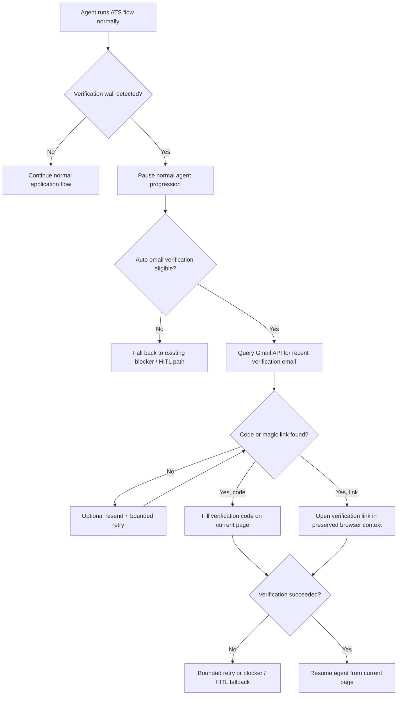

# Hand-X v4.2 — Email Verification Reintegration Plan

> Source of truth for the next phase of work on `feat/v4.0-domhand-enrichment`.
>
> This document covers the reintegration of inbox-based email verification
> handling into Hand-X. The goal is to move email-code / magic-link pages from
> a hard blocker into a bounded, deterministic recovery flow.

**Created:** 2026-05-31  
**Status:** Active plan  
**Branch:** `feat/v4.0-domhand-enrichment`

---

## 0. Latest Findings Log

### 2026-05-31 — Current-state audit

- Hand-X currently treats email verification pages as blockers rather than
  resolving them automatically.
- The current blocker path is spread across:
  - `ghosthands/agent/prompts.py`
  - `ghosthands/security/blocker_detector.py`
  - `ghosthands/cli.py`
  - `ghosthands/worker/hitl.py`
- The repo already contains a real Gmail API integration under:
  - `browser_use/integrations/gmail/service.py`
  - `browser_use/integrations/gmail/actions.py`
- That Gmail integration is not currently wired into Hand-X’s runtime apply
  flow. It exists as reusable infrastructure plus examples, not as active
  Hand-X behavior.
- The repo also contains an AgentMail disposable-inbox example under:
  - `examples/integrations/agentmail/`
- The AgentMail path is example/demo code and is not part of current Hand-X
  runtime behavior.
- Existing Hand-X account-creation logic already distinguishes:
  - account created and active
  - account created but pending verification
  - verification-required auth states
- Existing Hand-X runtime can already detect verification-code pages via:
  - DOM text probes
  - auth-state probes
  - blocker text emitted by the agent
- The existing Gmail integration uses Gmail OAuth with the
  `gmail.readonly` scope and stores:
  - `gmail_credentials.json`
  - `gmail_token.json`
- Important dependency gap: the Gmail integration imports Google API client
  packages, but those package names were not found in the current top-level
  `pyproject.toml` / `uv.lock` search. This must be treated as a real
  implementation item rather than assumed away.
- Important product constraint: Gmail-based verification only works when the
  application is using an inbox we actually control. The current sample profile
  email is `rc5663@nyu.edu`, which Gmail OAuth cannot read directly.
- The repo contains a toy job app with a Google-login + verification-code UI
  gate in `examples/toy-job-app/index.html`, but it currently has no matching
  backend for `/api/auth/google/*`, so it is not yet a complete end-to-end
  local verification harness.

### 2026-05-31 — Recommended architecture decision

- The shortest correct integration is **not** “let the general agent browse
  Gmail.”
- The recommended design is a **deterministic runtime subflow** that branches
  off the existing verification-blocker path.
- We should reuse the Gmail API service layer, but we should **not** reuse the
  raw `get_recent_emails` agent tool as the main production behavior.
- The general agent should continue doing the job application.
- When a verification wall is detected, runtime should:
  1. pause normal agent progress,
  2. retrieve the code or link through Gmail API directly,
  3. apply it to the current application page,
  4. verify the page advanced,
  5. then resume the agent from the current page.
- Gmail UI tab-hopping should **not** be the primary approach. Gmail API
  retrieval is cheaper, cleaner, safer, and more deterministic.
- Numeric verification codes and magic-link emails should both be first-class
  supported flows.

---

## 1. Problem Statement

The current Hand-X system can fill large portions of ATS applications, but it
still gets hard-blocked when a site asks the applicant to verify their email by
either:

- entering a code sent to the inbox, or
- clicking a link sent to the inbox.

Today, those pages are intentionally treated as blockers. That was the right
short-term choice, but it has become one of the main remaining automation
breakpoints.

The reintegration goal is to teach Hand-X to:

1. detect that it is on an email-verification page,
2. retrieve the verification artifact from a Gmail inbox through OAuth-backed
   API access,
3. apply the code or follow the link,
4. verify that the application flow advanced,
5. and then continue the job application normally.

This needs to work generically across ATS platforms, not as a one-off Workday
or Oracle hack.

---

## 2. First-Principles Requirements

This work should satisfy the following root requirements:

1. **Generic ATS support**
   - The system should solve the email-verification problem in a way that can
     work across Oracle, Workday, Greenhouse, and similar application systems.
   - The design should be page-state driven, not platform-hardcoded.

2. **Deterministic inbox access**
   - Hand-X should not rely on the outer agent improvising its way through
     Gmail UI.
   - Inbox retrieval should be deterministic and bounded.

3. **Preserve application state**
   - The system should avoid losing partially completed application state while
     handling verification.
   - This is especially important for long single-page forms and SPA-style
     applications.

4. **Safe failure behavior**
   - If email verification cannot be completed automatically, Hand-X should
     still fail clearly and safely instead of looping or fabricating progress.

5. **Privacy-aware handling**
   - We should avoid sending raw inbox contents to an LLM unless there is a
     very strong justification. The primary extraction path should be
     deterministic.

6. **No final-submit regressions**
   - This feature must not weaken the existing `submit_intent=review` safety
     guarantees.

---

## 3. Scope

### In scope

- Detect verification-code / email-confirmation pages during ATS runs.
- Retrieve verification emails through Gmail OAuth-backed API access.
- Support both:
  - numeric / alphanumeric codes,
  - magic-link verification emails.
- Resume the current application flow after successful verification.
- Add bounded retries, resend handling, timeout behavior, and blocker fallback.
- Test locally and then on real ATS targets.

### Out of scope

- General Gmail browsing through the browser UI.
- Broad “read arbitrary inbox and reason with an LLM” behavior.
- SMS verification, authenticator-app TOTP, or phone-based 2FA.
- Reworking unrelated Hand-X fill behavior.
- Building a generalized new account-creation system from scratch.

---

## 4. Current Runtime Reality

### 4.1 What Hand-X already does well

- It can detect many verification and auth states deterministically.
- It can distinguish:
  - native sign-in,
  - create-account,
  - verification-required,
  - authenticated/application states.
- It can emit account-created markers for Desktop/VALET.
- It already has a HITL pause/resume path for true blockers.

### 4.2 What is missing

- No runtime component currently:
  - reads inbox content,
  - extracts a code or magic link,
  - applies it to the current ATS page,
  - or resumes the run automatically.

### 4.3 Why the old Gmail example is not enough

The existing Gmail tool is useful infrastructure, but it is not a production
Hand-X solution because:

- it exposes raw recent emails as a general agent tool,
- it leaves parsing/decision-making to the LLM,
- it is not tied to the current ATS page state,
- it does not know how to fill code inputs or follow verification links,
- and it is not registered into the actual Hand-X runtime agent today.

---

## 5. Recommended Architecture

### 5.1 Core decision

Implement email verification as a **deterministic runtime recovery subflow**
that runs when Hand-X reaches a verification wall.

This should live beside the existing blocker/auth runtime logic, not as a raw
agent tool that the general browser agent is expected to discover and use
correctly on its own.

### Why this is the shortest correct path

- We already have blocker detection.
- We already have Gmail API service code.
- We already have continuation-task patterns in the runtime for special auth
  recovery cases.
- We do **not** need the agent to learn how to browse Gmail.

---

### 5.2 High-level flow

---

### 5.3 Runtime placement

The cleanest placement is:

1. let the agent reach the verification wall,
2. let the existing runtime recognize it,
3. before declaring final blocker / needs-human, try automatic email
   verification recovery once through a dedicated helper,
4. if recovery succeeds, continue the run from the current page,
5. if recovery fails, use the current blocker/HITL behavior.

This should be implemented as a shared runtime helper so both:

- `run_agent()` (JSONL / worker path)
- `run_agent_human()` (terminal path)

use the same verification-recovery logic instead of duplicating it.

---

## 6. Proposed Modules and Responsibilities

The recommended implementation shape is:

### 6.1 Gmail access wrapper

Add a Hand-X-facing wrapper that reuses the existing Gmail API service:

- candidate location:
  - `ghosthands/integrations/gmail_inbox.py`

Responsibilities:

- initialize Gmail service from Hand-X settings/runtime config,
- authenticate or refresh tokens,
- fetch recent emails with tight search parameters,
- expose structured mailbox results to the verification resolver.

Important: this wrapper should use `browser_use.integrations.gmail.GmailService`
as infrastructure, not re-implement Gmail auth from scratch.

### 6.2 Verification resolver

Add a deterministic orchestration helper, e.g.:

- candidate location:
  - `ghosthands/auth/email_verification.py`

Responsibilities:

- inspect current page hints,
- decide whether the page expects:
  - a code,
  - a magic link,
  - or cannot be auto-resolved,
- query Gmail,
- extract the best verification artifact,
- apply it to the current browser session,
- verify success/failure,
- return a structured result to the runtime.

### 6.3 Structured models

Use Pydantic v2 models for all new internal structures, for example:

- `EmailVerificationPageState`
- `MailboxQueryPlan`
- `VerificationEmailCandidate`
- `VerificationArtifact`
- `EmailVerificationAttemptResult`

This keeps the flow type-safe and inspectable.

### 6.4 Runtime integration helper

Add a small shared runtime helper in CLI/runtime code that:

- detects “this blocker is auto-verifiable,”
- invokes the resolver,
- decides whether to resume the agent or escalate to blocker/HITL.

This helper should be shared by human-mode and worker-mode paths.

---

## 7. Gmail Access Strategy

### 7.1 Primary recommendation

Use Gmail API directly through OAuth.

### Explicit recommendation

- **Do not** open Gmail in a new tab and scrape it through Browser Use as the
  primary strategy.
- **Do** use Gmail API for inbox retrieval.

### Why

- lower cost,
- lower latency,
- less brittle,
- no CAPTCHA/login churn on Gmail,
- easier to reason about bounded retries,
- safer for preserving ATS page state.

---

### 7.2 OAuth / credentials model

### v1 recommendation

For the first reintegration slice, use the existing file-based Gmail OAuth flow:

- credentials file:
  - `gmail_credentials.json`
- token file:
  - `gmail_token.json`

This is the shortest path because the existing `GmailService` already supports
it today.

### Important clarification

This is **not** the same as storing a Gmail username/password and logging into
Gmail in the browser.

The recommended design is:

- Gmail OAuth client credentials,
- Gmail OAuth refresh/access token,
- Gmail API `readonly` scope.

### Later production hardening

Once the behavior works end to end, we can decide whether to keep file-based
token storage for local/Desktop use or move to a more formal secret storage
scheme for production workers.

That hardening is not required to define the first correct implementation path.

---

### 7.3 Critical eligibility rule

Automatic Gmail verification is only eligible when the application email is an
inbox we actually control.

Examples:

- **eligible**
  - a real Gmail address we own,
  - an alias or forwarded address that lands in that Gmail inbox
- **not eligible**
  - random generated `@nyu.edu` addresses,
  - sample data emails that do not route into the authenticated Gmail inbox,
  - any mailbox not connected to the OAuth-authorized Gmail account

This needs to be explicit in both the implementation and the operator-facing
error messaging.

---

## 8. Verification Detection and Branching

### 8.1 Keep existing detection signals

We should continue using the current detection inputs:

- blocker text from agent final result,
- auth state probes,
- runtime DOM text probes,
- page content showing:
  - `check your inbox`
  - `verify your email`
  - `verification code`
  - `enter the code sent to`
  - `security code`
  - `OTP`

### 8.2 Add a narrower “auto-resolvable email verification” classifier

Not every verification-related page should be auto-retried.

We should distinguish:

- **auto-resolvable email verification**
  - email code field
  - email link confirmation
- **not in scope for this feature**
  - authenticator app
  - SMS OTP
  - Google phone challenge
  - device approval / push challenge

If the page is not clearly inbox-based email verification, the existing blocker
path should remain authoritative.

---

## 9. Page-State Extraction for Verification

When the verification wall is detected, runtime should capture a structured page
snapshot like:

- current URL,
- current tab id,
- visible heading text,
- whether code inputs are visible,
- number of code inputs,
- code input lengths / attributes:
  - `autocomplete="one-time-code"`
  - `inputmode="numeric"`
  - `maxlength`
- whether there is a `Resend code` control,
- whether the page shows the target email address,
- whether the page says “click the link in your email” instead of entering a
  code,
- company/platform hints from visible text and hostname.

This structured snapshot is what the inbox query and artifact-selection logic
should use.

---

## 10. Mailbox Query Strategy

### 10.1 Query inputs

The Gmail search/query planner should use:

- the current application email address,
- the time the verification wall was first seen,
- the current site hostname,
- visible company/platform text,
- generic verification keywords:
  - `verify`
  - `code`
  - `security`
  - `confirm`

### 10.2 Search principles

The search should prefer:

- recent emails only,
- emails newer than the wall-detection timestamp,
- emails addressed to the current applicant email if possible,
- emails whose sender/subject/body look related to the current ATS flow.

### 10.3 Query/result heuristics

The selection process should rank candidates by:

1. recency,
2. sender/subject match to current site/company,
3. target email match,
4. artifact confidence,
5. whether the message has already been attempted.

### 10.4 No broad inbox reasoning in v1

The first implementation should avoid:

- sending raw inbox contents to an LLM,
- broad inbox summarization,
- open-ended “which of these emails seems relevant?” agent behavior.

Instead, use deterministic parsing and scoring.

---

## 11. Verification Artifact Extraction

We need first-class support for two artifact types:

### 11.1 Code extraction

Extract:

- numeric codes,
- short alphanumeric one-time codes,
- code lengths suggested by page hints.

Selection rules:

- prefer code length that matches the visible input pattern,
- prefer the newest matching code,
- avoid reusing codes that were already tried in this run,
- reject obviously stale messages older than the wall timestamp window.

### 11.2 Magic-link extraction

Extract:

- explicit verification links,
- “Confirm your email” / “Verify account” URLs,
- safely decodable links from HTML/plain-text body content.

Selection rules:

- prefer link candidates from the newest matching email,
- prefer links whose domain looks related to the current site or an expected
  verification provider,
- avoid obviously unrelated marketing or notification links.

### 11.3 Structured artifact output

The parser should return a structured result like:

- type: `code` or `magic_link`
- value: code string or URL
- source message id
- confidence
- sender / subject metadata

---

## 12. Applying the Verification Artifact

### 12.1 Code-entry path

For code-based verification:

1. stay on the current ATS page,
2. locate code-entry inputs deterministically,
3. fill the code,
4. click the visible verify/continue/next button if needed,
5. wait/poll for page transition.

### Input patterns to support

- one full input field,
- segmented one-character OTP inputs,
- short text inputs with numeric input mode,
- pages that auto-submit on full code entry.

### Recommended implementation shape

Do this as a deterministic browser-session helper, not an agent reasoning task.

### 12.2 Magic-link path

For link-based verification:

1. preserve the current application tab,
2. open the verification link in a **new tab** in the same browser session,
3. wait for the verification flow to complete,
4. switch back to the application tab,
5. refresh/reassess only as much as needed,
6. verify that the original application page is now unlocked or progressed.

### Why new tab is recommended

It preserves the partially completed application page, which is safer than
replacing the current tab and hoping the ATS restores the form state.

---

## 13. Success Verification

After code or link application, runtime should **not** assume success.

It should explicitly verify that the page changed into an acceptable state, for
example:

- verification wall disappeared,
- application form became available,
- native sign-in page appeared when that is the expected next step,
- post-auth application state resumed,
- the old blocker text is gone.

If success cannot be proven, the verification attempt should not be treated as
successful.

---

## 14. Retry and Timeout Strategy

The retry policy should be bounded and simple.

### Recommended v1 behavior

Per verification wall:

- initial mailbox poll loop:
  - short bounded wait for newly delivered email
- if no artifact found:
  - click `Resend Code` once if the page exposes it
  - run one additional bounded mailbox poll loop
- if a code is found but rejected:
  - fetch newer email candidates and try at most one more artifact
- after that:
  - stop and fall back to existing blocker/HITL behavior

### Explicit anti-loop rules

- never retry indefinitely,
- never keep resending codes repeatedly,
- never keep trying the same message id / same code over and over,
- never restart the entire application run just because verification failed.

---

## 15. Error Handling and Edge Cases

### 15.1 Gmail setup/auth errors

Cases:

- Gmail OAuth credentials missing,
- token file missing,
- token expired and cannot refresh,
- OAuth scope invalid,
- API request failure.

Required behavior:

- fail clearly,
- emit a specific blocker reason,
- preserve existing HITL fallback.

### 15.2 No inbox access for current application email

Cases:

- application email is synthetic or external,
- application email does not route to the Gmail inbox we control,
- the run is using a generated create-account email that is not backed by a
  real mailbox.

Required behavior:

- do not attempt auto verification,
- emit a precise blocker message explaining that the current email is not
  inbox-readable by Gmail OAuth.

### 15.3 Multiple candidate emails

Cases:

- multiple codes after resend,
- same inbox being used across concurrent runs,
- marketing/notification emails mixed into results.

Required behavior:

- choose by recency + sender/subject + page hints,
- avoid already-tried message ids,
- consider enforcing one active verification flow per inbox as an operational
  recommendation if ambiguity becomes frequent.

### 15.4 Code rejection

Cases:

- code expired,
- wrong code chosen,
- page expects different code length,
- stale email selected.

Required behavior:

- detect rejection from page text/errors,
- fetch a newer artifact once,
- then stop and escalate if still unresolved.

### 15.5 Magic-link side effects

Cases:

- link opens a verification confirmation page,
- link signs the user in elsewhere,
- link redirects through multiple domains,
- original application tab needs refresh before it recognizes success.

Required behavior:

- keep the original tab alive,
- verify final state explicitly,
- switch back and reassess before concluding success/failure.

---

## 16. Security and Privacy Rules

1. Use Gmail `readonly` scope only.
2. Do not commit Gmail credentials or token files.
3. Do not pass full raw inbox contents to an LLM in v1.
4. Keep verification parsing deterministic.
5. Log metadata carefully:
   - sender,
   - subject,
   - timestamp,
   - artifact type,
   - message id
   but avoid printing full email bodies unless needed for local debugging.
6. Keep `submit_intent=review` protections unchanged.

---

## 17. Configuration Plan

We should add explicit runtime configuration for email verification.

### Recommended settings

- `GH_EMAIL_VERIFICATION_MODE`
  - `disabled` (default until configured)
  - `gmail`
- `GH_GMAIL_CREDENTIALS_FILE`
  - optional override path
- `GH_GMAIL_TOKEN_FILE`
  - optional override path
- `GH_GMAIL_TARGET_EMAIL`
  - optional explicit mailbox identity override if needed

### Important note

The existing `GOOGLE_API_KEY` is for Gemini and is **not** the same thing as
Gmail OAuth credentials.

That distinction needs to stay explicit in both implementation and developer
docs.

---

## 18. Integration Points in Hand-X

### 18.1 Agent prompts

Prompting should be updated so the agent no longer hardcodes
“email verification required => always blocker” when automatic inbox
verification is enabled.

However, the agent still should **not** be instructed to browse Gmail itself.

Recommended prompt change:

- tell the agent to report the verification wall accurately,
- but let runtime own the recovery behavior.

### 18.2 CLI/runtime orchestration

This is the primary integration point.

Recommended behavior:

1. run agent as usual,
2. if it returns a verification blocker or runtime probes detect a
   verification-required page,
3. attempt deterministic email-verification recovery,
4. if recovery succeeds:
   - continue the run from the current page,
5. if recovery fails:
   - preserve existing blocker/HITL behavior.

This is similar in shape to the existing false-verification-blocker recovery
logic already present in the CLI.

### 18.3 Worker/HITL path

The HITL path should remain the fallback, but it should only be triggered after
the auto-verification subflow has exhausted its bounded attempts.

### 18.4 Cost model

This feature should not add meaningful LLM cost if implemented correctly,
because:

- Gmail retrieval is API-driven,
- parsing is deterministic,
- code entry is deterministic,
- only normal ATS agent steps remain LLM-backed.

---

## 19. Testing Strategy

### 19.1 Unit tests

We should add deterministic unit coverage for:

- verification-page classification,
- Gmail query construction,
- code extraction,
- magic-link extraction,
- candidate ranking/scoring,
- deduping already-tried messages,
- segmented code-input filling logic,
- success/failure state transitions,
- blocker fallback behavior.

### 19.2 Mock integration tests

We should build mocked integration coverage around:

- fake Gmail service responses,
- current page state snapshots,
- code-entry DOM variants,
- magic-link tab flows.

This will let us validate the orchestration logic without needing a real Gmail
account on every test run.

### 19.3 Local end-to-end harness

The repo already has a promising local UI candidate in
`examples/toy-job-app/index.html`, because it includes:

- Google sign-in gate,
- verification-code gate,
- resend-code UI.

However, it is currently **frontend-only**. To make it a real test harness, we
will need a minimal mock backend or equivalent local harness that can:

- receive `/api/auth/google/start`,
- mint/store a fake verification code,
- expose a deterministic “email delivery” path for tests,
- verify `/api/auth/google/verify`,
- optionally simulate resend behavior.

This is the cleanest local proving ground before live ATS testing.

### 19.4 Live validation phases

Recommended live order:

1. controlled local verification harness,
2. public ATS target with email-code verification,
3. then broader production-like targets.

We should keep `submit_intent=review` for all live validation.

---

## 20. Proposed Implementation Phases

## Phase 1 — Runtime planning and shared models

- add Pydantic models for verification state/results,
- add settings/config surface,
- confirm Gmail dependency situation and lock required packages.

## Phase 2 — Gmail wrapper + deterministic artifact parsing

- wrap the existing Gmail service for Hand-X,
- implement recent-email search,
- implement deterministic code/link extraction.

## Phase 3 — Browser-session application helpers

- implement deterministic code-input fill helper,
- implement magic-link open/switch/restore helper,
- implement success verification helper.

## Phase 4 — Runtime integration

- wire the auto-verification recovery into shared CLI/runtime flow,
- resume the agent from the current page when successful,
- fall back to blocker/HITL when not.

## Phase 5 — Test harness + validation

- add mocked tests,
- make local toy verification harness usable,
- run live review-only validation.

---

## 21. Explicit Non-Goals for the First Implementation

To keep the first implementation logically correct and scoped:

- do **not** build full Gmail UI automation,
- do **not** add inbox LLM reasoning as the main path,
- do **not** try to solve SMS or authenticator 2FA here,
- do **not** fix unrelated fill issues as part of this slice.

---

## 22. Open Decisions / Questions to Lock Before Implementation

These do not block planning, but they should be answered before coding begins:

1. **Which application email will we use for live verification-enabled runs?**
   - We need a real inbox we control.
   - The current sample/test email (`rc5663@nyu.edu`) is not Gmail-readable by
     the OAuth inbox path.

2. **Do we want the first implementation to target only local/Desktop-hosted
   workers using file-based Gmail OAuth, or do we also need remote/production
   worker token transport in the same first slice?**
   - Recommendation: local/Desktop first.

3. **Do we want to support both code-entry and magic-link flows in the first
   implementation?**
   - Recommendation: yes, both, because both are explicitly in scope for the
     product problem.

---

## 23. Recommended Next Step

The next step should be:

1. lock the operator mailbox strategy for verification-enabled runs,
2. then implement the deterministic Gmail-backed recovery flow in phases,
3. starting with the shared runtime helper and mocked parser tests before live
   ATS testing.
